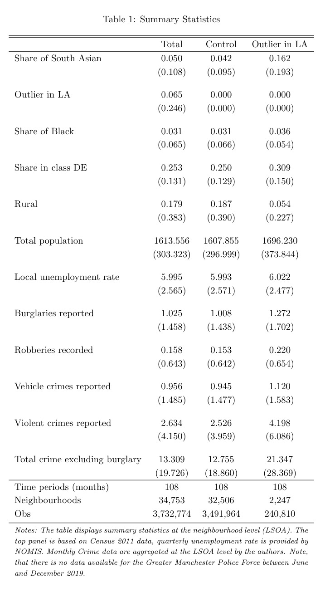
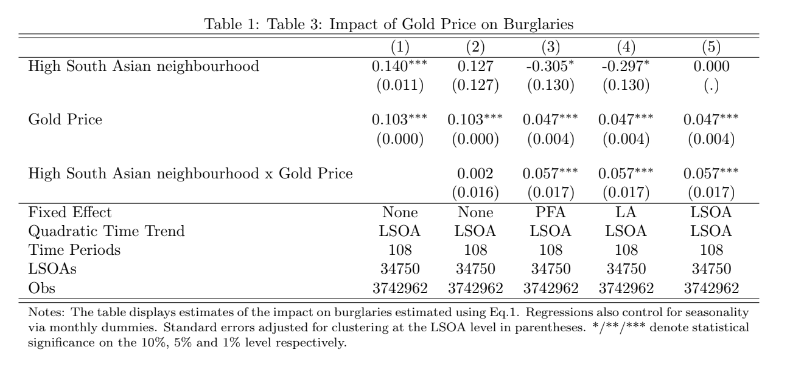
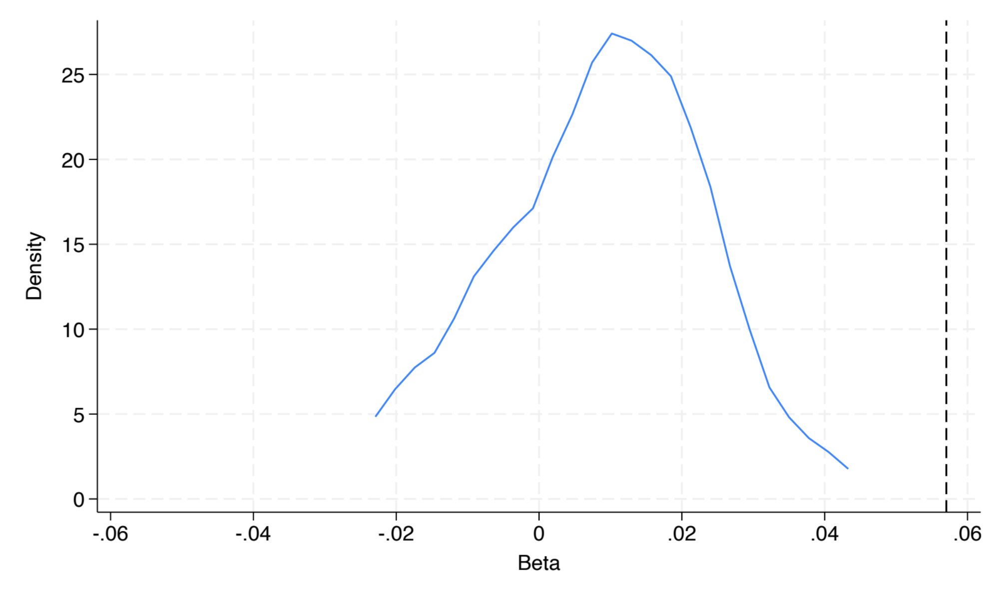

## Expected Returns to Crime and Crime Location

Braakmann, N., Chevalier, A., & Wilson, T. (2024). Expected returns to crime and crime location, AER, October 2024. <a href="https://www.aeaweb.org/articles?id=10.1257/app.20220585" target="_blank">https://www.aeaweb.org/articles?id=10.1257/app.20220585</a>

> <a href="resources/Resources_BCW/DoFile_BCW.do" target="_blank">[Download Do-File corresponding to the explanations below]</a> <a href="resources/Resources_BCW/Codebook_BCW.pdf" target="_blank">[Download Codebook]</a>

> <a href="https://www.openicpsr.org/openicpsr/project/190941/version/V1/view" target="_blank">[Link to the full original replication package paper from Open ICPSR]</a>

### Highlights  {-}

-   The research question of this paper is the following: Did the external increase of gold price affect the behavior of criminals in the sense that they increase the number of jewelry crimes and their targets, by selecting groups that stereotypically have more gold objects at home?

-   The paper employs a Difference-in-Differences (DiD) approach to examine the impact of gold price fluctuations as an exogenous shock on burglary locations. As a treatment group, it uses neighborhoods with a high proportion of South Asian households that they identify using census data. The DiD estimator interacts the monthly gold price with an indicator for a South Asian neighborhood, while controlling for various low-level geographical fixed effects, as well as time effects and neighborhood specific time-trends.

-   In the recent literature, their methodology falls somewhere between the traditional 2x2 DiD and the Generalized DiD. This is because , while they compare each group's outcome before and after the treatment, they also incorporate multiple treatment and control groups (neighborhoods).

-   This paper contributes to the DiD literature by defining the treated group as local outliers. Additionally, it incorporates quadratic trends in the main regression to account for time-varying unobservable variables. They also contribute by conducting a robustness check using placebo tests with 1,000 replications of the main regression and randomized treatment assignments.

-   Here, compared to the original replication package, we provide a smaller dataset that retains only the variables used, enabling a numerically simpler replication. Additionally, we offer a more detailed explanation of the original package. Finally, we have reduced the number of randomizations in the placebo test code from 1,000 to 25, significantly reducing run time: while the original code took 24 hours, this version requires only 60 to 90 minutes.

-   This code will teach some important functions and tricks:

    -   *How to use a high-dimensional fixed effects regression*

    -   *How to perform a placebo test and plot it !*

    -   *Give you practice in generating statistics and regressions, and then aggregating them into clear and comparable tables*

    -   *Give you practice in using the `preserve` command, which can be very useful when using Stata !*

### Introduction and Motivation

This paper discuss to what extent changes to the expected returns of criminal activity affect criminals’ choice about the nature of their crimes and their targets (the location of crime). For such, they need an exogenous variation on gold prices and a population sample with enough variation in their variable of interest. Hence, regarding the first condition, the authors showed that there was enough increase in gold prices in the period of interest. Then, they look at the effect of such an increase in gold prices on the number of jewellery crimes, according to the regions where criminals had more chance of success.

To tackle this question, the authors rely on ethnic variations in household preferences to store wealth in the form of gold jewellery: they exploit the long-standing cultural practices of families of South Asian descent to have a high proclivity toward storing wealth in the form of gold jewellery, specially of the highest quality (gold 22-carat). Then, they estimate whether the exogenous variation in the price of gold affects the geographical pattern of crime in England and Wales, as burglars target households with an expected greater preference of gold. That is, burglars target regions where there is a higher concentration of the South Asian community.

This second step of the article faces two challenges:

1.  Individuals from South Asian descent represent just over 5% of the population in England and Wales.

2.  South Asian communities tend to be regionally concentrated in the UK, in a way that the national variation is not well suited to the purpose since it would imply that burglars travel large distances in order to target neighborhoods with a high South Asian share.

As a consequence, the identification strategy used was to choose another segregation level: the local authorities. They compare neighborhoods within local authorities, which allows higher variation of the share of the population originating from South Asia between the units compared. In other words, they exploit this within-local authority variation in the share of South Asian households to estimate how fluctuations in the price of gold affect the distribution of burglaries within a local authority.

### Data

In practice, to exploit this within-local authority variation in the share of South Asian households, the authors collected data on individual crime occurrences between 2011 and 2019 for all police forces in England and Wales, and aggregate these to form a monthly panel at the level of small geographical neighborhoods (lower-layer super output areas, which gives 35,000 LSOAs). The neighborhoods (LSOA) are classified as relatively high density South Asian neighborhoods when their share of South Asians is an outlier in their local authority (LA). To define this relatively high density, they use the rule: if their share of South Asian population is in excess of the 75th percentile plus 1.5 times the interquartile range for that local authority (which is a standard outlier definition).

### Good practices before starting

If you wish to replicate this article yourself, you can both use the original **LSOAFinal.dta** from the original replication package, or use the prepared data available in this project **Dataset_BCW.dta**. To build it, we kept the variables that we will be using here, rename them, and generate intermediary variables.

You will have to set your directory where you saved the data to access it. You will also have to create the appropriate folders and `globals` to store your datasets and results. A `global` is a named storage location that can hold a value or a string of text. We use the command `global` to define it and the prefix `\$` to access it.

``` {.stata .Stata language="Stata" numbers="none"}
* Set the directory, where you have stored the original dataset and where you will store your results. To do so create a file named "data" in the file that you have defined as home
*global home "C:\Users\XXX"  

*cd "C:\Users\XXX\...\data""

* Set a global, to export all outputs we are going to make. To do so, create two files, "graphstata" and "texstata" in the file that you have defined as home/directory above.
global graphout "$home/graphstata"
global texout "$home/texstata"

* Importing data
use "$home/data/Dataset_BCW.dta", clear
```

To carry out the replication of this paper, the following packages must be installed:

``` {.stata .Stata language="Stata" numbers="none"}
ssc install estout
ssc install reghdfe
ssc install ftools
```

### Descriptive Statistics

After setting the Stata environment, we can begin to explore the data characteristics through the computing of descriptive statistics to achieve the replication of Table 1.

For this article, we will generate the stats for 3 groups. The first subsample is what they consider the treatment group, or neighborhoods with a high share of South Asian people, their group of interest. To identify them, we will add the condition `treat2 == 1` in our command, as this is the dummy variable that will force our code to only generate statistics for the units that obey this condition. The other groups are the control group (`treat2 == 0`) and the overall population.

#### Step 1 : Finding means and standard deviations

For that, we will need 2 main commands:

-   `eststo`: it stores estimation results in a model list for later use (e.g., to create comparison tables). This allows you to organize and summarize results across multiple groups.

    -   Following the `eststo` command, you can add a name, so it’s easy to reference it later.

    -   Always remember to `est clear` before running this command to avoid using previously stored results.

-   `summarize`: creates main statistics about the given group such as mean, standard deviation, maximum, and minimum values.

      -   To find means only for our group of interest, we add the condition `treat2 == 1` to determine the treatment group, as previously explained.

      -   We will only replicate column 3 of our table in this code. If you are interested in replicating all 3 columns, you only need to change the condition to`treat2 == 0` for the control group, and remove all conditions for the total population statistics. Don't forget to rename the estimation after the `eststo` command.

-   `estadd`: adds custom annotations to stored regression results, like model specifications or contextual details, to enrich descriptions for easier comparison or presentation in tables.

      -   We created a `local` variable named `tt` to save the number of months for which we compute information (108 months).

      -   We also added a `scalar` variable named `unique_lsoacode`, which gives the number of neighborhoods that fulfill the condition `treat2 == 1`.

-   `preserve`: this function saves the existing dataset used and allow us to make temporary changes on it, such as calculating variables or creating graphics.

      -   Always remember to `restore` after finishing the temporary changes

      -   Here, we use it to calculate the number of neighborhoods for the given condition: the `contract` function keeps only the unique values of variable we chose; by creating a `local` variable equal to `_N`, we are defining a temporary variable that represents the count of unique neighborhoods for the specified group.

``` {.stata .Stata language="Stata" numbers="none"}
//* Table 1 - Summary statistics */
// Column 3: Treatment Group

est clear
eststo treated: estpost summarize BIPshare treat2 Blackshare DEshare urban totpop unemploy burglary robbery vehiclecrime violence totexclburg if treat2 == 1
estadd local tt "108"

* Count unique lsoacode for control group
preserve
keep if treat2 == 1
contract lsoacode
local neigh_treated = _N  // Store the number of unique neighborhoods in a local macro
restore
* Add the unique count to the eststo object
estadd scalar unique_lsoacode = `neigh_treated’
```

::: {style="text-align: center;"}
{width="50%"}

#### Step 2 : Export our results in a tex-format table

We can visualize the results of the estimation with `esttab` command, which takes stored results from one or more estimation commands and formats them into a table. You can use it in multiple ways, as it allow us to choose what coefficient we want, with different decimals points and notations, and exporting in different forms.

Here, we choose to do export in the `.tex` format, which goes very well with *Latex* files and gives us nice and clean tables. You can see all the specifications we choose in the following. Furthermore, we highlight the using `$texout/Table_1.tex` command, which sets to save the generated table in the path we set before, in the correct form file.

``` {.stata .Stata language="Stata" numbers="none"}
esttab total1 control treated using "${root}\output\Table_1test_norandom.tex", ///
     cells("mean(fmt(3))" "sd(par)") substitute({l} {p{11cm}}) ///
     stat(tt unique_lsoacode N, fmt(%9.0fc %9.0fc %9.0fc) labels("Time periods (months)" "Neighbourhoods" "Obs")) nonum ///
     collabels(none) ///
     mti(Total Control "Outlier in LA") /// 
     title("Summary Statistics by Group") /// 
      addnote("\textit{Notes: The table displays summary statistics at the neighbourhood level (LSOA). The top panel is based on Census 2011 data, quarterly unemployment rate is provided by NOMIS. Monthly Crime data are aggregated at the LSOA level by the authors. Note, that there is no data available for the Greater Manchester Police Force between June and December 2019.}") /// 
    label replace nonumbers nocons nodepvar nostar compress
```

### Main strategies explanation: Difference-in-Differences

After having carried out the descriptive statistics analysis, in this section we dive into the empirical strategy of the research paper.

The main analysis of this article relies on a standard Difference-in-Differences design, where we have one unique treatment (*international gold princes increase*) that happened at the same time, for all treatment groups (*neighborhoods with a relatively high proportion of South Asian households compared to the rest of the local authority*) and their respective control group (*neighborhoods with a relatively low proportion of South Asian households, in the* same *local authority*).

$$
 y_{ict} = \beta_0 + \beta_1 SA_{ic} + \beta_2 GP_t + \beta_3 (SA_{ic} \ast GP_t) + \alpha_c + \gamma TREND_{it} + \epsilon_{ict}
$$

The output variable is the prevalence of burglaries in neighborhoods (LSOA) *i*, nested within local authorities *c*, at time *t*. The main explanatory variable is the average monthly gold price, $GP_t$. This variable is interacted with the treatment variable $SA_{ic}$, which takes the value of 1 when its condition is fulfilled. The coefficient of interest is the one associated with the interaction ($\beta_3$). To ease the interpretation, the measure of crime and the gold price are expressed in inverse hyperbolic sine, so that this coefficient can be interpreted as an elasticity. $\alpha_c$ represents local authority fixed effects.

Usually, it is also important to include time-varying controls at the local level, accessing for other possible variables that can explain the output. The authors differentiate themselves by using neighborhood-specific time trends $TREND_{it}$, which encapsulate how the outcome changes over time within each specific neighborhood. This approach allows them to account for these unique long-term patterns in each neighborhood.

### Main Results

The following code replicates Table 3 of the paper, which highlights the main results. On this page, we provide the code only for the 4th column estimation, which gives us one of the preferred estimations. If you're interested in replicating the entire table, you can do so by using the provided do-file or by simply modifying this code, adding or removing variables and fixed effects.

You will first run the regressions and store the estimates, then you will export your results

#### Step 1 : Run the regressions

We will again use `eststo`, which we provide further explications above. Some important commands used here:

-   `quietly`: suppresses the display of output during the execution of the regression.

-   `reghdfe`: runs a high-dimensional fixed effects regression. This is a robust method for handling large datasets with multiple levels of fixed effects.

-   `hypburg`: Our dependant variable, measures of the prevalence of various types of crime (principally burglary) for the respective neighborhood in a given month.

-   `BIParea`: a binary variable indicating whether a certain condition related to the BIP is met. It corresponds to $SA_{ic}$.

-   `hypgoldprice`: a continuous variable representing hypothetical gold prices, which could influence the outcome. It corresponds to $GP_t$.

-   `i.month`: includes month categorical variable (values from 1 to 12) to control temporal variations. Indeed, it is likely that there are more burglaries during the summer (and differ across units).

-   We also include the command `absorb` in `reghdfe`: specifies the fixed effects to "absorb". They are:

      -   `i.pfa_num`: Local Authority Fixed effects, corresponds to $\alpha_c$.

      -   `lsoaid#c.time`: Interaction of the location ID (lsoaid) with a linear time variable (time), controlling for time-specific trends at the location level.

       -   `lsoaid#c.time2`: Interaction of lsoaid with a quadratic time term (`time2`), allowing for nonlinear time trends specific to each location.

-   We also clusters the standard errors at the location ID (`lsoaid`) level with `cluster(lsoaid)`. This accounts for within-location correlation of errors over time, providing more reliable inference.

-   Finally, we used `estadd` again, adding custom annotation such as weather if the model have Fixed effect or no, the unit of the quadratic trend, and the number of months

``` {.stata .Stata language="Stata" numbers="none"}
/* Table 3 - Impact of Gold Price on Burglaries */
// Column 4

clear all
use "$home/data/Dataset_BCW.dta",clear

est clear
     
eststo: quietly reghdfe hypburg BIParea hypgoldprice interact i.month , absorb(lsoaid#c.time lsoaid#c.time2) cluster(lsoaid)
estadd local fe "None"
estadd local time "LSOA"
estadd local tt "108"
```

#### Step 2 : Export our results in a tex-format table

``` {.stata .Stata language="Stata" numbers="none"}
esttab using "$texout/Table_3_Main.tex", replace b(3) se(3) nonote compress nomti substitute({l} {p{16cm}}) stat(fe time tt N_clust N, fmt(%9.0f %9.0f %9.0f %9.0f %9.0f) labels("Fixed Effect" "Quadratic Time Trend" "Time Periods" "LSOAs" "Obs")) ///
keep(BIParea hypgoldprice interact) order(BIParea hypgoldprice interact) ///
coef( BIParea "High South Asian neighbourhood" hypgoldprice "Gold Price"  interact "High South Asian neighbourhood x Gold Price") addnote("Notes: The table displays estimates of the impact on burglaries estimated using Eq.1. Regressions also control for seasonality via monthly dummies. Standard errors adjusted for clustering at the LSOA level in parentheses. */**/*** denote statistical significance on the 10\%, 5\% and 1\% level respectively.") title("Table 3: Impact of Gold Price on Burglaries")
```

::: {style="text-align: center;"}
{width="50%"}
:::

### Robustness Checks

In this last section, we explain how to perform a standard robustness check. This is a common and highly recommended practice, as it strengthens the robustness of the main results. The authors tested alternative definitions of treated neighborhoods and analyzed displacement effects on other crime types or nearby neighborhoods. They also conducted placebo randomization tests, ensuring that these effects are not driven by arbitrary threshold definitions. This is the practice we will replicate in the following code.

::: {style="text-align: center;"}
{width="50%"}
:::

The placebo randomization tests whether the results are robust to the potentially arbitrary definition of treated neighborhoods (outliers of `BIPshare`). Unlike in classic DiD designs, where treatment is exogenously defined (e.g., by policy), here the researchers define treatment using a statistical threshold, allowing for randomization. By randomly assigning the treated status 1,000 times and recalculating the estimated effects, they compare these placebo results to the actual coefficients. If the real results differ significantly from the random ones, it validates that the findings are not driven by the threshold choice (or randomness) but by the actual relationship being studied.

The figure shows the distribution of placebo regression coefficients, with a line for the authors’ coefficient, highlighting its significant difference, proving that the coefficient found is not randomly driven.

  The following code will replicate this figure.

#### Step 1 : Adjusting data for the Placebo test

``` {.stata .Stata language="Stata" numbers="none"}
clear all
use "$home/data/Dataset_BCW.dta", clear

est clear
```

Before starting the randomization, we need to ensure the same distribution is obtained each time, with `set seed`. This is essential for result traceability.

``` {.stata .Stata language="Stata" numbers="none"}
set seed 12345 
```

With `set matsize`, we expand the maximum size for matrices, essential for handling large data or storing results during iterative procedures.

``` {.stata .Stata language="Stata" numbers="none"}
set matsize 5000 
```

We will keep only the relevant variables to speed up computation time. We used `compress` to optimize variable types to reduce memory usage.

We save this reduced dataset as a new file for subsequent use. With `keep`, we filter the dataset to include only observations for the first time period. This is because `BIPshare` is assumed constant over time, so only the initial period is needed for randomization.

``` {.stata .Stata language="Stata" numbers="none"}
keep laid lsoaid time time2 BIPshare hypgoldprice BIPhypgoldpriceOUTLA month hypburg BIPuqLA BIPiqrLA BIParea interact 
compress

save a, replace
keep if time==1
```

#### Step 2 : Create the random distribution

To reduce calculation time, we can reduce the number of distributions to 25 instead of 1000, the statistical accuracy of the results is decreased, but we can explain that this is to enable faster calculations.

##### Randomization

-   `forvalues i=1(1)25`: Executes a loop to generate random distributions between 0 and 1 for each LSOA.

-   `bys laid (lsoaid)` : Divides the data into groups based on the variable `laid` Within each group, the data is sorted by `lsoaid.`

-   `g rand i' = runiform(0,1)`: Generates uniformly distributed random numbers between 0 and 1 within each LA. Simulates random assignment of treated neighborhoods for placebo tests.

``` {.stata .Stata language="Stata" numbers="none"}
forvalues i=1(1)25{     
bys laid (lsoaid): g rand`i'=runiform(0,1)
}
```

##### Sorting

-   Sorts the LSOAs by the random numbers (`rand i'`) within each LA.

-   Assigns a sequential order (`random i'`) to LSOAs based on the sorted random numbers.

-   Creates a new randomized `BIPshare` variable for each iteration.

``` {.stata .Stata language="Stata" numbers="none"}
forvalues i=1(1)25{ 
bys laid (rand`i'): g random`i'=_n                                 
bys laid (lsoaid): g BIP`i'rand=BIPshare[random`i'] 
}
```

##### Hypothesis tested:

Now, we test hypothesis to check the results of the Placebo test.

-   Null hypothesis (H0): The relationship between BIP and hypburg is random.

    -   If H0 is true, the coefficients obtained with the real data should not differ from those obtained with the random data.

-   Alternative hypothesis (H1): The relationship between BIP and hypburg is significant and non-random.

``` {.stata .Stata language="Stata" numbers="none"}
keep laid lsoaid BIP*rand 
save "$home/data/tempLSOA", replace
clear
```

We reload the original dataset to prepare for merging with the randomized data.

``` {.stata .Stata language="Stata" numbers="none"}
use a
```

We merge the main dataset with the generated random distributions and delete the temporary dataset

``` {.stata .Stata language="Stata" numbers="none"}
merge m:1 laid lsoaid using "$home/data/tempLSOA", nogen
erase "$home/data/tempLSOA.dta"
```

#### Step 3 : Regress the new distribution and store the results

Now, we gonna re-do the regressions explain in section 1.5, for column 4 of previous Table 2.

``` {.stata .Stata language="Stata" numbers="none"}
reghdfe hypburg BIParea hypgoldprice interact i.month , absorb(i.laid lsoaid#c.time lsoaid#c.time2)     
```

We store the coefficients and standard errors from regressions, to set as comparison in future image.

``` {.stata .Stata language="Stata" numbers="none"}
mat B=[_b[interact], _se[interact]]     
```

Why the following code is so long to run?

-   This loop may take approximately 24 hours to run with 1,000 randomizations! With "only" 25 randomizations, the code processes each of the 36,000 LSOAs by generating 25 random BIP distributions (forvalues i=1(1)25) and running one regression for each random distribution. This means the following code will execute approximately 900,000 regressions in total (for 25 randomizations). Run the code and enjoy a well-deserved break!

In the following loop, with `gen`, we create a new variable (`BIPhypgoldout i'`) to identify outlier `BIPshare` values from the random distribution.

-   Outliers are defined as values greater than the upper quartile (`BIPuqLA`) plus 1.5 times the interquartile range (`BIPiqrLA`).

-   These outliers are then multiplied by `hypgoldprice`.

-   Converts the outlier variable (`BIPhypgoldout i`) into a binary indicator.

This defines a "treated area" based on the randomized BIP distribution.

Then we run multiple regressions against the variable `hypburg`

We store the results with `mat.` Appends the coefficient and standard error of the `BIPhypgoldouti` variable from the current regression to the `matrix B`.

Finally, with `drop` we delete the variables specific to the current iteration to free memory and avoid conflicts in the next loop iteration

``` {.stata .Stata language="Stata" numbers="none"}
forvalues i=1(1)25{
        
gen BIPhypgoldout`i'=(BIP`i'rand>=(BIPuqLA+(1.5*BIPiqrLA)))*hypgoldprice
gen BIPareaout`i'=BIPhypgoldout`i'>0

reghdfe hypburg  BIPareaout`i' hypgoldprice BIPhypgoldout`i' i.month , absorb(i.laid lsoaid#c.time lsoaid#c.time2)

mat B=[B\_b[BIPhypgoldout`i'], _se[BIPhypgoldout`i']]
drop BIPhypgoldout`i' BIPareaout`i'
}
```

#### Step 4 : Export as a graphic

##### Organizing data that we will plot

Now, we create a new Excel file for each `matrix m` (stored coefficients and standard errors), with `putexcel`. The second line of the code writes the`matrix m` to the first cell (A1) of the corresponding Excel file.

``` {.stata .Stata language="Stata" numbers="none"}
foreach m in  B {
putexcel set "$texout/randdist`m'", replace
putexcel A1= matrix(`m')
}
```

We import the combined Excel file with all the stored matrices into Stata for further analysis.

``` {.stata .Stata language="Stata" numbers="none"}
import excel "$texout/randdistB", clear    
```

We create a new variable `num` as a sequential identifier for each row of the imported dataset.

``` {.stata .Stata language="Stata" numbers="none"}
gen num=_n
```

We calculate summary statistics for the variable `A` in the first row of the dataset.

``` {.stata .Stata language="Stata" numbers="none"}
su A if num==1
```

We store the mean of `A` (from the first row) in the local macro `BIP`.

``` {.stata .Stata language="Stata" numbers="none"}
local BIP=r(mean)
```

##### Creating density plot

We will first count the total number of observations in the dataset. Then, with `local`, we store the number of rows minus one (excluding the first row) in the local macro `obs`. Finally, we delete the first row from the dataset with `drop if`.

``` {.stata .Stata language="Stata" numbers="none"}
count
local obs=(r(N) - 1)
drop if num==1
```

We summarize the remaining observations of `A` to understand its distribution. Then, run a regression on the variable `A`.

``` {.stata .Stata language="Stata" numbers="none"}
su A                
reg A
```

We again conduct a hypothesis test to compare the constant term (`_cons`) from the regression with the stored mean value (`BIP`).

``` {.stata .Stata language="Stata" numbers="none"}
test _cons=`BIP'  
```

We generate a density estimate to visualize the distribution of estimated coefficients.

``` {.stata .Stata language="Stata" numbers="none"}
kdensity A, generate(beta density) 
```

We create a line plot showing the kernel density of coefficients (`density`) against `beta`. Adds a vertical line at the mean coefficient (`BIP`) to visually compare the real result with the random coefficients.

``` {.stata .Stata language="Stata" numbers="none"}
two line density beta, xtitle(Beta) xlabel(-0.06(0.02)0.06) ylabel(0(5)25) xline(`BIP') graphregion(color(white)) ytitle(Density)
```

Finally, we export the density plot to the local already created. And then delete the dataset used, to finish with a clean environment!

``` {.stata .Stata language="Stata" numbers="none"}
graph export "$graphout/Figure_2.pdf", replace as(pdf)

clear 
erase a.dta
```

**Authors**
Victoria Bell, Rebecca Gramiscelli-Hasparyk, and Louis Marie, students in the Master program in Development Economics (2024-2025), Sorbonne School of Economics, Université Paris 1 Panthéon Sorbonne.

**Date**
December 2024.


