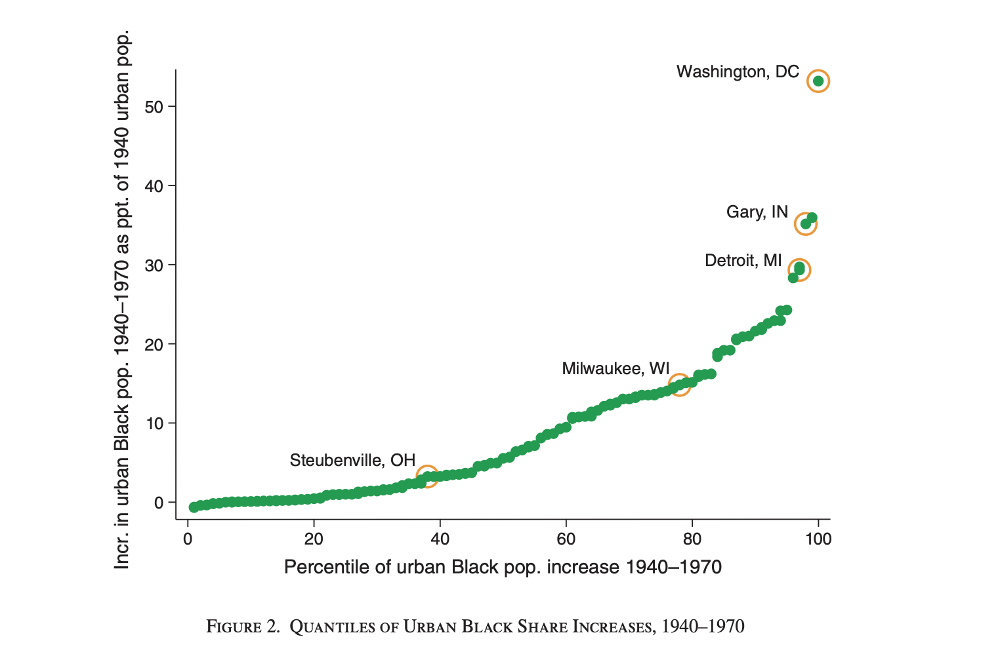

## Can you move to opportunity? Evidence from the great migration

Derenoncourt, Ellora. Can you move to opportunity? Evidence from the Great Migration. *American Economic Review* 112.2 (2022): 369-408. <a href="https://www.aeaweb.org/articles?id=10.1257/aer.20200002" target="_blank">https://www.aeaweb.org/articles?id=10.1257/aer.20200002</a>

```{r setup, include=FALSE}
knitr::opts_chunk$set(echo = TRUE)
Sys.setenv(STATA_PATH = "/Applications/Stata/StataMP.app/Contents/MacOS/StataMP")
library(Statamarkdown)
```

[Download the do-file corresponding to the explanations from here](resources/Resources_ED/DoFile_ED.do)

[Download the Codebook](resources/Resources_ED/Codebook_ED.pdf) 

<!-- [Download the final dataset from here](https://drive.google.com/file/d/1o-zdarmiF3-qVvtylLJ9NuhxP5A0mw8G/view?usp=drive_link) -->


### Highlights {-}

- This paper examines the impact of racial composition shocks during the Great Migration (1940-1970) on the upward mobility of Black families in northern U.S. cities, exploring the mechanisms through which these demographic changes influenced the long-term socio-economic outcomes.

- The research uses a **shift-share IV strategy**, leveraging historical migration patterns and southern economic shocks. 

- In this context, it effectively isolates exogenous variation in the Black population influx to northern cities, addressing endogeneity concerns and identifying causality, validated through pre-trend checks and robust instrument strength.

- This methodology is standard as it builds off the identification strategy developed by `Boustan (2010)` and has been used in subsequent papers on the Great Migration, such as `Tabellini (2018)` and `Fouka, Mazumder, & Tabellini (2022)`, making it a  recognized approach in the field of migration studies.

- Firstly, the document begins by presenting a concise summary of the paper, ensuring readers have a solid understanding of its key themes and objectives. Then, a step-by-step replication of the paper's important elements is provided, offering insights into the methodology and the validity of its findings.

- The final section highlights the key STATA techniques broken down in this document, including dynamic file management, string matching, macros, nested loops, IV regressions, and seamless LaTeX export, all contributing to enhancing the accessibility of the article and its code.


### Introduction and historical background

The Great Migration, a pivotal demographic shift in U.S. history, involved millions of Black Americans moving from the South to the North of the country between 1910 and 1970. This exodus, driven by the quest for freedom and better opportunities, occurred in two waves: the first from 1915 to 1930 and the second from 1940 to 1970, which is the period this paper focuses on. The second wave was largely fueled by an increased labor demand for war-production and defense industries during WWII, as well as in the automotive sector in subsequent decades. At the same time, important changes in the southern economy, including mechanization in agriculture combined with the ongoing political, social and economic repression of the black families under Jim Crow laws, further drove this out-migration from the south.

For decades, the North seemed to fulfill these aspirations, offering greater access to education and better living conditions. However, the Migration’s legacy has seemed to be complex. By the 2000s, many northern regions that once fostered upward mobility for Black families now exhibit some of the poorest outcomes. This historical shift in the geography of opportunity highlights the nuanced impacts of the Great Migration, making it a critical subject for understanding racial inequality and economic mobility in the United States.

### Data on upward mobility and city demographics

The author utilized historical U.S. census data from the IPUMS 1940 Complete Count Census (“CC”), which includes detailed information on educational outcomes for teenagers and their parents within the same household, as well as data on location, race, and other demographics. This was combined with a dataset on localized upward mobility developed by `Chetty et al. (2018)` and `Chetty and Hendren (2018b)`. The latter dataset, derived from U.S. federal tax records, provides information on parental income and the adult income of their children, with parents and children linked through dependent claims on tax forms. These data sources offer measures of upward mobility for the 1980s birth cohorts—the most recent cohorts for which adult outcomes can be reliably assessed. Additionally, the datasets were internally linked to census data to incorporate racial information, which is not captured in tax records.

As mentioned earlier, the study focuses on understanding upward mobility, defined broadly as the adult outcomes of children relative to their parents' economic status. Prior to the 1950s, the analysis centers on educational upward mobility, using measures such as the proportion of teenagers in a commuting zone with nine or more years of schooling, whose parents had between five and eight years of education. This approach leverages prior research to examine geographic and racial disparities in mobility during this period.

For earlier periods, when detailed educational data were unavailable, school attendance among teenagers from low socioeconomic families is used as a proxy. In contrast, upward mobility in the 2000s is assessed using income data, specifically the average income rank of individuals based on their parents' income rank within their birth cohort. These rankings are calculated nationally, offering a broader perspective on economic mobility.


Although educational upward mobility (historical periods) and income upward mobility (contemporary periods) are distinct measures that had been used due to data constraints, the study demonstrates a strong correlation between the two. This suggests that the geography of educational mobility in the 1940s provides meaningful insights into patterns of income mobility today.


In addition, the study concentrates on 130 urban commuting zones in the non-southern United States (referred to in the paper as “North” for simplicity), selected based on demographic changes during the Great Migration and net Black migration into the regions. These zones include cities with populations of 25,000 or more and states in the Northeast, Midwest, West, and a few southern locations like Maryland, Delaware, and Washington, D.C. The sample covers a significant portion of the population, including 85% of the non-southern U.S. population and 97% of its Black population, ensuring comprehensive representation for the analysis.


### Initialization and organization of the directories

All the data used for the creation of the final dataset are publicly accessible. For utilizing the **ICPSR** and **IPUMS USA** data, users should sign-up to their website, download the data from the DOI and unzip and store them and then follow the instruction of the related do files in the original replication package to create the final dataset.

Then, we install the essential packages (`ssc install`) and increase the maximum number of variables (`set maxvar`) that Stata can handle since our final dataset has more than the usual default number of variables Stata accepts.

After compiling the final dataset, to store our directories and main variables that will be used throughout the do-file, we use macros. Macros in Stata are placeholders that store text, numbers, or code to avoid repetition. Local macros store temporary information that can’t be accessed again outside of that specific block of code, while global macros can be used over again throughout the entirety of the do-file. Here, we create global macros for our directories, as well as OLS, IV, and baseline controls variables to avoid writing them everytime. This allows us to be efficient.

```{.Stata language="Stata" numbers="none"}
* Clear all and set max matsize

capture log close
clear all
set more off

set maxvar 9000 


*installing necessary packages
*estout stores estimates and allows us to make regression tables

ssc install estout, replace

* binscatter allows us to visualize grouped data trends
ssc install binscatter, replace

*ivreg2 allows us to run instrumental variables regressions
ssc install ivreg2, replace

* Setting up directories

global XX "YOUR DIRECTORY GOES HERE"
global data "$XX/directory of the data folder"
global logs "$XX/directory of the logs folder"
global figtab "$XX/directory of the figures and tables folder"

global x_ols GM
global x_iv GM_hat2	
global baseline_controls frac_all_upm1940 mfg_lfshare1940  v2_blackmig3539_share1940 reg2 reg3 reg4


```


Then, we define a program (a user-defined set of instructions and commands) named `Printest` to automate repetative tasks (e.g, exporting coefficients and results) and ensure consistency when saving outputs and make it easier to import results into **LaTeX** or **Word** for documentation. This customized command does 4 things:

  **1.** takes the estimate (e.g., median or mean values)
  **2.** formats it with specific text (e.g., units like "percentage points").
  **3.** rounds the estimate to a specified number of decimal places.
  **4.** writes the formatted result to a text file in the designated directory for documentation.

Even when we’re producing a figure, using this command, we get to store the estimates in a `txt` file under a standardized format. Let’s go through the functions of this command: `args` specifies the inputs (arguments) of the program. `cap` (i.e. capture) prevents Stata from stopping or displaying an error if the next line of code fails. Here, it ensures that if the program `PrintEst` already exists, it is quietly deleted so we can redefine it. `mkdir` (make directory) creates a directory even if it doesn’t exist, `tempname` creates a temporary reference to the name of the file, `file write` adds the text that you want to write to the file, and `file close` closes the file.

The program starts by specifying the argument, displays the desired estimate, displays the name of the estimate, creates a temporary file name, creates the directory where that file will be saved, opens the file, formats the estimate to a specified number of decimals, and writes the desired output before closing the file. 

The format of our output using this program can be seen in the first line: `args est name txtb4 txtaftr decim`. `est` is the estimate, `name` is the name of the output file, `txtb4` is any text we want to insert before the estimate, `txtaftr` is any text or notes we want to insert after the estimate, and `decim` is the number of decimals we want to see after the comma.

For example, in Figure 2 that we will see below, we can read:

``local slc_pctbpopchng4070 = `r(mean)'``

``PrintEst `slc_pctbpopchng4070' "slc_pctbpopchng4070" "" "th percentile%" "2.0"``

First line computes the mean of the variable local `slc_pctbpopchng4070`, and the second uses `PrintEst` to save that mean to a file named `slc_pctbpopchng4070.txt` and formats the output as [value]th percentile% at 2 decimals after the comma. If the mean is, for instance, 45, we will read in the text file: 45.00th percentile%. This provides a standardized way to document estimates throughout this do-file. 


```{.Stata language="Stata" numbers="none"}

capture program drop PrintEst
program PrintEst
	args est name txtb4 txtaftr decim
	di `est'
	di "`name'"
	tempname sample 
	cap mkdir $figtab/text
	file open `sample' using  "$figtab/text/`name'.txt", text write replace
	*local est_rounded = round(`est', 0`decim')
	local est_rounded : di %`decim'f `est'
	file write `sample'  `"`txtb4'`est_rounded'`txtaftr'"'
	file close `sample'
end
```


### Descriptive Statistics

#### Figure 2: Quantiles of urban black share increases, 1940-1970

Running descriptive statistics is essential. Good descriptive statistics further highlights the main points the paper attempts to drive. As such, we recreate Figure 2, which provides a comprehensive summary  of urban Black population increases in Northern US cities during the Great Migration (`bpopchange1940_1970`) . The figure allows for both city-specific insights and a broader view of population trends across all commuting zones. The statistical calculations for key cities help contextualize the findings, making this graphic essential for understanding regional variations in population changes and migration patterns during the great migration in the United States.

Before breaking down the code, let’s start with understanding some repeated commands in this section and throughout the paper:

- Locals save estimates. When we read local ``GM_`y'`` `= _b[$x_ols]`, the line is saving the OLS (`$x_ols`) coefficient (`_b`) of GM when the outcome variable is ```y’``. Similarly, when we read `qui sum GM, local ols_SD = ``r(sd)'` , the lines quietly summarize `GM` and extract its standard deviation saved into a local named `ols_SD`.

- `regexm` helps us find whether an expression is present in a string variable (a variable that contains text). If that variable contains the expression we’re looking for, regexm will return 1 (true) if it is found, and 0 (false) if it is not. For example, say we have a string variable `address` with the following entries `123 Detroit St.`, `456 San Francisco Ave.`, and `101 Washington Blvd.`. the code `gen has_detroit = regexm(address, "Detroit”)` will create a new dummy variable called `has_detroit` that will be equal to 1 if Detroit is present in the addresses or 0 if not. In this case we’ll have 1, 0, 0.

- This condition `|` means either. If we have `gen x = 1 if x1 = 2 | x2 = 3`, this means that the new variable x = 1 if x1 = 2 or if x2 = 3. In both cases, we record x as 1.

- The `xtile` command in Stata is used to create a new variable by dividing an existing variable into quantiles. It gives us the option to choose how many quantiles we’d like to split the variable. For instance, `xtile pctX = X, nq(4)` generates a new variable, `pctX`, that assigns each observation a percentile rank (from 1 to 4) based on the values X.

The first step loads the dataset, which contains the data for urban Black population increases from 1940 to 1970 across commuting zones (CZs). The `clear` option ensures any previously loaded data is removed before loading the new dataset. Next, a new variable `mylabel` is created to label specific cities of interest.

First, the `regexm` function identifies cities such as **Steubenville**, **Milwaukee**, **Washington**, **Gary**, and **Detroit**. `my label` will return `cz_name` + an empty string of custom labels that is then specified in the following lines of code. For instance, ,if `cz_name` contains any of the specified cities, the entry of `mylabel` for that row will be `cz_name +                             `. 

Then, we apply `replace mylabel` by the label we actually want for that city `if regexm(cz_name, “X”)` i.e. if regexm found the city’s name in the `cz_name` string variable. This allows for  highlighting key cities that are discussed in the paper.

```{.Stata language="Stata" numbers="none"}

	use ${data}/GM_cz_final_dataset.dta, clear
	gen mylabel=cz_name+"                  " if regexm(cz_name, "Steubenville") | regexm(cz_name, "Milwaukee") ///
	| regexm(cz_name, "Washington") | regexm(cz_name, "Gary") | regexm(cz_name, "Detroit") 
	replace mylabel="Washington, D.C." if regexm(cz_name, "Washington")
	replace mylabel="Detroit, MI" if regexm(cz_name, "Detroit")
	replace mylabel="Gary, IN" if regexm(cz_name, "Gary")
	replace mylabel="Steubenville, OH" if regexm(cz_name, "Steubenville")
	replace mylabel="Milwaukee, WI" if regexm(cz_name, "Milwaukee")


```

In this part of the code, the two-part scatter plot is generated using `twoway graph` which allows multiple types of plots in one figure. In this case, it’s used for two combined scatterplots. The first scatter plot visualizes the relationship between the urban Black population change (`bpopchange1940_1970`) on the Y-axis and our main independent variable,  the percentile of urban Black population increase (`GM`) on the X-axis, highlighting cities of interest with labels (`if mylabel =! “”`, where `!` means not equal and `“”` means empty, so when `mylabel` is not missing, which is only true for the cities we specified earlier).

As for formatting options, graph formatting options in Stata allow you to customize the appearance of graphs by adjusting elements such as marker size, symbol type, label placement, and color.  The points for these cities are marked with large (`msize(ylarge)`, orange (`jmporange`), hollow circles `msymbol(circle_hollow)` and labeled accordingly `mlabel(mylabel)`, making the cities easily identifiable. The color of the labels is black `mlabcolor(black)` and positioned above to the right `mlabposition(11)`. Legends usually are added automatically when generating a graph. Here, we remove legends using `legend(off)`. Finally, both the background and plotting area colors are set at white `graphregion(color(white))` &  `plotregion(ilcolor(white))`. For further guidance on visual formatting in STATA, refer to **A Visual Guide to STATA Graphics** by **Michael M. Mitchell**.

The second scatter plot displays the same data but includes all cities. As such, it offers a view of the population changes across the entire sample, drawn in green instead of orange. The plot is customized with titles on both axes, describing the population increase on the y-axis and the percentile of increase on the x-axis. We add a graph title using `ytitle`. The motivation behind this dual approach is to present both detailed, city-specific information and a general overview of the data.

```{.Stata language="Stata" numbers="none"}

	graph twoway (scatter bpopchange1940_1970 GM if mylabel!="", legend(off) mcolor(orange) msymbol(circle_hollow) ///
	msize(vlarge) mlabel(mylabel) mlabcolor(black) mlabposition(11) graphregion(color(white)) plotregion(ilcolor(white)) ///
	ylabel(,nogrid))  || (scatter bpopchange1940_1970 GM, xtitle("Percentile of urban Black pop increase 40-70") ///
	ytitle("Incr. in urban Black pop '40-70 as ppt of 1940 urban pop") legend(off) mcolor(green) graphregion(color(white)) plotregion(ilcolor(white))) 

```

After generating the graph, the output is saved as a **PNG file** in the specified directory (`$figtab`). `Cd “$figtable”` specifies the directory where the table will be saved.  The code then calculates summary statistics for the `bpopchange1940_1970` variable, such as the median and mean. We also generate `pctbpopchange1940_1970`, which is a percentile rank of the existing variable `bpopchange1940_1970` divided into 100 quartiles. For each selected city (e.g., Pittsburgh, Detroit, Salt Lake City, Washington, DC), the `summ` command computes the mean for both the raw population change (`bpopchange1940_1970`) and its percentile distribution (`pctbpopchange1940_1970`). These statistics are stored in local variables and printed using the `PrintEst` command for clarity.


```{.Stata language="Stata" numbers="none"}


		cd "$figtab"
	graph export bpopchange_percentiles.png, replace
	
	* Point estimates cited in text:
	
		* median
		summ bpopchange1940_1970, d
		local p50_bpopchng4070 = `r(p50)'
		PrintEst `p50_bpopchng4070' "p50_bpopchng4070" "" " percentage points%" "3.1"
	
		xtile pctbpopchange1940_1970 = bpopchange1940_1970, nq(100)
		
		*Pittsburgh
		summ bpopchange1940_1970 if cz_name=="Pittsburgh, PA"
		local pitt_bpopchng4070 = `r(mean)'
		PrintEst `pitt_bpopchng4070' "pitt_bpopchng4070" "" " percentage points%" "3.1"

		summ pctbpopchange1940_1970 if cz_name=="Pittsburgh, PA"
		local pitt_pctbpopchng4070 = `r(mean)'
		PrintEst `pitt_pctbpopchng4070' "pitt_pctbpopchng4070" "" "rd percentile%" "2.0"
		
		*Detroit
		summ bpopchange1940_1970 if cz_name=="Detroit, MI"
		local detr_bpopchng4070 = `r(mean)'
		PrintEst `detr_bpopchng4070' "detr_bpopchng4070" "" " percentage points%" "3.1"

		summ pctbpopchange1940_1970 if cz_name=="Detroit, MI"
		local detr_pctbpopchng4070 = `r(mean)'
		PrintEst `detr_pctbpopchng4070' "detr_pctbpopchng4070" "" "th percentile%" "2.0"
		
		*Salt Lake City
		summ bpopchange1940_1970 if cz_name=="Salt Lake City, UT"
		local slc_bpopchng4070 = `r(mean)'
		PrintEst `slc_bpopchng4070' "slc_bpopchng4070" "" " percentage points%" "3.1"

		summ pctbpopchange1940_1970 if cz_name=="Salt Lake City, UT"
		local slc_pctbpopchng4070 = `r(mean)'
		PrintEst `slc_pctbpopchng4070' "slc_pctbpopchng4070" "" "th percentile%" "2.0"
		
		*Washington, DC
		summ bpopchange1940_1970 if cz_name=="Washington DC, DC"
		local wadc_bpopchng4070 = `r(mean)'
		PrintEst `wadc_bpopchng4070' "wadc_bpopchng4070" "" " percentage points%" "3.1"

		summ pctbpopchange1940_1970 if cz_name=="Washington DC, DC"
		local wadc_pctbpopchng4070 = `r(mean)'
		PrintEst `wadc_pctbpopchng4070' "wadc_pctbpopchng4070" "" "th percentile%" "2.0"

```




### Identification strategy


**Causal Framework & Exclusion Restriction** 

In this paper, the author faces endogeneity concerns stemming from two issues:

**1. Reverse causality** because upward mobility in northern cities may have influenced the magnitude and direction of Black migration during the Great Migration, as migrants were likely to select destinations with better economic opportunities, and/or 

**2. Omitted variable bias** because of unobserved factors, such as pre-existing local economic conditions, racial dynamics, or industrialization levels, that could simultaneously influence both the extent of Black migration and future upward mobility. 

To address this, the author employs a **shift-share instrumental variable (IV) strategy**, which leverages exogenous variation in migration “push factors” from southern counties combined with historical settlement patterns in northern cities. Indeed, Black southern migrants tended to move where previous migrants from their communities had settled, thus generating correlated origin-destination flows similar to those observed in the international migration context. Shocks to migrants’ origin locations (“push factors”) are plausibly orthogonal to shocks to the destinations (“pull factors”) that could also influence the location choices of future migrants. Interacting exogenous shifts in migration at the origin level with historical migration patterns in the destinations yields a potential instrument for Black population changes in the North.

The IV is constructed as the following:

**1. Share:** The historical distribution of southern Black migrants across northern cities in 1940, i.e. original migration patterns. 

**2. Shift:** Exogenous "push factors" that caused migration from southern counties, such as declines in cotton production, economic shocks in agriculture, and World War II-related defense spending in southern counties.  

The predicted Black population increase in a northern CZ is the shift-share instrument used in this paper. It is constructed as:
$$
\widehat{\Delta b}_{\text{urban,CZ,1940–1970}} = \sum_{j \in S} \sum_{c \in CZ} \omega_{jc}^{1935–1940} \cdot \widehat{m}_j^{1940–1970}
$$

Where:

* $\omega_{jc}^{1935–1940}$ : The share of pre-1940 Black migrants from southern county $j$ who settled in city $c$ by 1940. This captures pre-existing linkages between southern counties and northern cities.

* $\widehat{m}_j^{1940–1970}$ : The predicted migration from southern county $j$ between 1940 and 1970.

After computing predicted increases in the urban Black population in northern CZs using this method, the author  uses the percentile of predicted increases, \widehat{GMCZ}, to instrument for the percentile of observed increases in the Black population, GMCZ.

### Model Equations:

**1. First Stage Equation**

The first stage equation relates the **predicted percentile increase in the Black population** ($\widehat{GMCZ}$) to the **observed percentile increase in the Black population** ($GMCZ$):

$$ GMCZ = \gamma + \delta \widehat{GMCZ} + X_{CZ}' \mu + \epsilon_{CZ} $$
Where:

* $GMCZ$: The observed percentile increase in the Black population in the CZ (1940–1970).

* $\widehat{GMCZ}$: The predicted percentile increase in the Black population based on the instrument.

* $X_{CZ}$: Vector of control variables (defined in the codebook under Baseline controls)

* $\epsilon_{CZ}$: The error term.


**2. Second Stage (2SLS) Equation**

The second stage equation estimates the causal effect of the observed Black population increase ($GMCZ$) on upward mobility:

$$ \overline{y}_{p, CZ} = \alpha + \beta GMCZ + X_{CZ}' \Gamma + \epsilon'_{CZ} $$

Where:

* $y_{p, CZ}$: The average income rank of children with parents at rank $p$ in the CZ.

* $\beta$: The causal effect of the Great Migration ($GMCZ$) on upward mobility ($y_{p, CZ}$).

* $X_{CZ}$: Vector of control variables. 

*  $\epsilon'_{CZ}$: The error term.

### Results on upward mobility

To test the impact of the Great Migration on the upward mobility of Black and White families, the author regresses key outcomes (detailed in the codebook)  on the percentile of observed Black population increase.

In this section, we’re replicating two tables for the main results: the great migration impact on white families, and the great migration impact on black families. Each table includes the results of the first-stage regression, the ordinary least squares regression, the reduced form regression, and the two stage least squares regressions. Each regression is run on our set of six outcome variables, for both black and white families. Given the large amount of work, we use a loop for efficiency. 

A loop is an interactive mechanism that allows the execution of specified commands for each value in the specified list. Here, we loop multiple times. Our first essential loop differentiates between white and black families. In the line (foreach r in "black" "white"”), our “list” is “black” and “white” and “foreach” black and white, the loop will execute the code inside it. 

Inside the code, we loop over outcomes to run each regression with a different y, defined inside the first main loop. Indeed, each loop for each model (`RF`, `2SLS`, `OLS`, and `First-Stage`) starts with (`foreach y in` ``outcomes'{`) before executing the actual regression on different Ys.

Before explaining the specificities of each model, let’s go through potentially tricky commands used in all of them to make it easier to read.

- `qui` stands for quietly, where we execute a command without seeing its result in the stata window.

- `test $x_iv = 0` tests for whether the IV is significantly correlated with X. 

- `Estadd scalar`: adds a row to the final table that includes values (or scalars) we choose to save. When we read a line like ``sum `y'``,    `estadd scalar basemean=r(mean)`,   `estadd scalar sd=r(sd)` ,  ``estadd scalar gm_sd=`ols_SD'``, we know that we are summarizing the outcome variable, and adding its mean, SD, and the `ols_SD` we saved earlier as an additional row down the table we’re compiling. 

- Finally, `eststo` saves estimates. `eststo clear` makes sure the memory is empty of previously saved estimates. `esttab` compiles the table, with options for us to polish it.

**Note**: we will be splitting the loop for this section into multiple parts to explain its specifities. In the do-file, it can be run all together. 

The first section creates a loop to capitalize the labels black and white. Then, we define local outcomes which we will loop over. 


```{.Stata language="Stata" numbers="none"}
* Replicating Tables 5 and 6
use "${XX}/GM_cz_final_dataset.dta", clear

* Start the loop for racial groups
foreach r in "black" "white" {
    local race "Black"    
    if "`r'" == "black" {
        local race "White"
    }

    * Define outcomes for the current racial group
    local outcomes kfr_`r'_pooled_p252015 kir_`r'_female_p252015 kir_`r'_male_p252015 kfr_`r'_pooled_p752015 kir_`r'_female_p752015 kir_`r'_male_p752015

```

#### First-stage regression

The loop clears any estimates in memory, summarizes GM and extracts its SD into the local `ols_SD`, regresses the instrument on the main independent variable, tests its significance  and saves the F-stat which is necessary to check whether it matches the relevance condition for a good instrument (F-stat > 10). Although we see lines of code related to y, these are irrelevant at the first-stage. As we will see in the tables, the coefficient and F-stat for all 6 Ys is the same. 


```{.Stata language="Stata" numbers="none"}
    * First Stage Analysis
    eststo clear
    foreach y in `outcomes' {
        use "${XX}/GM_cz_final_dataset.dta", clear
        keep if `y' != .
        qui sum GM
        local ols_SD = `r(sd)'
        replace `y' = 100 * `y'
        reg $x_ols $x_iv ${baseline_controls} if `y' != .
        eststo `y'
        test $x_iv = 0
        estadd scalar fstat = `r(F)'
    }
    cd "$XX"
	esttab `outcomes' using "`r'_hh_table.tex", frag replace  varwidth(25) label se ///
	stats(fstat, labels(  F-Stat)) keep($x_iv) mgroups("", prefix(\multicolumn{6}{c}{First Stage on GM})) nonumber ///
	nostar nomtitle nonotes nolines nogaps prefoot(\cmidrule(lr){2-7}) postfoot(\cmidrule(lr){2-7}) substitute({table} {threeparttable}) 

```

Here, we’ll learn how to export a table and make it publication ready. First, the table is exported using `esttab` into a `.tex` file, since **LateX** provides consistent formatting that is widely accepted by academic publishers.

- The `frag` option allows us to fragment the table into multiple sections to be able to insert formatting options like horizontal lines to demarcate different sections.

- `replace` replaces the table in the directory if it is already saved. 

- `varwidth(25)` makes sure the variables are aligned in columns with consistent widths, or in this case, 25 characters.

- `label` shows the variable labels instead of variable names.

- The `se` option adds standard errors to the table next to the regression coefficient

- `stats()` specifies the summary statistics in the table. Here, we are keeping the fstat

- `keep()` only keeps necessary variables. Here, we are only showcasing the coefficient of our `x_iv` in the table.

- The code ensures clear formatting: Suppresses stars (`nostar`) , titles (`nomtitle`), notes (`nonotes`) , unnecessary lines (`nogaps`).

These are options that can be used to extract any table, even if not in the tex format. Now we move to `.tex` specific options:

- `mgroups` is used to groups columns under a common label. It will appear on top of the columns that are relative to our first stage regression, indicating that they are “under the same umbrella”.  Further enhancements are also made: prefix is used. It allows us to edit the title. The name of the `mgroup` is empty `””` because it will be added in the prefix, which has the following form: `prefix(\multicolumn{span}{centering}{text}’`. `Span` specifies over how many columns the title will span over. Since we’re looping over 6 outcomes, that will be 6. `{c}` centers the title at the center of the columns. Finally, we insert  the title in `{text}`.

- `prefoot()` inserts a horizontal line before the footer of the table in latex, and `postfoot()` adds a line after the footer marking the end of the table. For instance, `prefoot(\cmidrule(lr){2-7})` spans the line from column 2 to column 7, and `lr` aligns the line to the left (l) and right (r) edges of the table columns.

- Finally, `substitute({table} {threeparttable})` subsidies the “table” environment to a “threeparttable” environment that gives a more structure approach in latex as it splits the table into three distinct parts: the caption above the table, the main body, and the notes below the table. 

#### OLS and Reduced form Regressions

As part of the same ongoing loop, we then conduct Ordinary Least Squares (OLS) and Reduced form (RF) regressions for a series of outcome variables (outcomes) to evaluate the impact of the treatment variable `\$x_ols` on each outcome while controlling for baseline characteristics `\${baseline_controls}` and the direct impact of the instrument on y, respectively. It iteratively loads the dataset, removes missing values for the current outcome, and rescales outcomes to percentile ranks for interpretability. The regression results for each outcome are stored with eststo. We then append (`esttab`, `append`)  the regression results to our first LaTeX table file, structured to compare pooled, women, and men groups across low and high income categories as you can read in this command: 


```{.Stata language="Stata" numbers="none"}
prehead("\\" "&\multicolumn{3}{c}{Low Income}&\multicolumn{3}{c}{High Income}\\" ///
"&\multicolumn{1}{c}{Pooled}&\multicolumn{1}{c}{Women}&\multicolumn{1}{c}{Men}&\multicolumn{1}{c}{Pooled}&\multicolumn{1}{c}{Women}&\multicolumn{1}{c}{Men}
```

It names each column accordingly, and gives an overarching title for low income vs high income individuals with multicolumn and subtitles with `multicolumn(1)`, `multicolumn(2)`, ect. with the same options for table design that we explained earlier. 


```{.Stata language="Stata" numbers="none"}

* OLS 	
	eststo clear
	foreach y in `outcomes'{
	use "${XX}/GM_cz_final_dataset.dta", clear
	keep if `y'!=.
	* Rescale treatment in terms of standard deviations
	qui sum GM
	local ols_SD=`r(sd)'
	* Rescale outcome in percentile ranks
	replace `y'=100*`y'
	reg `y' $x_ols  ${baseline_controls}  if `y'!=.
	eststo `y'
	}
	cd "$XX"
	esttab `outcomes' using "`r'_hh_table.tex", frag append  varwidth(25) label se ///
	prehead("\\" "&\multicolumn{3}{c}{Low Income}&\multicolumn{3}{c}{High Income}\\" ///
	"&\multicolumn{1}{c}{Pooled}&\multicolumn{1}{c}{Women}&\multicolumn{1}{c}{Men}&\multicolumn{1}{c}{Pooled}&\multicolumn{1}{c}{Women}&\multicolumn{1}{c}{Men} \\\cmidrule(lr){2-7}")  ///
	stats( r2, labels( R-squared)) keep($x_ols) mgroups("", prefix(\multicolumn{6}{c}{Ordinary Least Squares})) nonumber ///
	nostar nomtitle nonotes nolines nogaps prefoot(\cmidrule(lr){2-7}) postfoot(\cmidrule(lr){2-7}) substitute({table} {threeparttable})
	
	
	
* RF 	
	eststo clear
	foreach y in `outcomes'{
	use "${XX}/GM_cz_final_dataset.dta", clear
	keep if `y'!=.
	* Rescale treatment in terms of standard deviations
	qui sum GM
	local ols_SD=`r(sd)'
	* Rescale outcome in percentile ranks
	replace `y'=100*`y'
	reg `y' $x_iv  ${baseline_controls} if `y'!=.
	eststo `y'
	}
	cd "$XX"
	esttab `outcomes' using "`r'_hh_table.tex", frag append  varwidth(25) label se ///
	stats( r2, labels( R-squared)) keep($x_iv) mgroups("", prefix(\multicolumn{6}{c}{Reduced Form})) nonumber  ///
	nostar nomtitle nonotes nolines nogaps prefoot(\cmidrule(lr){2-7}) postfoot(\cmidrule(lr){2-7}) substitute({table} {threeparttable}) 

```


#### Two-Stage Least Squares (2SLS) regressions

We then perform Two-Stage Least Squares (2SLS) regressions to address endogeneity and estimate causal effects between the Great Migration `$x_ols` and outcomes outcomes. For 2SLS, we have to use the command `ivreg2`. We write `ivreg2 y (x_ols = x_iv)` with `=` to specify that we are concerned about endogeneity in variable `x_ols` and we're using the IV `x_iv` to address it. The instrument `$x_iv` predicts the endogenous treatment in the first stage, while the second stage regresses the outcomes on the predicted treatment, controlling for `baseline_controls`. Outcome variables are again scaled. After running the 2SLS, we save the coefficient, absolute value of the coefficient, and standard error into locals. We also export the coefficients using our Printest program. We finish by saving the Mean Rank, SD Rank, and SD GM as scalars and appending the tex table to our former outputs. Finally, we create a footer by exporting a table that includes everything we want to add (e.g. our scalars) and appending it to the original.

```{.Stata language="Stata" numbers="none"}

* 2SLS 	
	eststo clear
	foreach y in `outcomes'{
	use "${XX}/GM_cz_final_dataset.dta", clear
	keep if `y'!=.
	* Rescale treatment in terms of standard deviations
	qui sum GM
	local ols_SD=`r(sd)'
	* Rescale outcome in percentile ranks
	replace `y'=100*`y'
	ivreg2 `y' ($x_ols = $x_iv )  ${baseline_controls}  if `y'!=., first
	local GM_`y' = _b[$x_ols]
	local GM_`y'_abs = abs(_b[$x_ols])
	local GM_`y'_se : di %4.3f _se[$x_ols]
	PrintEst `GM_`y'' "GM_`y'" "" " percentile points (s.e. = `GM_`y'_se')%" "4.3"
	PrintEst `GM_`y'_abs' "GM_`y'_abs" "" " percentile points (s.e. = `GM_`y'_se')%" "4.3"
	eststo `y'
	use "${XX}/GM_cz_final_dataset.dta", clear
	keep if `y'!=.
	sum `y' 
	estadd scalar basemean=r(mean)
	estadd scalar sd=r(sd)	
	estadd scalar gm_sd=`ols_SD'
	}
	
	cd "$XX"
	esttab `outcomes' using "`r'_hh_table.tex", frag append  varwidth(25) label se ///
	keep($x_ols) mgroups("", prefix(\multicolumn{6}{c}{Two-stage least squared})) nonumber ///
	nostar nomtitle  nonotes nolines nogaps prefoot(\cmidrule(lr){2-7}) substitute({table} {threeparttable}) 
	
	* Footer
	cd "$XX"
	esttab `outcomes' using "`r'_hh_table.tex", frag append  varwidth(25) label se ///
	stats( N  basemean sd gm_sd, labels("Observations"  "Mean Rank" "SD Rank" "SD GM")) drop(*) nonumber ///
	nostar nomtitle  nonotes nolines nogaps prefoot(\cmidrule(lr){2-7}) substitute({table} {threeparttable}) 
	}
```


We arrive to this outcome:


### Robustness checks


**Table 9** tests the robustness of the paper’s results on the effect of the great migration on the upward mobility of black men by adding a new set of controls to check the robustness of the results to alternative specifications. 

First, we store the variables used in each of 8 columns of the table in macros for efficiency and convenience

```{.Stata language="Stata" numbers="none"}

global nocon "v2_blackmig3539_share1940"
global divfe "v2_blackmig3539_share1940 reg2 reg3 reg4"	
global baseline "frac_all_upm1940 mfg_lfshare1940 v2_blackmig3539_share1940 reg2 reg3 reg4"
global emp "frac_all_upm1940 mfg_lfshare1940 v2_blackmig3539_share1940 reg2 reg3 reg4 emp_hat"
global flexbpop40 "frac_all_upm1940 mfg_lfshare1940 v2_blackmig3539_share1940 reg2 reg3 reg4 i.bpopquartile"		
global swmig "frac_all_upm1940 mfg_lfshare1940 v2_blackmig3539_share1940 reg2 reg3 reg4  GM_hat8"
global eurmig "frac_all_upm1940 mfg_lfshare1940 v2_blackmig3539_share1940 reg2 reg3 reg4  eur_mig"
global supmob "frac_all_upm1940 mfg_lfshare1940 v2_blackmig3539_share1940 reg2 reg3 reg4  vm_blacksmob1940"

eststo clear
use "${XX}/GM_cz_final_dataset.dta", clear

```


Before we break down the rest of the code, let’s look at a new commands. `estadd local <name> "Y"/"N"` saves labels indicating which controls are included to track model features (Yes if the controls are added /No if not). When we compile the table, we'll add `name` as a statistic in separate table rows.


```{.Stata language="Stata" numbers="none"}
	local y  kir_black_male_p252015 	

	replace `y' = 100 * `y'
	
	reg $x_ols $x_iv $nocon 
	test $x_iv = 0
	local fstat=`r(F)'

reg `y' $x_ols $nocon  
eststo nocon_ols
estadd local hasdivfe       "N"
estadd local hasbaseline    "N"
estadd local hasemp         "N"
estadd local hasflexbpop40  "N"
estadd local hasswmig       "N"
estadd local haseurmig      "N"
estadd local hassupmob      "N" 
estadd local precisionwt    "Y"

ivreg2 `y' ($x_ols = $x_iv) $nocon  
eststo nocon
estadd scalar fstat = `fstat'  // Now `fstat` is correctly defined

reg $x_ols $x_iv $divfe 
test $x_iv = 0
local fstat = r(F)  // Update `fstat` for the new test
```

`local y kir_black_male_p252015`  and ``replace `y' = 100 * `y'`` prepare the dependent variable by turning it into a local then converting it to percentages, respectively. 

Then, each specification (table column) goes through the same process: first-stage regression, OLS regression, and then IV regression. The first estimation with no controls has been run first and the we run the first-stage regression and save the F-stat into the local scalar named `fstat`, then we run an OLS, saves the estimation of the results using eststo under the name `nocon_ols`, and adds the specifications of the model using `estadd`.
Finally, We run the IV regression for which the coefficient is saved with eststo under the name `nocon`, and save the F-stat value under the same `fstat` local. 


```{.Stata language="Stata" numbers="none"}
reg `y' $x_ols $divfe    
eststo divfe_ols
estadd local hasdivfe       "Y"
estadd local hasbaseline    "N"
estadd local hasemp         "N"
estadd local hasflexbpop40  "N"
estadd local hasswmig       "N"
estadd local haseurmig      "N"
estadd local hassupmob      "N" 
estadd local precisionwt    "Y"
	
	ivreg2 `y' ($x_ols = $x_iv )  $divfe    
	eststo divfe
	estadd scalar fstat=`fstat'
	
	reg $x_ols $x_iv $baseline 
	test $x_iv = 0
	local fstat=`r(F)'

	reg `y' $x_ols $baseline 
	eststo baseline_ols
	estadd local hasdivfe 		"Y"
	estadd local hasbaseline 	"Y"
	estadd local hasemp 		"N"
	estadd local hasflexbpop40	"N"
	estadd local hasswmig		"N"
	estadd local haseurmig		"N"
	estadd local hassupmob		"N"	
	estadd local precisionwt 	"Y" 

	ivreg2 `y' ($x_ols = $x_iv ) $baseline 
	eststo baseline
	estadd scalar fstat=`fstat'
	
	reg $x_ols $x_iv $emp 
	test $x_iv = 0
	local fstat=`r(F)'

	reg `y' $x_ols $emp  
	eststo emp_ols
	estadd local hasdivfe 		"Y"
	estadd local hasbaseline 	"Y"
	estadd local hasemp 		"Y"
	estadd local hasflexbpop40	"N"
	estadd local hasswmig		"N"
	estadd local haseurmig		"N"
	estadd local hassupmob		"N"	
	estadd local precisionwt 	"Y" 

	ivreg2 `y' ($x_ols = $x_iv ) $emp  
	eststo emp
	estadd scalar fstat=`fstat'

	reg $x_ols $x_iv $flexbpop40 
	test $x_iv = 0
	local fstat=`r(F)'

	reg `y' $x_ols $flexbpop40  
	eststo flexbpop40_ols
	estadd local hasdivfe 		"Y"
	estadd local hasbaseline 	"Y"
	estadd local hasemp 		"N"
	estadd local hasflexbpop40	"Y"
	estadd local hasswmig		"N"
	estadd local haseurmig		"N"
	estadd local hassupmob		"N"	
	estadd local precisionwt 	"Y"

	ivreg2 `y' ($x_ols = $x_iv ) $flexbpop40  
	eststo flexbpop40
	estadd scalar fstat=`fstat'
	
	reg $x_ols $x_iv $swmig 
	test $x_iv = 0
	local fstat=`r(F)'

	reg `y' $x_ols $swmig  
	eststo swmig_ols
	estadd local hasdivfe 		"Y"
	estadd local hasbaseline 	"Y"
	estadd local hasemp 		"N"
	estadd local hasflexbpop40	"N"
	estadd local hasswmig		"Y"
	estadd local haseurmig		"N"
	estadd local hassupmob		"N"	
	estadd local precisionwt 	"Y" 

	ivreg2 `y' ($x_ols = $x_iv ) $swmig  
	eststo swmig
	estadd scalar fstat=`fstat'

	reg $x_ols $x_iv $eurmig 
	test $x_iv = 0
	local fstat=`r(F)'

	reg `y' $x_ols $eurmig  
	eststo eurmig_ols
	estadd local hasdivfe 		"Y"
	estadd local hasbaseline 	"Y"
	estadd local hasemp 		"N"
	estadd local hasflexbpop40	"N"
	estadd local hasswmig	 	"N"
	estadd local haseurmig		"Y"
	estadd local hassupmob		"N"	
	estadd local precisionwt 	"Y" 
	
	ivreg2 `y' ($x_ols = $x_iv )  $eurmig  
	eststo eurmig
	estadd scalar fstat=`fstat'

	reg $x_ols $x_iv $supmob 
	test $x_iv = 0
	local fstat=`r(F)'

	reg `y' $x_ols $supmob  
	eststo supmob_ols
	estadd local hasdivfe 		"Y"
	estadd local hasbaseline 	"Y"
	estadd local hasemp			"N"
	estadd local hasflexbpop40	"N"
	estadd local hasswmig		"N"
	estadd local haseurmig		"N"
	estadd local hassupmob		"Y"	
	estadd local precisionwt 	"Y" 
	
	ivreg2 `y' ($x_ols = $x_iv ) $supmob  
	eststo supmob
	estadd scalar fstat= `fstat'

```

The process re-iterates while progressively adding new controls. 
To compile the table and convert it to a **LateX** format, we use the following code:

```{.Stata language="Stata" numbers="none"}
	cd "$figtab"
	esttab nocon divfe baseline flexbpop40 supmob  swmig eurmig emp using "main_robust_table_bmp25.tex", frag replace varwidth(25) label se ///
	stats( fstat, labels("First Stage F-Stat")) keep($x_ols) coeflabel(GM "GM (2SLS)")  nonumber ///
	nostar nomtitle nonotes nolines nogaps  substitute({table} {threeparttable}) prefoot(\cmidrule(lr){2-9})
	
	esttab nocon_ols divfe_ols baseline_ols flexbpop40_ols supmob_ols  swmig_ols eurmig_ols emp_ols  using "main_robust_table_bmp25.tex", frag append  varwidth(25) label se ///
	prehead("\\") coeflabel(GM "GM (OLS)") ///
	stats( r2  N  precisionwt hasdivfe hasbaseline hasflexbpop40 hassupmob hasswmig haseurmig hasemp , ///
	labels( "R-squared (OLS)" N "Precision Wt" "Census Div FE" "Baseline Controls"  "1940 Black Share Quartile FEs" "Southern Mob" ///
	"White South Mig" "Eur Mig"  "Emp Bartik" )) keep($x_ols)  nonumber  ///
	nostar nomtitle nonotes nolines prefoot(\cmidrule(lr){2-9}) postfoot(\cmidrule(lr){2-9})  substitute({table} {threeparttable}) 
```			
We create two tables and append them. For both tables, the code ensures the same formatting as results tables. The first table displays results from the 2SLS regressions for different specifications, and showcases the coefficient of interest and the F-stat, labelled as GM(2SLS) using the command `coeflabel(GM "GM (2SLS)")`. The second table showcases and appends OLS regression results to the same LaTeX file using `append`. We include model specifications using `stats`. Compiled in a LateX reader, we get: 


### Contribution


Throughout this document we explained these STATA tricks:

- **How to manage dynamic file creation and output**, including generating files programmatically, organizing results, and saving them in a structured manner using `tempname`, `file open`, and `file write`.

- **How to handle string matching** with `regexm()` to manipulate and process string  variables based on specific patterns.

- **How to use macros and loops effectively**, automating repetitive tasks with nested loops and running multiple regressions for different groups or variables using both local and global macros, and learning to identify the correct use for each. 

- **How to seamlessly export to LaTeX for Publication-Ready Tables**, making it incredibly easy to present your regression outputs in publication-ready tables. Using `esttab` and `eststo`, we create formatted tables that are immediately ready for inclusion in **LaTeX** documents, eliminating the need for manual formatting.

- **How to implement instrumental variable (IV) regressions using the ivreg2 package**, understanding how to address endogeneity by using external instruments and analyzing first-stage results for instrument strength.

***

**Authors:** Gaia Bechara, Evely Geroulakous, Oleksandra Povstiana, Fatemeh Razavi, Students in Master program in `Development Economics` (2024-2025), Sorbonne School of Economics, Université Paris 1 Panthéon Sorbonne.

**Date:** December 2024

