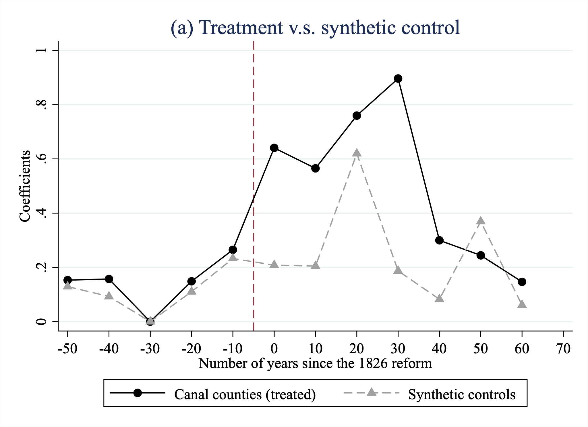
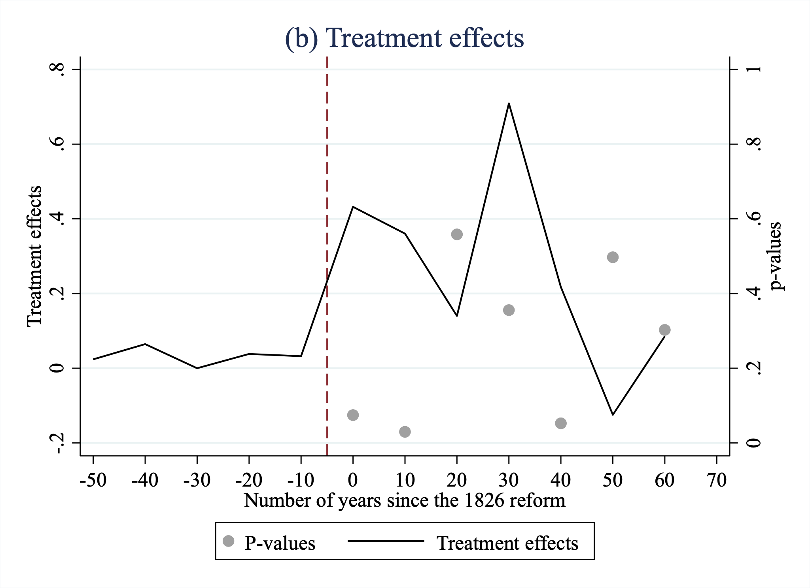

## Rebel on the Canal: Disrupted Trade Access and Social Conflict in China, 1650-1911

Cao, Y., & Chen, S. (2022). Rebel on the canal: Disrupted trade access and social conflict in China, 1650–1911. American Economic Review, 112(5), 1555-1590. <a href="10.1257/aer.20201283"  target="_blank">https://www.aeaweb.org/doi/10.1257/aer.20201283</a>

<a href="resources/Resources_IB_NO_MA/Stata_Replication_IB_NO_MA.do" target="resources/Resources_IB_NO_MA/Stata_Replication_IB_NO_MA.do">[Download Do-File corresponding to the explanations below]</a> <a href="resources/Resources_IB_NO_MA/Codebook_IB_NO_MA.pdf" target="resources/Resources_IB_NO_MA/CODEBOOK_IB_NO_MA.pdf">[Download Codebook]</a>

<a href="https://www.openicpsr.org/openicpsr/project/157781/version/V1/view" target="_blank">[Link to the full original replication package paper from Open ICPSR]</a>

### Highlights {-}

-   Research question: How did the closure of the Grand Canal in 1825 affect social unrest in China?

-   Methodology: A Differences-in-Differences (DiD) approach combined with:

    -   Heterogenuous treatment effects by spatial proximity and exposure
    -   Robustness checks using the Synthetic Control Method (SCM)

-   Baseline Model: A Two-Way Fixed Effects (TWFE) approach

-   Standard Approach: Methodology aligns with standard DiD approaches (only one treatment period), employing fixed effects to control for unobserved heterogeneity and comparing treated versus control groups over time.

-   Originality: SCM and spatial standard errors to address concerns about differential pre-trends and geographic dependencies.

-   Value Added: This replication provides detailed explanations and simplifications of the original analysis, introducing advanced techniques like Conley standard errors and SCM for applied researchers.

-   Stata Tricks:

    -   Using reghdfe for high-dimensional fixed effects.

    -   Computing Conley spatial standard errors for panel data.

    -   Generating and visualizing synthetic controls using synth_runner.

### Background

Economists often focus on how a specific treatment impacts an outcome of interest. In this study, the closure of the Grand Canal in 1825 serves as a natural experiment to investigate the broader social implications of trade disruptions. The Grand Canal, historically linking Beijing and Hangzhou, was central to economic integration, facilitating the movement of goods, tribute rice, and people across vast distances. By the early 19th century, however, mounting maintenance costs and governmental exploration of alternative trade routes led to its gradual abandonment. This event created what economists call a "treatment reversal," providing an opportunity to study the relationship between trade access and social conflict.

Why focus on this period?

The Grand Canal’s decline coincided with significant political and economic transitions in China, making it an ideal case study for understanding the socio-economic consequences of disrupted infrastructure. The loss of this critical trade artery not only impacted economic activity but also heightened social grievances, culminating in increased incidents of rebellion. These dynamics underscore the intertwined nature of economic and political stability.

The Methodology: Economists frequently employ the Differences-in-Differences (DiD) framework to estimate causal effects by comparing outcomes in treated and control groups over time. However, challenges arise in accounting for:

-   Time trends: Changes over time that affect all regions equally.

-   Cross-sectional differences: Variations between treated and control regions at a single point in time.

By combining both temporal and cross-sectional comparisons, the DiD approach mitigates these biases. In this study, counties along the canal (treated) are compared to those further away (controls) before and after 1825, the year marking the beginning of alternative trade route exploration.

We will provide you with the code for some of the main results and graphs from the paper. Since the idea is that this document will help you understand the basic idea behind the concepts and codes we will often simplify and shorten the actual code. The full code will be found in the Do-File.

### Empirical Approach and Descriptive Statistics

Although the canal was officially closed much later—by 1901—the authors argue that the causal effect was a result of the declining use starting in 1826. The closure significantly reduced rice transportation volumes, as illustrated in Figure 1. The discontinuity observed starting in 1826 suggests an immediate and marked decline in canal activity, aligning with the government’s exploration of alternative trade routes. Visualizing the Context: The authors use historical data on tribute rice transportation to illustrate the canal’s declining role. Tribute rice, a critical commodity transported via the canal, provides a proxy for trade activity. The graphing exercise involves visualizing trends in rice shipments from 1755 to 1860, with a clear discontinuity emerging after 1825. Regression lines (lfit) for pre- and post-reform periods emphasize the shift, while a vertical line (xline) marks the pivotal year. Customization options such as line widths (lwidth), colors, and patterns enhance the clarity of the visualization.


**Stylized Trends in Rice Transportation:** Figure 1 highlights the evolution of rice shipments before and after the onset of canal decline. Two fitted regression lines delineate the pre- and post-1826 periods, with a sharp break at the transition year. This visualization reinforces the absence of significant pre-treatment changes, suggesting that the observed decline is directly attributable to the policy shift rather than prior trends.

``` {.Stata language="Stata" numbers="none"}

duplicates drop year, force
keep if year > 1755 & year <1860

twoway (lfit lamount year if year < 1826, lwidth(1.5pt) color(black) lpattern(dash)) ///
(lfit lamount year if year >= 1826, lwidth(1.5pt) lpattern(dash) color(black)) ///
(scatter lamount year, color(gs10)), ///
xline(1825, lwidth(2pt) lcolor(maroon)) ///
xtitle("Years") ytitle("Shipping Volume (log million piculs)") legend(off) ///
title("Figure 1: Canal Usage measured by Tribute Rice Transportation") subtitle("1755 - 1860")
graph export figure1.png, replace
```

**Explanation:**

-   The dataset is restricted to 1755–1860 by dropping years outside this range.

-   twoway combines multiple graph elements: - lfit: Fits regression lines for pre- and post-reform periods.

-   scatter: Plots individual data points. -

-   xline: Adds a vertical line at the treatment year (1825).

-   Graph customization includes:

    -   Line width (lwidth), color (color), and pattern (lpattern) for regression lines.

    -   Axis titles (xtitle, ytitle), overall title (title), and subtitle (subtitle).

    -   The legend(off) command disables the legend, simplifying the output.

-   The graph is exported using graph export, with the replace option overwriting existing files.

### Main Results

The baseline model estimates the relationship between canal access and the frequency of rebellions. The key dependent variable is the inverse hyperbolic sine transformation of rebellion counts, normalized by 1600 population. The treatment variable is an interaction term for counties along the canal (AlongCanal_c) and the post-reform period (Post_t).

**Model Components:**

-   Fixed effects: - Time ($\sigma_t$) and county ($\delta_c$).

-   Additional controls for geography, agriculture, and demographics (added incrementally).

**Estimation:**

-   Columns 1–5 in Table 3 progressively add controls, including pre-reform trends, province-year fixed effects, and prefecture-level time trends.
-   We provide only one of the columns for simplicity

Model form: $Y_{c,t}$ = $\beta$ \* $AlongCanal_c$ x $Post_t$ + $\delta_c$ + $\sigma_t$ + $chi_{ct}$ + $\epsilon_{ct}$.


Replication Code: The baseline TWFE models are estimated using reghdfe, a Stata command for high-dimensional fixed effects. Results are stored with eststo and formatted into LaTeX tables with esttab.

``` {.Stata language="Stata" numbers="none"}
use ".../Rebellion.dta", clear

global ctrls larea_after rug_after disaster disaster_after flooding drought flooding_after drought_after lpopdencnty1600_after maize maize_after sweetpotato sweetpotato_after wheat_after rice_after

reghdfe ashonset_cntypop1600 interaction1, absorb(i.OBJECTID i.year) cluster(OBJECTID)
eststo Column1
quietly tabulate OBJECTID if e(sample)
scalar groups=r(r)
qui su ashonset_cntypop1600 if e(sample)
scalar ymean=r(mean)
estadd scalar depavg=ymean:Column1
estadd scalar N_g=groups:Column1
```

**Commands:**

-   reghdfe: Estimates TWFE models with absorb() for fixed effects. Different from xtreg since we can include multiple fixed effects without having to use dummies in our equations

-   cluster(OBJECTID): Clusters standard errors at the county level to account for serial correlation within counties

-   scalar() allows us to get certain values for our table (here: number of clusters and the mean of the dependent variable)

-   eststo and estadd: Store results and add summary statistics (e.g., mean of dependent variable).

The above steps are repeated for Columns 2–5, progressively adding fixed effects and controls.

Spatial Conley Standard Errors: To address spatial correlation, Conley standard errors are computed using the user-written command available here: <http://www.globalpolicy.science/code/>. Results are added to stored estimates.

``` {.Stata language="Stata" numbers="none"}
preserve
hdfe ashonset_cntypop1600 interaction1, clear absorb(i.OBJECTID i.year) tol(0.001) keepvars(OBJECTID year Y_COORD X_COORD)
ols_spatial_HAC ashonset_cntypop1600 interaction1, lat(Y_COORD) lon(X_COORD) time(year) panel(OBJECTID) distcutoff(500) lagcutoff(262) disp star
matrix V_spat=vecdiag(e(V))
matmap V_spat SE_spat, m(sqrt(@))
estadd matrix sesp=SE_spat: Column1
restore
```

**Commands:**

-   preserve and restore allow us to manipulate the dataset and reset it after we run our commands

-   hdfe allows us to account for multiple fixed effects in the next step which is an OLS model. The dependent variable will now be the initial values minus the corresponding fixed effects for each observation

-   ols_spatial_HAC user written code that estimates OLS models accounting for spatial (here 500km) and serial (262 periods) correlation.

-   the rest of the steps are necessary to save the computed values for later implementation into our table.

``` {.Stata language="Stata" numbers="none"}
estfe Column1 Column2 Column3 Column4 Column5

esttab Column* using table3.tex , compress keep(interaction1 _cons) se(4) nomtitles nonotes ///
cells(b(fmt(4)) se(fmt(4) par(( ))) sesp(fmt(4) par([ ]) drop(_cons))) collabels("",none) ///
sca(OBJECTID) stats( depavg N N_g r2_a, fmt( 3 %7.0fc 0 4) labels( "Mean of the dependent Variable" "Number of observations" "Number of counties" "Adjusted R^2")) label title("Rebellions") ///
indicate("County FE =0.OBJECTID" "Year FE=0.year" "Pre-reform rebellion $\times$ Year FE=0.year#c.ashprerebels" "Province $\times$ Year FE=0.provid#0.year"  "Prefecture Year Trend=0.prefid#c.year" "Controls $ \times $ Post=$ctrls ") 

eststo clear
```

**Final Steps** to get a nice table:

-   indicate will tell Stata when to display the yes concerning which fixed effects are included

-   cells() to manually define which values to include (sesp() are the Conley SEs)

-   labels(), compress, keep() etc. for a nicer output

### Robustness Checks

The robustness checks include:

1.  Pre-trend Analysis: Confirms no pre-treatment effects.
2.  Placebo Tests: Examines other trade routes and finds no similar effects.
3.  Synthetic Control Method: Constructs artificial counterfactuals for treated counties using synth_runner.

 




Our focus in this section will be the synthetic control method. The idea is that instead of comparing treated and non-treated groups we design an artificial counterfactual. This sounds complex but is rather intuitive. Remember some counties were exposed to the canal and others weren't. We look at individual counties and design the synthetic control by finding a combination of the non-treated counties that best fits this observation (before treatment). Imagine that county A is actually represented fairly accurately by a combination of B, C and D. We tell Stata to compute the best fitting combination, by assigning weights to each control county, to yield our counterfactual. We then check how accurate our counterfactual is before treatment (how close the lines are) and then we see how our synthetic control evolves over time after treatment and how the actual observation behaves. The observed gap will be our treatment effect. What is cool about the method is that it is told using graphs so interpretation is quite intuitive.

Replication Code for SCM:

``` {.Stata language="Stata" numbers="none"}
synth_runner y y(1776) y(1796) y(1806) y(1816), d(interaction1) gen_var
matrix P = e(pvals_std)

/// Intermediate and Setup omitted for simplicity (see Do-File for full code)

twoway (connected y year, lpattern(solid) msymbol(C) color(black)) ///
(connected y_synth year, lpattern(dash) msymbol(T) color(gs10)), ///
ytitle("Coefficients") ///
xtitle("Number of years since the 1826 reform") ///
legend(order(1 "Canal counties (treated)" 2 "Synthetic controls") cols(2))

twoway (line effect year, c(l) yaxis(1) lpattern(solid) color(black) ytitle("Treatment effects", axis(1)) ylabel(-0.2(0.2)0.8,axis(1))) ///
(scatter p_vals year, yaxis(2) color(gs10) ylabel(0.0(0.2)1.0, axis(2)) ytitle("p-values", axis(2))), ///
xtitle("Number of years since the 1826 reform") ///
xline(-5, lpattern(dash) lcolor(maroon)) /// ///
xlabel(-50(10) 70) ///
graphregion(color(white)) ///
scheme(s2color) ///
legend(order(2  "P-values" 1 "Treatment effects") cols(2))
```

**Commands**

-   synth_runner is the more flexible approach - compared to synth - for estimating synthetic controls. y is the dependent variable and the y() specify which pre-treatment values to use to construct the synthetic control

-   the option d() specifies the treatment variable and gen_vars saves the estimated results as variables in the dataset

-   In the next steps we save the estimated p-values (placebo based inference) in the matrix P

    -   placebo based inference is one of the advantages of the synth_runner command. The resulting p-values don't originate from any defined distribution but represent the position of the estimated coefficients compared to the effect sizes of about 100,000 placebo estimations

-   connected in the first graph streamlines the alternative combination of a scatter and line graph

-   In the second graph we follow standard practice. This is different to the authors' code so we get slightly different axis labeling but overall results are mostly the same (except for one p-value)

### Discussion and Interpretation

The study "Rebel on the Canal" by Cao and Chen examines the causal relationship between the disruption of trade access—caused by the abandonment of China’s Grand Canal—and subsequent social unrest in the region. The authors build an original dataset spanning 575 counties over 262 years to investigate how a plausibly exogenous shock to trade infrastructure contributed to increased rebellion frequency in counties along the canal.

**Key Findings**

1\. Direct Impact of Canal Closure:

-   Counties with sections of the Grand Canal experienced a 117% increase in rebellion frequency compared to non-canal counties after the closure. This robust effect persisted across various model specifications. The effect size is to be interpreted carefully since there are some concerns with respect to the arcsinh transformation (see Chen & Roth, 2024: <https://doi.org/10.1093/qje/qjad054>).

-   The mangitude of this impact highlights the importance of trade routes in maintaining regional stability, suggesting that access to trade mitigates socio-economic and spatial inequalities that could lead to social unrest

2.  Heterogeneity of Effects:

    -   The analysis revealed that counties more reliant on the canal, either geographically (based on canal length within a county) or economically (proximity of towns to the canal), experienced greater rebellion intensity.

    -   Spillover effects extended to counties up to 150 kilometers away from the canal, indicating broader regional dependencies on this critical infrastructure.

3.  Mechanisms:

    -   Loss of trade access significantly reduced economic opportunities, particularly for urban workers reliant on the canal for employment.

    -   The closure disrupted market town growth and deprived regions of the risk mitigation benefits traditionally afforded by trade, such as smoothing income shocks during adverse events.

**Rigorous Robustness Checks**

The Difference-in-Differences (DiD) framework is supplemented by advanced techniques like the Synthetic Control Method (SCM) and Changes-in-Changes (CiC) estimation to address concerns about differential pre-trends and unobserved heterogeneity. Placebo tests on other trade routes confirm that the observed effects were unique to the Grand Canal's abandonment, strengthening the causal inference.

**Broader Implications**

1.  Trade Access and Stability:

-   Findings reinforce dual role of trade in fostering economic prosperity and political stability, a topic with extreme relevance given recent debates on globalization and trade restrictions. The study shows how disruptions to economic systems can reveal existing vulnerabilities, potentially informing policy discussions on infrastructure resilience and equitable access.

2.  Urban Dynamics:

-   Focus on urban workers underscores socio-economic importance of trade infrastructure for urban centers, expanding traditional narratives that emphasize rural impacts.

3.  Historical Contributions:

-   Provides new insights into the dynamics of 19th-century Chinese social unrest, connecting the rise in rebellions to economic shocks rather than solely to political or military factors.

**Future Research Directions**

-   Investigate long-term socio-economic trajectories of regions affected by the canal's closure with respect to trust for instance
-   Extending the analysis to explore how modern disruptions in trade infrastructure - such as those caused by climate change - might replicate similar patterns of instability
-   Examine similar cases globally to test generalizability of findings

---

**Authors:** Ibrahim Ben Araar, Nour Ouljihate and Marie Moussé, students in the [Master program in Development Economics and Sustainable Development ](https://economie-master-developmenteconomics.pantheonsorbonne.fr/) (2024-2025), Sorbonne School of Economics, Université Paris 1 Panthéon Sorbonne.

**Date:** December 2024
