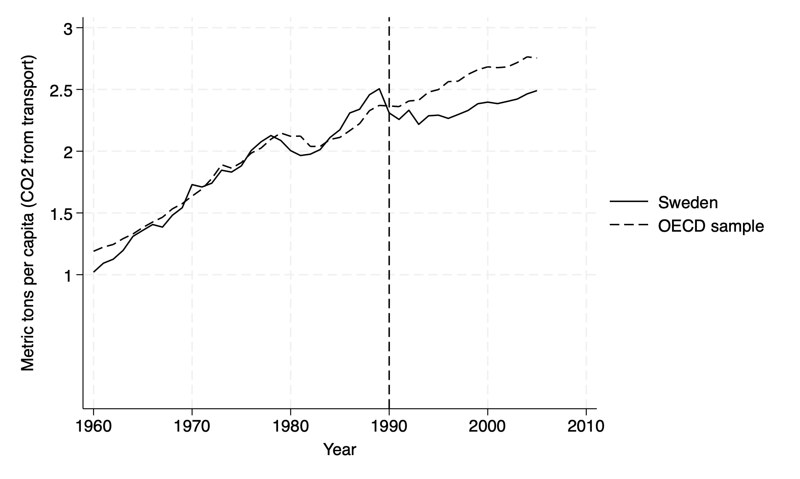
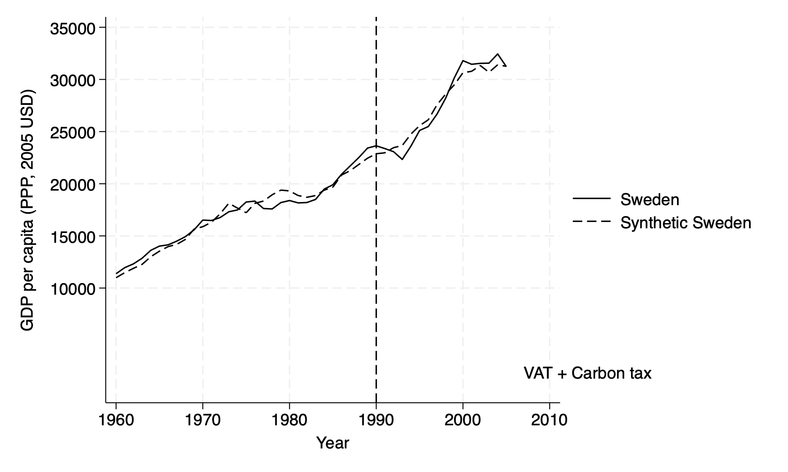
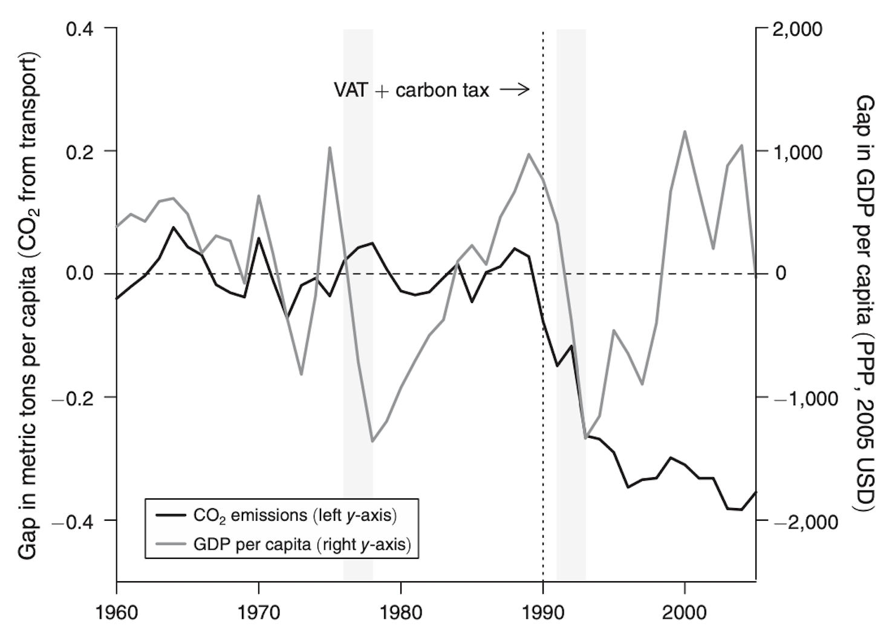
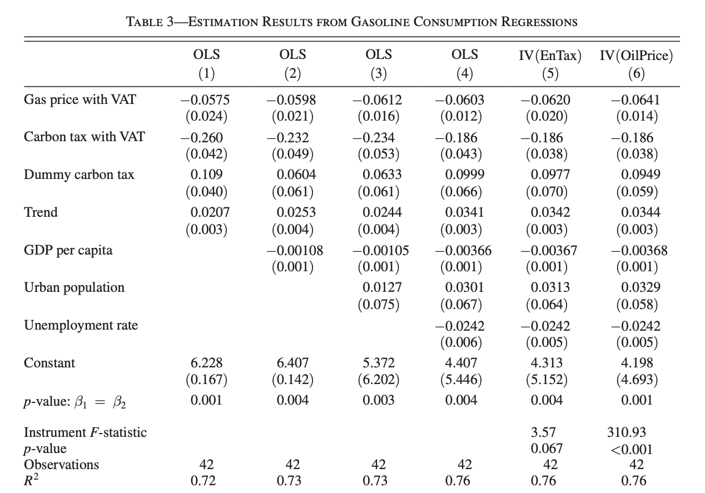
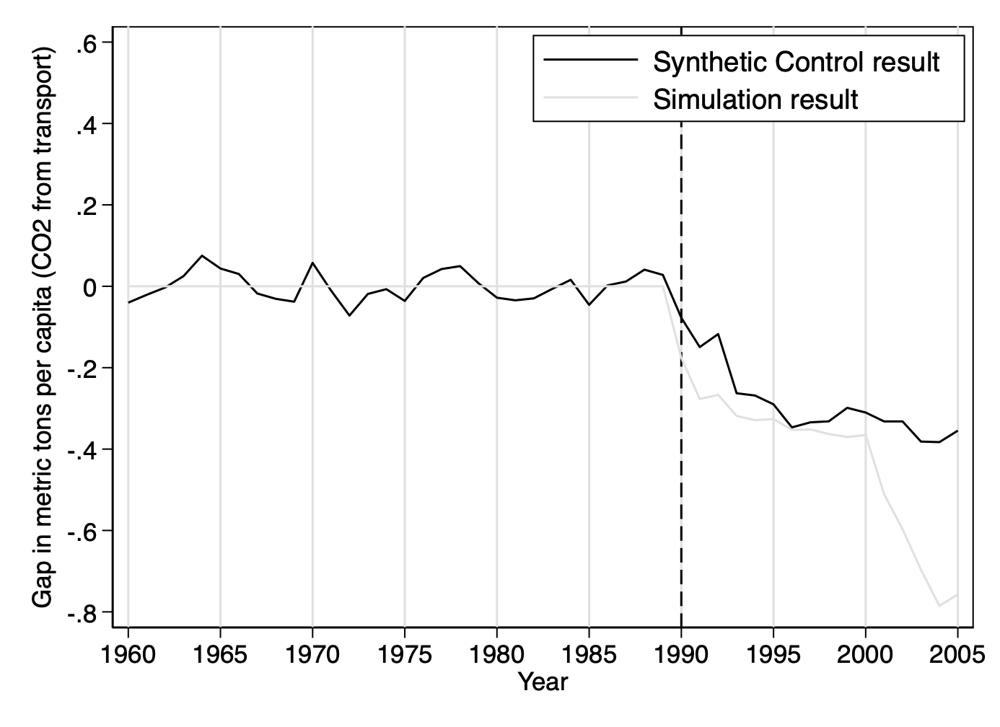

## Carbon Taxes and CO2 Emissions: Sweden as a Case Study

Andersson, J. (2019). Carbon Taxes and CO2 Emissions: Sweden as a Case Study. *American Economic Journal: Economic Policy*, 11(4): 1–30. [https://doi.org/10.1257/pol.20170144]

<a href="resources/Resources_NO_LB_AB/DoFile_NO_LB_AB.do" target="_blank">[Download Do-File corresponding to the explanations below]</a> <a href="resources/Resources_NO_LB_AB/codebook_NO_LB_AB.pdf" target="_blank">[Download Codebook]</a>

 <a href="https://www.aeaweb.org/journals/dataset?id=10.1257/pol.20170144" target="_blank">[Link to the full original replication package paper from AEA web]</a>


### Highlights {-}

- The paper examines the impact of Sweden’s carbon tax on CO₂ emissions from the transport sector over the period ranging from 1990 to 2005.

- J. Andersson uses **the synthetic control method** to address concerns in regards to endogeneity due to the presence of unobservables affecting both Sweden’s CO₂ emissions and the implementation of the taxation policy.

- This methodology works well for comparative case studies, as **it compares Sweden to other countries by creating a “synthetic Sweden”**. The author does this by combining a weighted mix of OECD countries that share similar characteristics with Sweden before the tax was introduced, but that did not adopt carbon taxes themselves. This synthetic version gives a realistic counterfactual of what Sweden’s emissions may have looked like without the carbon tax.

- Our contribution to the original replication package is the documentation and detailed explanation of the provided code, making it easier for other researchers to follow and understand. We also show step-by-step guidance on the extraction of the main tables and figures directly from the Stata code. This allows users to generate all key outputs and adapt them as needed. 

- A key element of this replication consists in integrating **Newey-West standard errors** ( to account for serial correlation and heteroscedasticity in time series data) and **IV techniques**, adding robustness to causal inference. Instead of focusing solely on the treatment and control group comparisons typical in synthetic control analysis.

- Throughout this replication exercise, we provide a detailed explanation of the original replication package. You will be able to become familiar with many STATA tricks, including: 
  - How to create figures and plots using graph, line, and twoway 
  - How to present your results in academic tables, by using the packages estout, ivreg2, outreg2, and ranktest
  - How to create regression models using ivregress and regress
  - How to handle potential autocorrelation and heteroskedasticity in time series data by using the Newey-west command
  - How to manipulate data to generate new variables using egen, label variables using label, and merge datasets using merge
  - How to visualize your data using descriptive statistics including tabulate, describe, summarize, and correlate.

### Introduction

"Carbon Taxes and CO₂ Emissions: Sweden as a Case Study" explores the effectiveness of carbon taxes in reducing greenhouse gas emissions, focusing on Sweden’s groundbreaking carbon tax policy introduced in 1991. Using **Sweden as a natural experiment**, the study investigates whether carbon taxes can significantly lower emissions without hindering economic growth.  

Andersson employs a **quasi-experimental design** within **an event study framework to evaluate the policy's impact**. This approach analyzes changes in Sweden's CO₂ emissions over time, comparing the period before and after the tax's implementation. The study further enhances its analysis with the **synthetic control method**, which constructs a **counterfactual** scenario by combining data from other European countries that did not adopt similar policies. This **synthetic control** provides a benchmark to estimate what Sweden’s emissions trajectory might have been in the absence of the tax.  

By combining these methods, the study ensures **robust results**, effectively isolating the specific impact of the carbon tax while addressing potential confounding factors. This dual approach highlights the causal relationship between Sweden’s carbon tax and its success in reducing emissions.

The study utilizes **panel data** on CO₂ emissions, economic indicators, and policy variables from Sweden and other European countries spanning several decades. Emissions data is sourced from national and international **databases**, ensuring consistency and comparability across countries. Economic variables, such as GDP growth, are included to examine the broader impacts of the carbon tax on Sweden’s economy. Additionally, data on energy prices and sector-specific emissions are used to control for other factors influencing emissions and to identify the policy's sectoral effects.To strengthen the causal inference, the **synthetic control** method is used. This method constructs a counterfactual for Sweden by creating a **weighted combination** of other European countries that did not implement a similar carbon tax.  

The study concludes that Sweden’s carbon tax significantly reduced CO₂ emissions, particularly in sectors directly targeted by the policy, such as transportation and heating. Importantly, these reductions occurred without stalling economic growth, demonstrating that ambitious climate policies can coexist with economic stability. By effectively isolating the impact of the tax, the research provides strong evidence supporting carbon taxes as a powerful and practical tool for reducing greenhouse gas emissions. Sweden’s experience serves as a valuable model for other countries aiming to achieve substantial emission reductions through market-based climate policies.

### Identification strategy

When using the Difference-in-Difference (DiD) estimator in comparative case studies, it’s important to consider some key assumptions to ensure the identification of robust accurate results. The most critical is the **parallel trends assumption**, which suggests that, without the treatment, the treated unit and the control group would have followed similar trends in the outcome over time. This assumption is what allows the DiD method to account for unobserved factors that might otherwise skew the results. In the case of CO₂ emissions, this means that without Sweden’s carbon tax and VAT, emissions in Sweden and the control group would have followed parallel paths. While it’s possible to check this assumption by analyzing pretreatment trends, it’s impossible to verify fully after the treatment has occurred. 

If the treated unit and the control group don’t share a similar trend, the DiD estimates can end up biased.
The attractiveness of using the synthetic control method relies on the fact that it provides a way to overcome this limitation. Unlike the DiD estimator, which uses a simple average of the control group, the synthetic control approach creates a **weighted combination of control units** that closely match the treated unit in terms of key predictors as well as pretreatment trends. This flexibility allows it to account for differences that might change over time, making it a stronger tool for comparative case studies. For example, when analyzing the effects of Sweden’s carbon tax and VAT on transport sector emissions, the synthetic control method creates a better counterfactual by closely mimicking Sweden’s emissions patterns before the policy was introduced. This helps address the weaknesses of the DiD method and provides more reliable results.

### From the article to practice: exploring the replication code
#### Getting started: database access and required packages
To open the Stata database and run the lines of code, the user needs to download and install various packages. In this section, we will show you step-by-step how to access the database and why these packages are necessary. First, download the original dataset from a link provided. Then, run the initial lines of code to create a shorter version of the dataset. We also provide a codebook (see the header) to help you understand it.

***Open the database*** 
*download and save the replication package dataset zip from: https://www.aeaweb.org/journals/dataset?id=10.1257/pol.20170144

*you should find nine datasets once you open the downloaded zip: carbontax_data.dta, carbontax_fullsample_data.dta, disentangling_regression_data.dta, tax_incidence_data.dta, descriptive_data.dta, fullsample_figures.dta, Table3.dta, leave_one_out_data.dta, and disentangling_data.dta

*define your working directory, where you also just stored the dataset

``` {.Stata language="Stata" numbers="none"}
clear mata
capture log close
clear
clear all
set more off

cd "C:\Users\" /*C:\Users\ = path where you also store the dataset*/
For example: 

use "/Users/alicebrossard/Desktop/Replication Project STATA/data/disentangling_regression_data.dta", clear 
describe 
browse 
``` 
Subsequently, several Stata packages are necessary to execute the replication code successfully:

- The first package needed is the `estout` package. This package allows to make regression tables using regressions previously stored in the Stata memory. 

- The second package required is the `ivreg2` package. This package allows to run instrumental variables regressions.

- The third package is the `ranktest` package. This package is used for non-parametric statistical tests, which rely on the ranks of data instead of the actual values.This makes it great for comparing groups or analyzing relationships when your data contains outliers. For example, you can use it to test if two groups have different medians or to analyze repeated measurements over time.

All the packages can be installed using the following lines of code.

***Install the required packages***
``` {.Stata language="Stata" numbers="none"}
ssc install estout
ssc install ivreg2
ssc install ranktest
``` 

####  Importing specific datasets 
To **replicate Descriptive Figures**: Figure 3 and Figures 11-12 of the paper, you will need to download the original dataset, descriptive_data.dta, from the original replication package.

In order to do so, follow these steps:

1. Set up your directory and import your dataset on your STATA board:
For example: 
``` {.Stata language="Stata" numbers="none"}
use "/Users/alicebrossard/Desktop/Replication Project STATA/data"
import delimited "descriptive_data.dta", clear

2. Load the dataset:
use "descriptive_data.dta", clear
describe 
``` 

To **replicate the main results** that disentangle the Carbon Tax and VAT, you will need to download the original dataset, disentangling_regression_data.dta, from the original replication package. This specific dataset is used to replicate Table 3, while the dataset disentangling_data.dta is used to replicate complementary Figure 14. 

In order to do so, follow these steps:

1. Set up your directory and import your dataset on your STATA board:
For example:
``` {.Stata language="Stata" numbers="none"}
use "/Users/alicebrossard/Desktop/Replication Project STATA/data"
import delimited "disentangling_regression_data.dta", clear

2. Load the dataset:
use "disentangling_regression_data.dta", clear
describe 
``` 
### Descriptive Statistics : Figure 3 and Figures 11-12 

**Use the dataset "descriptive_data.dta"**

**Figure 3: CO2 Emissions per capita, Sweden vs OECD average**
``` {.Stata language="Stata" numbers="none"}
twoway (line CO2_Sweden year if inrange(year, 1960, 2005), lwidth(medium) lcolor(black)) ///
       (line CO2_OECD year if inrange(year, 1960, 2005), lpattern(dash) lwidth(medium) lcolor(black)) ///
       , ytitle("Metric tons per capita (CO2 from transport)") xtitle("Year") ///
       legend(order(1 "Sweden" 2 "OECD sample")) ///
       yscale(r(0 3)) xscale(r(1960 2005)) xline(1990, lpattern(dash)) ///
       text(1981 1 "VAT + Carbon tax", place(e))
``` 


- **Figure 3** will help you understand how to optimize the `twoway` command, which is used to combine multiple layers of plots to visually identify plot trends. 
- In our replication, we use it to plot CO2 emissions (metric tons) for Sweden and an OECD sample from 1960 to 2005. We use `twoway` to specify that a graph will be drawn with one or more "layers" of plots, which we enclose using parentheses:

  - You will first use the `line` command to draw the line plots using the format `line y_variable x_variable [if condition], [options]`. For instance, our first line starts with the variable on the Y-axis, `CO2_Sweden` (CO2 emissions for Sweden), followed by the variable on the X-axis, `year` (time, 1960 to 2005), with a specification using the command `if inrange(year, 1960, 2005)` to make sure only data from the years 1960-2005 is included. You then set the line width to "medium" for better visibility using `lwidth(medium)`, and the line color to black using `lcolor(black)`.

  - To create a second plot for `CO2_OECD`, you should apply the same step-by-step logic, adding the command `lpattern(dash)` to specify that you would like a dashed line instead of a solid one, which we used in our first line plot for Sweden.

  - To visually structure your figure, you should use the `ytitle` command, specified here `ytitle("Metric tons per capita (CO2 from transport)")`, to label the Y-axis, while adding the command `xtitle("Year")` to label your X-axis. 
   
   - You should make sure to scale both axes using `yscale(r(0 3))` to restrict the Y-axis range from 0 to 3 metric tons per capita, and `xscale(r(1960 2005))` to set the X-axis range from 1960 to 2005. This command ensures your graph uses the same scale across multiple graphs if you are to compare different groups, without misleading axis differences. To customize an ordered legend, you can use the `legend(order(1 "Sweden" 2 "OECD sample"))` command, which labels the first line as "Sweden" and the second as "OECD sample." 

  - Finally, You can add a vertical dashed line at a specific impactful year, here 1990, using the `xline(1990, lpattern(dash))` command. To add context, in our case "VAT + Carbon tax", you can use the text command `text(1981 1 "VAT + Carbon tax", place(e))`, which positions the annotation at the coordinates (1981, 1) and makes sure it does not overlap with other elements using `place(e)`. 

**Figure 11: GDP per capita, Sweden vs Synthetic Sweden**
``` {.Stata language="Stata" numbers="none"}
twoway (line GDP_Sweden year if inrange(year, 1960, 2005), lwidth(medium) lcolor(black)) ///
       (line GDP_Synthetic_Sweden year if inrange(year, 1960, 2005), lpattern(dash) lwidth(medium) lcolor(black)) ///
       , ytitle("GDP per capita (PPP, 2005 USD)") xtitle("Year") ///
       legend(order(1 "Sweden" 2 "Synthetic Sweden")) ///
       yscale(r(0 35000)) xscale(r(1960 2005)) xline(1990, lpattern(dash)) ///
       text(1981 10000 "VAT + Carbon tax", place(e))
``` 


- Now that you have the necessary tools to build multiple layers of plots using `twoway`, you can replicate your code from Figure 3 and apply it to Figure 11.

- **Figure 11** essentially shows that GDP per capita in Sweden and its synthetic counterpart track each other similarly during the 30 years before and 16 years after treatment. 

  - The innovation in Figure 11 revolves around the scalar command. As in Figure 3, the `xscale(r(1960 2005))` limits the X-axis to the years 1960-2005, keeping the focus on the relevant time period and avoiding extra space. The `yscale(r(0 35000))` however changes here, setting the Y-axis from 0 to 35,000 to include the highest GDP per capita values (in PPP-adjusted 2005 USD) without cutting off or crowding the data. You must remain attentive to the specifications in your dataset, to make sure your variables align with your chosen axis ranges correctly.

**Figure 12: Gap in CO2 emissions and GDP per capita**
Set your graph options:
``` {.Stata language="Stata" numbers="none"}
set scheme s2mono

twoway (line gap_CO2_emissions_transp year, lcolor(black)) ///
       (line gap_GDP year, lcolor(gs8) yaxis(2)), ///
       ytitle("Gap in metric tons per capita (CO2 from transport)") ///
       ylabel(-0.4(0.2)0.4) ///
       ytitle("Gap in GDP per capita (PPP, 2005 USD)", axis(2)) ///
       ylabel(-2000(1000)2000, axis(2)) ///
       xtitle("Year") ///
       xlabel(1960 1970 1980 1990 2000) ///
       xline(1990, lpattern(dash) lcolor(black)) ///
       legend(order(1 "CO2 Emissions (left y-axis)" 2 "GDP per capita (right y-axis)"))

*`gap_CO2_emissions_transp`
twoway line gap_CO2_emissions_transp year, lcolor(black) ///
       ytitle("Gap in metric tons per capita (CO2 from transport)") ///
       xtitle("Year")
       
twoway (line gap_CO2_emissions_transp year, lcolor(black)) ///
       (line gap_GDP year, lcolor(gs8) yaxis(2)), ///
       ytitle("Gap in metric tons per capita (CO2 from transport)") ///
       ytitle("Gap in GDP per capita (PPP, 2005 USD)", axis(2)) ///
       xtitle("Year")
```       



- **Figure 12** illustrates the correlation between the gaps in GDP per capita and CO2 emissions from transport for Sweden and its synthetic counterpart. It provides a comparison of the effects of two major recessions in Sweden during the sample period: the first in 1976–1978, and the second in 1991–1993. 

- In Figure 12, the command `set scheme s2mono` is used at the beginning of our code to change the default appearance of the graph to a monochrome color scheme. You will find this command helpful in the redaction of academic papers, printed documents, or presentations, because using color schemes like `s2mono` helps maintain focus on the data itself, rather than the colors. 

  - You can then set the color of your lines accordingly, making your first line, for CO2 emissions here, black `(lcolor(black))`, and your second, for GDP here, gray `(lcolor(gs8))`, maintaining a simple yet effective visual differentiation without the use of bright colors.
  

- One of the key innovations here is the use of dual y-axes. This approach makes it easier for you to compare two variables with different units and scales without needing separate graphs, while still showing their relationship across the same time. The left y-axis is used for the CO2 emissions gap `gap_CO2_emissions_transp`, while the right y-axis is reserved for the GDP per capita gap, `gap_GDP`. 

- In line with the logic applied in Figures 3 and 11, you can label your first Y-axis, here for CO2 emissions, with  `ytitle("Gap in metric tons per capita (CO2 from transport)") `, while your second for GDP is named  `ytitle("Gap in GDP per capita (PPP, 2005 USD)", axis(2)) `. 

  - You can then apply the  `ylabel(-0.4(0.2)0.4) ` command to define the tick marks for the first Y-axis, ranging from -0.4 to 0.4 in steps of 0.2, and ylabel(-2000(1000)2000, axis(2)) ` for the second Y-axis, ranging from -2000 to 2000 in steps of 1000. This ensures each variable fits well within its own scale.

  - The `axis(2)` option is used in Stata to specify that `gap_GDP` should be applied to the second Y-axis, rather than the default first Y-axis. This will be helpful to help you distinguish the two variables clearly while in the same graph.
 
### Main Results: Table 3 and Figure 14
**Use the dataset "disentangling_regression_data.dta"**

**Table 3: Estimation Results from Gasoline Consumption Regressions**
``` {.Stata language="Stata" numbers="none"}
use "disentangling_regression_data.dta", clear
describe 
tsset year

eststo clear
eststo: newey log_gas_cons real_carbontaxexclusive_with_vat real_carbontax_with_vat d_carbontax t, lag(16)
eststo: newey log_gas_cons real_carbontaxexclusive_with_vat real_carbontax_with_vat d_carbontax t real_gdp_cap_1000, lag(16)
eststo: newey log_gas_cons real_carbontaxexclusive_with_vat real_carbontax_with_vat d_carbontax t real_gdp_cap_1000 urban_pop, lag(16)
eststo: newey log_gas_cons real_carbontaxexclusive_with_vat real_carbontax_with_vat d_carbontax t real_gdp_cap_1000 urban_pop unemploymentrate, lag(16)
eststo: ivregress 2sls log_gas_cons (real_carbontaxexclusive_with_vat=real_energytax_with_vat) real_carbontax_with_vat d_carbontax t real_gdp_cap_1000 urban_pop unemploymentrate, vce(hac bartlett opt)
eststo: ivregress 2sls log_gas_cons (real_carbontaxexclusive_with_vat=real_oil_price_sek) real_carbontax_with_vat d_carbontax t real_gdp_cap_1000 urban_pop unemploymentrate, vce(hac bartlett opt)

esttab, r2 label mtitles("OLS" "OLS" "OLS" "OLS" "IV(EnTax)" "IV(OilPrice)") se(3) star(* 0.10 * 0.05 ** 0.01)

** p-value b1=b2
test real_carbontaxexclusive_with_vat = real_carbontax_with_vat

* Instrument F-statistic and testing for weak instruments
gen rctewvat= real_carbontaxexclusive_with_vat
ivreg2 log_gas_cons (rctewvat = real_energytax_with_vat ) real_carbontax_with_vat d_carbontax t real_gdp_cap_1000 urban_pop unemploymentrate  , bw(auto) robust first
ivreg2 log_gas_cons (rctewvat = real_oil_price_sek ) real_carbontax_with_vat d_carbontax t real_gdp_cap_1000 urban_pop unemploymentrate  , bw(auto) robust first 

* Estimated elasticities, using results from column (4)
newey log_gas_cons real_carbontaxexclusive_with_vat real_carbontax_with_vat d_carbontax t real_gdp_cap_1000 urban_pop unemploymentrate , lag(16)
margins, dyex(real_carbontax_with_vat real_carbontaxexclusive_with_vat) at(real_carbontax_with_vat=8.478676 real_carbontaxexclusive_with_vat=8.478676)
``` 




**Columns 1 through 6** in the table represent different econometric specifications, combining Ordinary Least Squares (OLS) and Instrumental Variables (IV) regressions to investigate the impact of carbon taxes on gas consumption.

- These models build on a quasi-experimental framework, leveraging both direct estimates and instrumental variable techniques to isolate causal effects. 

- The dependent variable in all regressions is the natural logarithm of gas consumption `log_gas_cons` “Gasoline Consumption Regressions”, while the key explanatory variable,`real_carbontaxexclusive_with_vat` “Gas Price with VAT” is central to understanding the role of carbon taxes in influencing gas usage. By varying the inclusion of control variables and introducing instruments, the table presents a nuanced exploration of the data.

**Model Specifications**

- The first four columns employ OLS regressions with Newey-West standard errors to account for autocorrelation and heteroscedasticity. 

- **Column 5** and **Column 6** both adopt an Instrumental Variable (IV) to address potential endogeneity in the variable  `real_carbontaxexclusive_with_vat`. The use of IVs – `real_energytax_with_vat` (Column 5) and `real_oil_price_sek` (Column 6) – strengthens causal inference by isolating exogenous variation in the key explanatory variable. The specification also includes heteroscedasticity- and autocorrelation-consistent (HAC) standard errors, calculated with a Bartlett kernel.

**Estimation Process**

- The analysis begins with the `eststo clear` command, resetting previously stored estimations to ensure a clean workspace. Regressions are then performed using the `newey` function for OLS models and `ivregress 2sls` for IV models. The lag structure in Newey-West regressions `lag(16)` ensures robustness by accounting for potential autocorrelation over 16 periods. For IV regressions, the `vce(hac bartlett opt)` option calculates standard errors using the Bartlett kernel with optimal bandwidth selection, ensuring consistency and efficiency.

- In all models, the dependent variable `log_gas_cons` is regressed on a combination of explanatory variables, with progressively added controls providing insight into how the inclusion of economic and demographic factors affects the estimated relationships. The table uses `eststo` to store results for each regression and summarizes them using `esttab`.

#### Instrumental Variable Approach and Weak Instrument Tests

- Columns 5 and 6 focus on addressing endogeneity in the carbon tax variable. To assess instrument strength, the code employs the `ivreg2` command with the `first` option, which outputs the first-stage F-statistic. This step is crucial for testing the validity of the instruments, as weak instruments can lead to biased IV estimates. The chosen instruments `real_energytax_with_vat` and `real_oil_price_sek` provide exogenous variation, allowing the analysis to disentangle the causal impact of carbon taxes on gas consumption.

This code offers some distinct features that could be interpreted as complementary to or extending synthetic control approaches and are applied in Table 3:

- **The Use of Newey-West Standard Errors**: `Newey` used in the first 4 columns:

Instead of focusing solely on the treatment and control group comparisons typical in synthetic control analysis, this code uses **Newey-West** standard errors to handle potential autocorrelation and heteroskedasticity in time series data. This is particularly important for robustness when working with longitudinal data over multiple years.

Traditional standard error estimation assumes that:

- Residuals are independent and identically distributed (i.i.d.):The errors are uncorrelated across observations and have constant variance (homoscedasticity).
- No autocorrelation exists: Residuals from one observation are not systematically related to residuals from others.

**When to Use the Newey-west command:**

- When working with cross-sectional data where the assumption of i.i.d. errors is reasonable.
- If residuals are uncorrelated across time or units (no serial correlation).

**Key Features:** 

- **Lag Structure:** 
Newey-West requires specifying a lag length `lag(16)` in the code, representing the maximum distance across which residuals are assumed to be correlated.
- **HAC (Heteroscedasticity and Autocorrelation-Consistent):**
The method constructs standard errors that remain valid under general forms of heteroscedasticity and autocorrelation.
- **Kernel Weighting:**
Residuals beyond the specified lag length are down-weighted using a kernel function.

**Why do we use Instrumental Variables in columns 5 and 6 (ivregress 2sls and ivreg2) ?**

- The use of **Instrumental Variables (IV)** in columns 5 and 6, alongside a synthetic control methodology, is somewhat unconventional. 

- Typically, the **synthetic control method (SCM)** is a standalone tool used to construct a counterfactual for a treated unit without explicitly requiring instruments, Synthetic control methods typically rely on weighted averages of untreated units to construct a counterfactual for the treated unit. Here, the code introduces instrumental variables (IV) to address endogeneity concerns, leveraging instruments like real_energytax_with_vat and real_oil_price_sek. This hybrid approach (combining regression and IV techniques) could be seen as an innovation relative to standard synthetic control frameworks to bring more robustness 

- Using IV methods in conjunction with synthetic control methodologies is **not common practice**, but it is an emerging area of research, When **confounding factors** are suspected to bias the construction of the synthetic control (concerns that the synthetic control weights or the pre-treatment trends are influenced by endogenous factors (e.g., omitted variables like energy prices)), IV helps correct for this bias.

- The inclusion of these IV estimations alongside SCM ensures that the results are robust and account for potential biases not addressed by synthetic control alone. This combination demonstrates methodological innovation, bridging SCM's strength in constructing counterfactuals with IV's ability to address endogeneity. Additionally a **Complementarity**, SCM provides a framework for comparison, while IV ensures unbiased estimates under endogenous treatment variables.

- The use of Tests for Weak Instruments and Parameter Comparisons `test` and `ivreg2`:
The code evaluates the strength of IVs and performs parameter tests, which adds robustness checks typically absent in straightforward synthetic control implementations.Generally, this framework complements the synthetic control methodology bringing additional econometric rigor and flexibility.

#### Modelling Figure 14

**Creating data set disentangling_data.dta used for Figure 14**

* First, we predict gasoline consumption using the full model
``` {.Stata language="Stata" numbers="none"}
newey log_gas_cons real_carbontaxexclusive_with_vat real_carbontax_with_vat d_carbontax t real_gdp_cap_1000 urban_pop unemploymentrate , lag(16) 
predict yhat

* Second, we predict gasoline consumption without the carbon tax 

preserve
newey log_gas_cons real_carbontaxexclusive_with_vat real_carbontax_with_vat d_carbontax t real_gdp_cap_1000 urban_pop unemploymentrate , lag(16)
replace d_carbontax=0
replace real_carbontax_with_vat=0
predict yhat_nocarb
restore

* Third, we predict emissions without the carbon tax and without the VAT

preserve
newey log_gas_cons real_carbontaxexclusive_with_vat real_carbontax_with_vat d_carbontax t real_gdp_cap_1000 urban_pop unemploymentrate , lag(16)
replace real_carbontaxexclusive_with_vat= real_carbontaxexclusive
replace d_carbontax=0
replace real_carbontax_with_vat=0
predict yhat_nocarb_novat
restore
``` 

The predictions are a crucial part of the synthetic control in this paper and for the econometric evaluation methodology. They enable the creation of **counterfactual outcomes** to isolate and measure the effects of the carbon tax and VAT on gasoline consumption.

**Counterfactual Analysis:**

- These predictions create what-if scenarios that allow us to measure the effects of policies:
   - Without the carbon tax.
   - Without the carbon tax and VAT.
- Comparing actual consumption `(yhat)` to these counterfactuals isolates the causal effects.

**Decomposition of Effects:**

- By generating multiple counterfactuals:
   - `yhat_nocarb` measures the effect of the carbon tax alone.
   - `yhat_nocarb_novat` measures the combined effect of the carbon tax and VAT.
- This helps disentangle the contributions of each policy.


**Figure 14: Gap in Per Capita CO2 Emissions from Transport: Synthetic Control versus Simulation**
``` {.Stata language="Stata" numbers="none"}
use "disentangling.dta", clear

list year CO2_reductions_simulation CO2_reductions_synth in 1/46

* Here I Create the graph with CO2 reductions for both Synthetic Control and Simulation
twoway (line CO2_reductions_synth year, lcolor(black) lwidth(medium)) /// 
       (line CO2_reductions_simulation year, lcolor(gs14) lwidth(medium)), /// 
       xlabel(1960(5)2005, grid) ylabel(-0.8(0.2)0.6, angle(horizontal)) /// 
       xtitle("Year") ytitle("Gap in metric tons per capita (CO2 from transport)") ///
       yscale(range(-0.8 0.6)) /// 
       xline(1990, lpattern(dash) lcolor(black) lwidth(medium)) ///
       legend(label(1 "Synthetic Control result") label(2 "Simulation result") position(2) ring(0) col(1) size(medium))


twoway (function y=-0.845, range(2000 2004.9) lcolor(gs15) fcolor(gs15) lwidth(none)) ///
       (function y=0, range(1960 2005) lpattern(dash) lcolor(black) lwidth(medium)) ///
       , addplot (scatter 0 1987, msymbol(none) mcolor(black)) ///
       addplot (scatter 0 1989, msymbol(none) mcolor(black)) ///
       addplot (line 0.3 1987 1989, lcolor(black) lpattern(solid) lwidth(medium)) ///
       text(1981 0.3 "VAT + Carbon tax", size(medium) color(black))
``` 


- **Figure 14** illustrates the reduction in CO₂ emissions in the transport sector in Sweden, comparing estimates from the synthetic control method and the simulation, which align closely before the introduction of the carbon tax but diverge significantly afterward.

**Why should you use a Pre-Intervention Fit?** 

Drawing the synthetic control **before 1990** is a standard and critical practice when implementing the Synthetic Control Method (SCM). The reasons for doing so:

   - **Pre-Intervention Fit:**
       - Showing the synthetic control **before the intervention (pre-1990)** demonstrates how well the synthetic control matches the treated unit during the pre-policy period. A good pre-policy fit increases confidence that the synthetic control represents a valid counterfactual.``

   - **Validation of the Counterfactual:**
       - By comparing the pre-1990 trajectory of the observed outcome (e.g., CO2 emissions) to that of the synthetic control, we can visually assess whether the method correctly estimates what would have happened in the absence of the policy.
       - If the lines for the actual and synthetic outcomes align well before the intervention, the synthetic control is validated as a reliable counterfactual.
       
   - **Benchmark for Causal Inference:**
      - The difference between the treated and synthetic control **after 1990** (post-policy period) is interpreted as the causal effect of the policy.
      - The pre-1990 comparison serves as a **baseline** to confirm there were no significant differences before the intervention, ensuring that observed gaps after 1990 are attributable to the policy, not pre-existing trends or selection issues.

**The Simulation Result Line**       

- The main innovation in this figure lies in the use of **simulation**, designed to isolate the specific effect of the carbon tax on CO₂ emissions. This approach is based on a theoretical model that projects emissions according to annual adjustments of the carbon tax, while assuming that other factors remain constant. The simulated reductions are estimated for each year by incorporating the actual variations in the carbon tax.

- **Why use simultaneously the SCM and the simulation?** 

  - it helps mitigate the weighting bias inherent in the SCM while avoiding reliance on the theoretical assumptions of the simulation, such as a constant price elasticity and invariant external factors, for the entirety of the analysis.

**Graph Customization:**

- One of the interesting aspects of the code in Figure 14 is the use of `msymbol(none)` to mark specific points, such as the years 1987 and 1989, while suppressing their visual display. This function allows you to mark precise textual annotations linked to these points without overloading the graph. 

- **Legend customization** is another important feature you can use, especially when it comes to keeping your graph clear and easy to read. Placing the legend in the top-right corner will involve using commands like `ring(0)` to prevent it from overlapping the plot, and `col(1)` to arrange the entries in a single column. 

---

**Authors:** Nicolás Ortega, Luna Baroni, and Alice Brossard, students in the [Master program in Development Economics and Sustainable Development ](https://economie-master-developmenteconomics.pantheonsorbonne.fr/) (2024-2025), Sorbonne School of Economics, Université Paris 1 Panthéon Sorbonne.

**Date:** December 2024
