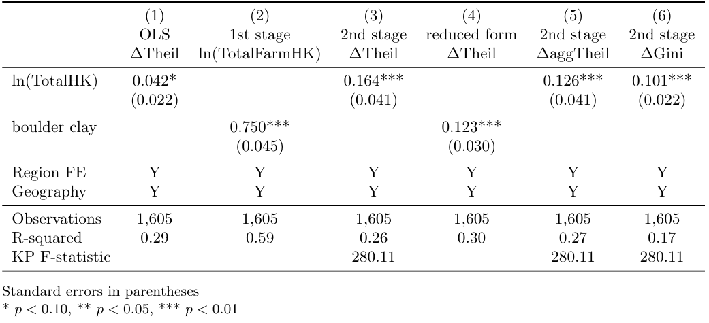
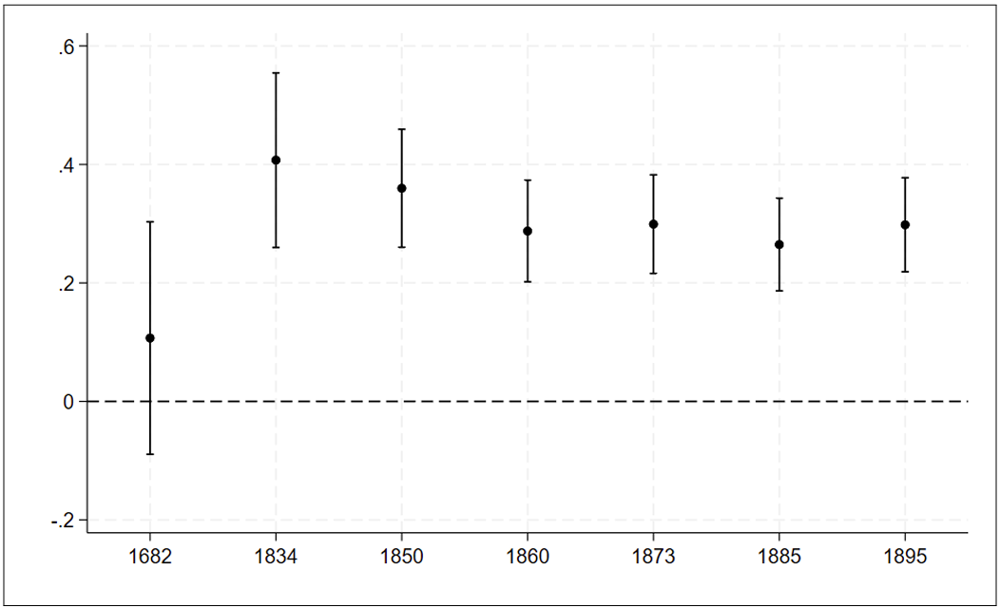
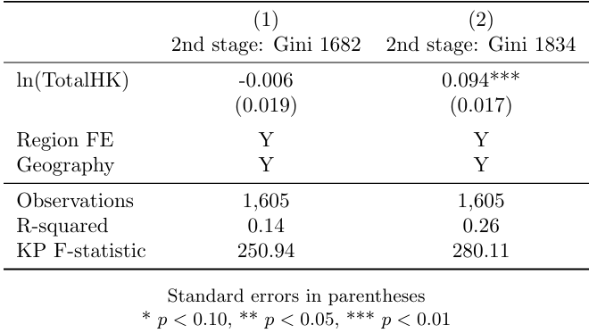
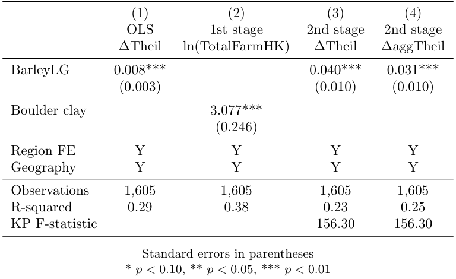

## Winners and losers from Agrarian Reform: Evidence from Danish land inequality 1682–1895

Authors and date of the replication: Auvray Adrien, Carette Anne-Laure, Tarlapan Alina - December 2023

### Highlights {-}

- Research question: What are the distributional effects of land reforms (1682-1895) in Denmark?

- Methodology: Instrumental Variable (IV), used to deal with endogeneity issues stemming from reverse causality between the variable of interest (land productivity) and the dependent variable (land inequalities).

- This methodology is standard by the choice of a geological instrument. It follows the usual steps of the IV procedure, including tests of the instrument’s pertinence (F-statistic of the 1st stage estimation).

- Our added value to the original replication package lies in the detailed explanation of the provided code. Additionally, we demonstrate how to extract various tables and figures directly from the Stata code. While the authors have created a well-realized replication package, our contribution enhances its accessibility and usability.

- Useful Stata tricks:
  - Diagnostic Statistics: We leverage the ‘estat firststage’ command to obtain diagnostic statistics pertaining to the first-stage of instrumental variable estimation, which includes extracting and storing the F-statistics for further analysis.
  - Looping: The ‘foreach’ loop structure is used, which enables the iteration over multiple years for instrumental variable regressions and allows to avoid repetitive commands in the code.
  - Advanced Formatting: Through the utilization of the ‘esttab’ command along with various formatting options, we create well-formatted tables, which results in the production of tables that are not only clear and organized but also visually appealing.
  
- Link to the paper: https://osf.io/jmn5y/?view_only=f18f6d51efe44f04abef6e9042c0163c

- Link to the replication package: https://doi.org/10.1016/j.jdeveco.2021.102813

### Introduction

As a rule, agrarian reforms are viewed as fundamental for economic
development, allowing, on one hand, to fuel agricultural productivity
and on the other, to reallocate the necessary productive resources to
industrialization. Their design has to fulfill two competing objectives:
**stimulating farms' productivity** and **ensuring an equitable access
to land**. As numerous reforms have been criticized for failing the
latter, this paper provides the first quantitative long-term assessment
of the Danish agrarian reforms' effects on both economic efficiency and
land inequalities. Rather efficiency-oriented, these reforms were
designed to support the owners of medium-sized farmers and were
therefore detrimental to smallholders and landless agricultural
laborers. As land inequalities became more stringent in the most fertile
areas, the objective of the paper is to find the underlying mechanisms
of these patterns and more specifically, the role of agrarian reforms in
this context.

To do so, the authors combine several sources of historical data on
farms at the parish level with population and agricultural censuses to
cover the 1682- 1895 period and enhance the robustness and depth of
their analysis. The utilization of a singular, extensive dataset allows
for a thorough examination of long-term land inequality trends and
patterns, including nuances and variations that might be overlooked in
studies with more limited or less comprehensive datasets. The authors'
access to a unique dataset positions their study as a valuable
contribution to the literature on historical agrarian economies,
providing nuanced perspectives that contribute to a broader
understanding of the subject matter. The authors opted for the use of
the Theil index to measure land inequality due to its analytically
desirable properties. One key advantage is that the Theil index adheres
to the principle of transfers, ensuring that a redistribution from one
individual to a less affluent one results in a proportional decline in
the Theil index, which is particularly convenient for focusing on
changes in inequalities over time. Moreover, the Theil index provides
unambiguous rankings of distributions, ensuring that two regions with
identical Theil indices exhibit identical income distributions. This is
not guaranteed by other common measures such as the Gini index. The
preference for the Theil index would allow for a higher precision and
interpretability of their findings.

From an econometric point of view, the most obvious approach would be to
regress changes in parish-level land inequalities on a measure of soil
productivity -- Total HK, translated as "barrels of hard grain" -- and
some geographical characteristics of the parish, as well as regional
fixed effects. Nonetheless, such a specification would be exposed to
endogeneity issues, due to the reverse causality between the explained
variable (evolution in land inequalities) and the variable of interest
(land productivity): as higher agricultural productivity leads to
Malthusian dynamics, in parishes with more fertile soils, there would be
more smallholders and landless individuals, whose socio-economic status
would be deteriorated by the reforms. Consequently, areas with a higher
agricultural productivity were more exposed to rises in land
inequalities. At the same time, population growth has beneficial effects
on innovation and thus, agricultural productivity. To tackle this, the
authors adopt an IV strategy and choose as an instrument for land
productivity the distribution of "Boulder Clay", the sediment type most
adapted to barley, resulting from the Weichselian glaciation. Geological
variables are generally viewed as reliable instruments, since they
capture long-term determinants of development that are independent from
human factors.

### Identification strategy

When deciding to use a 2SLS strategy, several points need to be
discussed in order to allow the identification of robust causal effects.
The first hypothesis to be considered and which cannot be tested
statistically is the **exclusion restriction**. It is necessary to rule
out any direct effect of the instrument (boulder-clay) on the dependent
variable (land inequalities). In this specific case, it can be assumed
that soil composition doesn't directly affect the level of land
inequalities. In fact, the authors argue that the rise of inequalities
is driven by a stronger demographic growth, due to the productive
capacity of the land. This implies, beside the soil fertility, adequate
land management practices and efficient agricultural technologies. The
authors also have to exclude any effect of the dependent variable on the
instrument. Here, once again, land inequalities and the soil fertility
seem to be unrelated, as the soil's share of boulder clay stems from the
Weichselian glaciation, which occurred approximately 18,000 years ago.
Moreover, the sediment classification they use was made below the impact
area of cultivation practices and technologies, which allows to infirm a
potential effect of inequalities on this measure of land fertility.

The second hypothesis to be respected is the **instrument's relevance**.
The authors need to convincingly describe how the instrument affects the
endogenous variable. In our case, the soil composition represents a key
determinant of the land's productivity and thus is supposed to be
positively correlated with the total production of an area measured by
the variable TotalHK. Unlike the aforementioned exclusion restriction,
this assumption can be tested statistically. It can be done, for
instance, by verifying whether after estimating the first-stage
specification (1), the coefficient of the instrumental variable is
statistically significant or whether the F-statistic is superior to the
conventionally fixed value of 10.\

\begin{equation}
\tag{1}
ln(TotalHK)_{p}=α_{0}+βBoulderClay_{p}+λ_{r}+X_{p}γ+ϵ_{p} 

\end{equation}

As we can see in column 2 of Table 1, the effect of the soil composition
on total production is statistically significant at 1% level. Also, the
value of the F-statistic is equal to 280. Hence, we can conclude that
both steps necessary to ensure the relevance and the exogeneity of the
instrument have been fulfilled. That said, they further estimate the
second-stage specification (2).\

\begin{equation}
\tag{2}
ΔTheil_{p}=α_{0}+β\widehat{ln(TotalHK)}_{p}+λ_{r}+X_{p}γ+ϵ_{p}

\end{equation}

After estimating both the OLS and the second-stage IV specifications,
the authors find statistically significant positive effects of land
productivity on land inequalities during the agrarian reforms. To
ascertain the robustness of these findings, they estimate additional
specifications, using alternative measures of land inequalities -- such
as Gini index, an alternative to the Theil index -- and of land
productivity -- the amount of barley paid in tax. As no significant
change in the results was detected, we can conclude that the econometric
estimation allowed them to confirm their predictions, exposed in the
theoretical part of the paper. In the next part of our narrative, we
will discuss some of the main figures of the paper. We will also
indicate the necessary commands to replicate them using Stata.

### From the article to practice: exploring the replication code

#### Getting started: database access and required packages

In order to open the Stata database and execute the following lines of
code, several packages need to be downloaded and installed. In this
section, we guide you through the process of accessing the database and
briefly refer to these packages.\
The Stata code to open the database uses a global variable `dirData`
to store the path to the directory where the `"Dataset_AA_ALC_AT"`
database is located. Users can change the value of the `dirData`
variable based on the location of their own data directory. Thus, by
simply modifying the value of `dirData` to match their personal path,
the users can open the database without having to modify the rest of the
code. Subsequently, several Stata packages are necessary to execute the
replication code successfully.\
The first package needed is the **estout** package. This package allows
to make regression tables using regressions previously stored in the
Stata memory.\
The second package required is the **ivreg2** package. This package
allows to run instrumental variables regressions.\
The third package is the **coefplot** package. This package is used to
create coefficients plots which visually represent the estimated
coefficients and their confidence intervals.\
The fourth package is **outreg2**. This package is used to produce
illustrative tables of regression outputs. This package is able to write
LaTex-format tables.\
All the packages can be installed using the following lines of code.

#### **Stata code in order to access to the database and to install packages** 
``` {.Stata language="Stata" numbers="none" caption="Stata code in order to access to the database and to install packages"}
***Open the database***
global dirData "C:/Your Directory Here/" 
use "${dirData}Dataset_AA_ALC_AT", clear

***Install the required packages***
ssc install estout

ssc install ivreg2

ssc install coefplot

ssc install outreg2
```

#### Understanding the replication process: code analysis of Table 1

#### **Table 1: IV estimation using total HK and the share of parish area classified as boulder clay** {-}


``` {.Stata language="Stata" numbers="none" caption="Stata code for Table 1" label="lst:stata_code"}
***Table 1***

eststo clear

***Column (1) : OLS***
eststo ols1: qui reg D.Theil_c ln_TotalFarmHK ln_area LnDistCPH Lat Long LnDistCoast i.region if year==1834, vce(robust)

eststo ols2: qui reg D.AggTheil_c ln_TotalFarmHK ln_area LnDistCPH Lat Long LnDistCoast i.region i.year if year==1834, vce(robust)

***Column (2) : First-stage***
eststo fiv1: qui reg ln_TotalFarmHK MLmean ln_area LnDistCPH Lat Long LnDistCoast i.region if year==1834, vce(robust)

***Column (4) : Reduced form***
eststo ziv1: qui reg D.Theil_c MLmean ln_area LnDistCPH Lat Long LnDistCoast i.region if year==1834, vce(robust)

***Column (3) : Second-stage (with diffTheil)***
eststo ivdiff1: qui ivregress 2sls D.Theil_c ln_area LnDistCPH Lat Long LnDistCoast i.region (ln_TotalFarmHK = MLmean) if year==1834, vce(robust)
    estat firststage
    mat fstat = r(singleresults)
    estadd scalar Fstat = fstat[1,4] 

***Column (5) : Second-stage (with diffAggTheil)***
eststo ivdiff2: qui ivregress 2sls D.AggTheil_c ln_area LnDistCPH Lat Long LnDistCoast i.region (ln_TotalFarmHK = MLmean) if year==1834, vce(robust)
    estat firststage
    mat fstat = r(singleresults)
    estadd scalar Fstat = fstat[1,4] 
 
 ***Column (6) : Second-stage (with Gini)***
eststo ginihkdiff: qui ivregress 2sls D.Gini ln_area LnDistCPH Lat Long LnDistCoast i.region (ln_TotalFarmHK = MLmean) if year==1834, vce(robust)
    estat firststage
    mat fstat = r(singleresults)
    estadd scalar Fstat = fstat[1,4] 

***Formation of Table 1***
esttab ols1 fiv1 ivdiff1 ziv1 ivdiff2 ginihkdiff, se star(* 0.10 ** 0.05 *** 0.01) b(3) r2 var(15) model(12) wrap keep(MLmean ln_TotalFarmHK) mtitles("OLS" "first stage" "second stage (diffTheil)" "reduced form (diff Theil)" "second stage (diffAggTheil)" "second stage (diffGini)" ) stats(N r2 Fstat, labels("Observations" "R-squared" "KP F-statistic") fmt(%9.0fc 2 2)) indicate("Region FE = 2.region" "Geography = LnDistCPH" , labels(Y N)) label
```

##### OLS regressions by replicating the columns 1,2 and 4 of Table 1 {-}

``` {.Stata language="Stata" numbers="none" caption="First part of Stata code for Table 1" label="lst:stata_code" escapechar="\\%"}
***Table 1***

eststo clear

***Column (1) : OLS***
eststo ols1: qui reg D.Theil_c ln_TotalFarmHK ln_area LnDistCPH Lat Long LnDistCoast i.region if year==1834, vce(robust)

eststo ols2: qui reg D.AggTheil_c ln_TotalFarmHK ln_area LnDistCPH Lat Long LnDistCoast i.region i.year if year==1834, vce(robust)

***Column (2) : First-stage***
eststo fiv1: qui reg ln_TotalFarmHK MLmean ln_area LnDistCPH Lat Long LnDistCoast i.region if year==1834, vce(robust)

***Column (4) : Reduced form***
eststo ziv1: qui reg D.Theil_c MLmean ln_area LnDistCPH Lat Long LnDistCoast i.region if year==1834, vce(robust)
```

\

Columns 1, 2, and 4 of Table 1 represent two Ordinary Least Squares
(OLS) regressions, a first-stage, and a reduced form, respectively,
representing distinct stages through OLS regressions. These different
model specifications are often used in econometric analyses to examine
causal relationships between variables. These columns offer a
comprehensive understanding of underlying economic relationships and
allow for nuanced interpretation of results. The singular variable
differing across the two OLS regressions is the initial variable,
corresponding to the dependent variable: the change in the Theil index
from 1682 to 1834 `D.Theil_c` and the change in the Theil index of
1834 aggregated to the size categories of 1682 `D.AggTheil_c`,
respectively. In line with our approach of conducting both the
first-stage and the reduced form analyses, we introduce the instrumental
variable `MLmean` in the two last regression equations. The
replication process of these columns involves several crucial steps in
estimating econometric models.

Firstly, the use of the `eststo clear` command ensures a reset of
previous estimation results, creating a clean environment before running
new estimations. Subsequently, the inclusion of `qui` -- for quietly
-- with the `reg` -- for regress -- function allows for the temporary
storage of regression results in a named matrix, such as `ols1` in the
first model. Moreover, the model specification, denoted as
`D.Theil_c ln_TotalFarmHK ln_area LnDistCPH Lat Long LnDistCoast i.region`,
details the variables included in the regression equation. It is crucial
to note that this specification is essential for understanding the
relationships between key variables and the dependent variable -- here
`D.Theil_c` or `D.AggTheil_c`. Furthermore, the use of the
conditional `if year==1834` filters the data, retaining only
observations where the `year` variable is equal to 1834. This
filtering step enables a focus on a particular year -- here 1834 --,
allowing for a more targeted analysis. Finally, the `vce(robust)`
option is specified to estimate robust standard errors, thereby
addressing potential heteroskedasticity issues. These robust standard
errors are particularly important to ensure the reliability of
estimation results, especially when residuals exhibit heterogeneous
variations.

##### IV regressions by replicating columns 3,5 and 6 of Table 1 {-}

``` {.Stata language="Stata" numbers="none" caption="Second part of Stata code for Table 1" label="lst:stata_code"}
***Table 1***

***Column (3) : Second-stage (with diffTheil)***
eststo ivdiff1: qui ivregress 2sls D.Theil_c ln_area LnDistCPH Lat Long LnDistCoast i.region (ln_TotalFarmHK = MLmean) if year==1834, vce(robust)
    estat firststage
    mat fstat = r(singleresults)
    estadd scalar Fstat = fstat[1,4] 

***Column (5) : Second-stage (with diffAggTheil)***
eststo ivdiff2: qui ivregress 2sls D.AggTheil_c ln_area LnDistCPH Lat Long LnDistCoast i.region (ln_TotalFarmHK = MLmean) if year==1834, vce(robust)
    estat firststage
    mat fstat = r(singleresults)
    estadd scalar Fstat = fstat[1,4] 

***Column (6) : Second-stage (with Gini)***
eststo ginihkdiff: qui ivregress 2sls D.Gini ln_area LnDistCPH Lat Long LnDistCoast i.region (ln_TotalFarmHK = MLmean) if year==1834, vce(robust)
    estat firststage
    mat fstat = r(singleresults)
    estadd scalar Fstat = fstat[1,4] 
```

\

The columns 3, 5, and 6 which represent second-stages, are estimated
through instrumental variable regressions. Similar to OLS regressions,
the command `eststo ivdiff1 : qui` is used to store the estimation
results in a matrix named `ivdiff1`, ensuring an organized storage of
relevant information. Secondly, the function `ivregress 2sls` is
applied to conduct a two-stage IV regression, as indicated by `2sls`.
Additionally, the explanatory variables
`D.Theilc lnarea LnDistCPH Lat Long LnDistCoast i.region` mirror those
used in the OLS regressions, providing continuity in the model
specification. The only variable differing across each column
specification is the initial variable, corresponding to the dependent
variable : the change in the Theil index from 1682 to 1834 `D.Theilc`,
the change in the Theil index of 1834 aggregated to the size categories
of 1682 `D.AggTheilc`, and the change in the Gini coefficient instead
of the Theil index `D.Gini`, respectively. This nuanced change
reflects the distinct focus on different dependent variables in each
instance, while the remaining explanatory variables remain constant,
allowing for a systematic exploration of the impact of the selected
variables on the varied dependent variables. The inclusion of
`(lnTotalFarmHK = MLmean)` specifies the endogenous variable
`lnTotalFarmHK` and its instrument `MLmean`. This crucial
specification distinguishes the endogenous variable and its
corresponding instrument, a fundamental aspect of instrumental variable
estimation. Furthermore, to address heteroskedasticity and
autocorrelation, the `vce(robust)` command employs a robust
variance-covariance matrix, ensuring the reliability of standard errors
in the estimation.

The upcoming lines of code that we are about to describe initially
seemed somewhat unclear to us. However, despite the initial ambiguity,
they prove to be valuable and, upon closer examination, are now better
understood. This is why we will take the time to provide a clear
explanation of these lines. First, the line `estat firststage` is
employed to display statistics from the first-stage of the IV
regression. This step is typically utilized to assess the validity of
instruments and ascertain their suitability for the estimation process.
Secondly, storing the first-stage results in a matrix named 'fstat' is
accomplished through the line `mat fstat = r(singleresults)`. This
matrix captures relevant statistics from the first-stage, providing a
comprehensive view of the instrumental variable performance. Finally,
the line `estadd scalar Fstat = fstat[1,4]` introduces a new scalar
variable, `Fstat`, into the main regression results. This step allows
to extract the F-statistic from the first-stage matrix `fstat` and
assigns it to `Fstat`. The F-statistic is a crucial metric in
instrumental variable regression, serving as a diagnostic tool to assess
the overall validity of the instruments used. A high F-statistic, that
is superior to 10, suggests that the instruments collectively have a
strong explanatory power for the endogenous variable. In summary, these
lines of code are essential for evaluating the quality and relevance of
the instrumental variables employed in the two-stage IV regression.

##### Formatting Table 1, an additional but optional step {-}

``` {.Stata language="Stata" numbers="none" caption="Third part of Stata code for Table 1" label="lst:stata_code"}
***Table 1***

***Formation of Table 1***
esttab ols1 fiv1 ivdiff1 ziv1 ivdiff2 ginihkdiff, se star(* 0.10 ** 0.05 *** 0.01) b(3) r2 var(15) model(12) wrap keep(MLmean ln_TotalFarmHK) mtitles("OLS" "first stage" "second stage (diffTheil)" "reduced form (diff Theil)" "second stage (diffAggTheil)" "second stage (diffGini)" ) stats(N r2 Fstat, labels("Observations" "R-squared" "KP F-statistic") fmt(%9.0fc 2 2)) indicate("Region FE = 2.region" "Geography = LnDistCPH" , labels(Y N)) label
```

\

The next stage in our analysis involves the creation of a comprehensive
table summarizing the results of the previously conducted regressions.
It is essential to note that this step does not stand alone, rather it
complements the preceding two steps in which variables were defined and
regressions were estimated. The resulting table serves as a visual
representation of the relationships captured in the regression models,
enhancing the interpretability and communicative power of the findings.
First, the command `esttab ols1 fiv1 ivdiff1 ziv1 ivdiff2 ginihkdiff`
specifies which models to include in the table, incorporating the
Ordinary Least Squares (OLS), first-stage instrumental variable (IV),
and second-stage IV regression results. To enhance the clarity of the
table, additional formatting options are applied. The
`se star(* 0.10 ** 0.05 *** 0.01)` command displays standard errors
with significance stars, denoting significance levels with asterisks.
Thirdly, the `b(3)` command allows to limit coefficient estimates to
three decimal places, contributing to a cleaner presentation of results.
Moreover, the inclusion of `r2` displays the coefficient of
determination, the R-squared, in the table, providing insights about the
explanatory power of the model. The `var(15)` option limits the
display of R-squared to 15 decimal places.

Additionally, with `model(12)`, we specify the maximum number of
models to display in the table, accommodating up to 12 different model
specifications. The `wrap` command facilitates the wrapping of long
variable names onto multiple lines, ensuring readability. The
`keep(MLmean lnTotalFarmHK)` option selectively includes only the
variables `MLmean` and `lnTotalFarmHK` in the table, which are our
instrument and endogenous variables. Furthermore, `mtitles()` assigns
model titles to each specified model, contributing to a more informative
and organized presentation. The
`stats(N r2 Fstat, labels("Observations" "R-squared" "KP F-statistic") fmt(%9.0fc 2 2))`
option adds relevant statistics to the table, including the number of
observations (N), the R-squared, and the F-statistic. The
`indicate ("Region FE = 2.region" "Geography = LnDistCPH", labels(Y N))`
command introduces indicator in a regression model. The first part,
`"Region FE = 2.region"`, includes fixed effects for a specific
region, here denoted as `2`, representing Jutland. This accounts for
unobserved variation specific to Jutland. The second part,
`"Geography = LnDistCPH"`, introduces an indicator variable related to
geography. The labels `Y` and `N` are assigned to indicate the
presence or absence of fixed effects or controls in each observation,
contributing to the model's interpretability. This step allows for a
nuanced interpretation of how fixed effects and geographic controls
influence the results. Finally, the `label` option is appended to the
`esttab` command, indicating that variable labels should be included
in the table for clarity and precision.

In the replication code provided by the authors, no specific instruction
regarding the exportation of tables has been included. Therefore, we
recommend users to add the command `using "NameOfYourTable.tex"` right
after the last variable mentioned in `esttab`, just before the comma
in front of `se star`, if they intend to export the table in LaTeX
format. Alternatively, users can use the command
`using NameOfYourTable.txt"`, at the same location in the code, if
they prefer the table in a text format. This flexibility allows users to
choose the desired output format for the tables based on their specific
needs.\
This last step -- which involves the formation of the table -- can be
used in the context of other studies to generate a clear and visually
appealing table summarizing regression results. However, it is crucial
to emphasize that this step is not indispensable for obtaining
replication results. The results can be independently observed directly
using the same code without the `qui` option, starting from `reg` or
`ivreg`. This underscores the flexibility of the code, allowing
researchers to directly access and analyze the regression outcomes
without relying on the table generation step. While the table
contributes to a more organized presentation, it is not a prerequisite
for the replication process. Users can tailor their analysis based on
their preferences and requirements before proceeding to this step. The
study relies on an instrumental variable method that can be challenging
to comprehend. Explaining the replication code of Table 1 is deemed
essential for us, as it allows a detailed exploration and validation of
the authors' instrumental variable approach. This importance is further
underscored by the fact that Table 1 showcases the primary results of
the study. Having elucidated the intricacies of the Table 1 replication
code, we will now transition to describing the replication code for
Figure 5.

#### Understanding the replication process: code analysis of Figure 5

#### **Figure 5** {-}


``` {.Stata language="Stata" numbers="none" caption="Stata code for Figure 5" label="lst:stata_code"}
***Figure 5***

eststo clear    

foreach x in 1682 1834 1850 1860 1873 1885 1895 {
    qui ivregress 2sls ln_Theil_`x'c ln_area LnDistCPH Lat Long LnDistCoast i.region (ln_TotalFarmHK`x' = MLmean) if year==`x', vce(clust ID)
    estimates store coef`x' 
}       
    coefplot coef*, vert yline(0) keep(ln_TotalFarmHK*) graphregion(color(white)) ciopts(recast(rcap) lcol(black)) mcolor(black) ///
    xtick(1(1)7) xlabel(1 "1682" 2 "1834" 3 "1850" 4 "1860" 5 "1873" 6 "1885" 7 "1895", ) grid(b) legend(off) 
graph export "outputfile.png", replace
```

The provided Stata code segment serves to illustrate the coefficients
for second-stage estimations conducted over the years 1682 to 1895. The
dependent variable under consideration is `ln(Theil)`, and the
instrumental variable utilized is the share of boulder clay `MLmean`.
The use of the natural logarithm for the dependent variable
`ln(Theil)` in the second-stage regression is intentional. This choice
allows for the presentation of estimates for the second-stage
coefficients in levels, offering insight into the relationships over the
years 1682 to 1895. The focus on `ln(Theil)` in different years
underscores a preference for examining the absolute values of Theil
index rather than changes in Theil index, providing a comprehensive
perspective on the dynamics of the variable across the specified
temporal range.

Initially, `eststo clear` ensures a clean slate by clearing any
previously stored estimation results. Subsequently, the `foreach` loop
in the provided Stata code serves as an iterative mechanism, allowing
the execution of specified commands for each value in the specified
range or list. In this case, the loop iterates over the years 1682,
1834, 1850, 1860, 1873, 1885, and 1895. For each iteration, the code
within the loop conducts a 2-stage least squares regression using the
`ivregress 2sls` command, estimating a model for the given year. The
model includes various independent variables such as
`lnTheil’x’c, lnarea, LnDistCPH, Lat, Long, LnDistCoast` as
well as the endogenous variable `lnTotalFarmHK` instrumented by
`MLmean` and there are fixed effects for `region`. The purpose of
the loop in this context is to efficiently run the same regression model
for multiple years, automating the process and avoiding redundant code.
This is particularly useful when dealing with time-series data or when
conducting analyses for various time points. The resulting coefficient
plot provides a concise and visual representation of the dynamics of the
variable of interest across different years. The line
`estimates store coef’x’` facilitates the storage of estimation
results in matrices named `coef’x’`, where `x` represents the
specific year. Following the loop, the `coefplot coef*` command
generates a coefficient plot based on the stored estimation results,
specifically focusing on coefficients related to the variable
`lnTotalFarmHK` across the years.\
In terms of visual representation, the plot includes a vertical line at
0 for reference with the `vert yline(0)` command, retains only
coefficients related to `lnTotalFarmHK` with the
`keep(lnTotalFarmHK*)` command, and employs a white background for
enhanced clarity thanks to the `graphregion(color(white))`. Confidence
intervals are displayed using a horizontal line in black with
`ciopts(recast(rcap) lcol(black))`, and the markers -- dots --
representing coefficient estimates are colored black for visibility with
the `mcolor(black)` option. Additionally, `xtick(1(1)7)` and
`xlabel(1 "1682" 2 "1834" 3 "1850" 4 "1860" 5 "1873" 6 "1885" 7 "1895")`,
allow stick marks and corresponding labels on the x-axis to be
strategically positioned to represent each year from 1682 to 1895.
Gridlines are incorporated for ease of interpretation `grid(b)`, and
the legend is turned off for a clean and uncluttered visual
representation thanks to the `legend(off)` command.

The final line of code, `graph export "outputfile.png", replace`, is
added by us to the replication code for the purpose of exporting the
coefficient plot as a PNG file. This command utilizes Stata's graph
export feature, allowing us to save the generated graph to an external
file named \"outputfile.png\" in the current working directory. The
option \"replace\" ensures that if a file with the same name already
exists, it will be overwritten. This line of code enhances the
replicability of the study by facilitating the export of the coefficient
plot in a widely used PNG format for further analysis or inclusion in
reports and presentations. This meticulous approach allows for a
comprehensive exploration of coefficient dynamics over time, offering
insights into the relationship between the dependent variable,
`ln(Theil)`, and the instrumental variable `MLmean` -- share of
boulder clay -- with controls included, across the specified years. With
the explanation of the coefficient plots for second-stage estimations
complete, our attention now shifts to describing the replication code
for Table A.3 found in the Appendix.

#### Understanding the replication process: code analysis of Table A.3

#### **Table 3: Robustness check: Second-stage IV estimates using Gini coefficient** {-}


``` {.Stata language="Stata" numbers="none" caption="Stata code for Table A.3" label="lst:stata_code"}
***Table A.3***

***Creation of a loop***
eststo clear
foreach x in 1682 1834 {
    eststo ginihk`x': ivregress 2sls gini`x' ln_area LnDistCPH Lat Long LnDistCoast i.region (ln_TotalFarmHK = MLmean) if year==`x' & gini1834!=., vce(clust ID)
    estat firststage
    mat fstat = r(singleresults)
    estadd scalar Fstat = fstat[1,4] 
}

***Formation of Table A.3***
esttab ginihk1682 ginihk1834, se star(* 0.10 ** 0.05 *** 0.01) b(3) r2 var(15) model(11) wrap keep(ln_TotalFarmHK) mtitles("2nd stage: Gini diff" "2nd stage: gini 1682" "2nd stage: gini 1834") stats(N r2 Fstat, labels("Observations" "R-squared" "KP F-statistic") fmt(%9.0fc 2 2)) indicate("Region FE = 2.region" "Geography = LnDistCPH" , labels(Y N)) label
```

\
Table A.3 in the Appendix presents robustness check results,
specifically second-stage instrumental variable estimates using the Gini
coefficient. This additional analysis aims to verify the robustness of
the findings by employing an alternative measure. The choice of the Gini
coefficient not only enhances interpretability but also provides a basis
for comparing and validating the study's results against a broader
scholarly context.

##### Creation of a loop {-}

``` {.Stata language="Stata" numbers="none" caption="First part of Stata code for Table A.3" label="lst:stata_code"}
***Table A.3***

***Creation of a loop***
eststo clear
foreach x in 1682 1834 {
    eststo ginihk`x': ivregress 2sls gini`x' ln_area LnDistCPH Lat Long LnDistCoast i.region (ln_TotalFarmHK = MLmean) if year==`x' & gini1834!=., vce(clust ID)
    estat firststage
    mat fstat = r(singleresults)
    estadd scalar Fstat = fstat[1,4] 
}
```

\
Firstly, the use of the `eststo clear` command ensures a reset of
previous estimation results, creating a clean environment before running
new estimations. The loop designated by `foreach x in 1682 1834`
iterates over two specific years, namely 1682 and 1834. This looping
mechanism, as explained in the preceding section -- Section 3.3 --,
provides a concise and efficient way to conduct repetitive tasks for
multiple years. The `eststo ginihk‘x’` command within the loop
facilitates the storage of results in matrices named `ginihk‘x’`, with
`x` representing the current year in each iteration. For a more
comprehensive understanding of the loop creation and its purpose,
referring to the preceding Section 3.3 is recommended. Moreover, the
`ivregress 2sls` function is employed to conduct a two-stage
instrumental variable (IV) regression. The model's explanatory variables
include `D.Theil_c ln_area LnDistCPH Lat Long LnDistCoast i.region`.
In specifying `(ln_TotalFarmHK = MLmean)`, the endogenous variable --
the natural logarithm of the total value of the land measured in barrel
of hard grain of parish -- is denoted as `ln_TotalFarmHK` and its
instrument is identified as `MLmean`.

To ensure that the analysis includes only observations for the specified
year `x` where the variable `gini1834` is not missing, the condition
`if year==x & gini1834!=.` is incorporated. Furthermore, the command
`vce(clust ID)` is used to adjust standard errors in the regression
model, accounting for within-cluster correlation. The code that we will
now describe mirrors the structure found in Table 1. Following this,
`estat firststage` is employed to display statistics from the
first-stage of the IV regression. This step is crucial for assessing the
validity of instruments. The subsequent lines involve the storage of
first-stage results in a matrix named `fstat` using the
`mat fstat = r(singleresults)` command. This matrix captures relevant
statistics from the initial stage, providing insights into the
instrumental variable performance. Finally,
`estadd scalar Fstat = fstat[1,4]` introduces a new scalar variable
`Fstat` into the main regression results. This step extracts the
F-statistic from the first-stage matrix `fstat` and assigns it to
`Fstat`. For a more comprehensive understanding of the F-statistics
and its purpose, referring to the preceding Section 3.3.2 is
recommended.\

##### Formatting table A.3, an additional but optional step {-}

``` {.Stata language="Stata" numbers="none" caption="Second part of Stata code for Table A.3" label="lst:stata_code"}
***Table A.3***

***Formation of Table A.3***
esttab ginihk1682 ginihk1834, se star(* 0.10 ** 0.05 *** 0.01) b(3) r2 var(15) model(11) wrap keep(ln_TotalFarmHK) mtitles("2nd stage: Gini diff" "2nd stage: gini 1682" "2nd stage: gini 1834") stats(N r2 Fstat, labels("Observations" "R-squared" "KP F-statistic") fmt(%9.0fc 2 2)) indicate("Region FE = 2.region" "Geography = LnDistCPH" , labels(Y N)) label
```

\
Moving forward in our analysis, we proceed to construct a comprehensive
table that consolidates the outcomes of the earlier regression analyses.
Importantly, it's crucial to emphasize that this stage is not conducted
in isolation, instead it builds upon the groundwork laid in the
preceding step where variables were defined and regressions within the
loop were executed. The resultant table serves as a visual
representation, effectively summarizing the relationships captured in
the regression models. This approach enhances the interpretability and
communicative power of the analytical findings. The code employed in the
creation of the comprehensive table A.3 aligns with the methodology
elucidated in Section 3.2.3, specifically used for Table 1. Indeed, the
Stata code provided encompasses the construction of a table using the
`esttab` command, incorporating results from the two-stage
instrumental variable regressions conducted for the years 1682 and 1834.
Thus, the `esttab ginihk1682 ginihk1834` line specifies the models
whose results will be included in the table, representing these two
specific years.

To enhance the clarity and readability of the table, several formatting
commands are employed. The `se star(* 0.10 ** 0.05 *** 0.01)` line
introduces significance stars denoted by asterisks, indicating the
levels of statistical significance. Additionally, `b(3)` limits the
coefficient estimates to three decimal places. The inclusion of the
coefficient of determination R-squared is facilitated by `r2` command,
with `var(15)` limiting the number of decimals for R-squared to 15
digits. The `model(11)` command specifies the maximum number of models
displayed in the table, accommodating 11 different models. Moreover, the
`wrap` command assists in managing long variable names, allowing them
to span multiple lines for improved readability. The
`keep(lnTotalFarmHK)` line specifies the variable `lnTotalFarmHK` to
be included in the table. Furthermore, model titles are assigned using
`mtitles()`, and additional statistics, such as the number of
observations (N), R-squared, and the F-statistic, are incorporated with
`stats(N r2 Fstat, labels("Observations" "R-squared" "KP F-statistic")fmt(%9.0fc 2 2))`.
The
`indicate("Region FE = 2.region" "Geography = LnDistCPH", labels(Y N))`
section introduces indicator variables in a regression model. The first
part, `"Region FE = 2.region"`, includes fixed effects for a specific
region, here denoted as `2`, representing Jutland. This accounts for
unobserved variation specific to Jutland. The second part,
`"Geography = LnDistCPH"` introduces an indicator variable related to
geography. The `labels` `Y` and `N` are assigned to indicate the
presence or absence of fixed effects or controls in each observation,
contributing to the model's interpretability. Finally, the `label`
option appended to the end of the `esttab` command ensures that
variable labels are included in the table, enhancing the
interpretability of the presented results.\
Once again, in the provided replication code by the authors, no specific
instruction regarding the exportation of tables has been included.
Therefore, we recommend users to add the command
`using "NameOfYourTable.tex"` right after the last variable mentioned
in `esttab`, just before the comma in front of `se star`, if they
intend to export the table in LaTeX format. Alternatively, users can use
the command `using NameOfYourTable.txt"`, at the same location in the
code, if they prefer the table in a text format. This flexibility allows
users to choose the desired output format for the tables based on their
specific needs. This last step to form a table can be employed in the
context of other studies to generate a clear and visually appealing
table summarizing regression results. However, it is crucial to
emphasize that this step is not indispensable for obtaining replication
results.\

#### Understanding the replication process: code analysis of Table A.4

#### **Table 4: IV estimation using barley payments and the share of parish area classified as boulder clay** {-}


``` {.Stata language="Stata" numbers="none" caption="Stata code for Table A.4" label="lst:stata_code"}
***Table A.4***

eststo clear

***Column (1) : OLS***
eststo ols1: qui reg D.Theil_c BygLG ln_area LnDistCPH Lat Long LnDistCoast i.region if year==1834, vce(robust)

eststo ols2: qui reg D.AggTheil_c BygLG ln_area LnDistCPH Lat Long LnDistCoast i.region i.year if year==1834, vce(robust)

***Column (2) : First-stage***
eststo fiv1: qui reg BygLG MLmean ln_area LnDistCPH Lat Long LnDistCoast i.region if year==1834 & ln_TotalFarmHK!=., vce(robust)

***Column (3) : Second-stage (diffTheil)***
eststo ivdiff1: qui ivregress 2sls D.Theil_c ln_area LnDistCPH Lat Long LnDistCoast i.region (BygLG = MLmean) if year==1834, vce(robust)
    estat firststage
    mat fstat = r(singleresults)
    estadd scalar Fstat = fstat[1,4] 

***Column (4) : Second-stage (diffAggTheil)***
eststo ivdiff2: qui ivregress 2sls D.AggTheil_c ln_area LnDistCPH Lat Long LnDistCoast i.region (BygLG = MLmean) if year==1834, vce(robust)
    estat firststage
    mat fstat = r(singleresults)
    estadd scalar Fstat = fstat[1,4] 

***Formation of Table A.4***
esttab ols1 fiv1 ivdiff1 ivdiff2, se star(* 0.10 ** 0.05 *** 0.01) b(3) r2 var(15) model(11) wrap keep(MLmean BygLG) mtitles("OLS" "first stage" "second stage (diffTheil)" "second stage (diffAggTheil)" ) stats(N r2 Fstat, labels("Observations" "R-squared" "KP F-statistic") fmt(%9.0fc 2 2)) indicate("Region FE = 2.region" "Geography = LnDistCPH" , labels(Y N)) label
```

\

Transitioning to another robustness test, presented in Table A.4 in the
Appendix, we explore an alternative measure of land quality. In this
test, rather than considering the total value of the parish's HK, the
authors focus solely on the amount of barley paid in tax as an indicator
of land quality. This measure is derived from the digitization of a map
presented by Frandsen in 1988. The results of this robustness check
closely resemble the main estimations of table 1, underscoring the
consistency and reliability of the analytical findings.

##### OLS regressions by replicating the columns 1 and 2 of Table A.4 {-}

``` {.Stata language="Stata" numbers="none" caption="First part of Stata code for Table A.4" label="lst:stata_code"}
***Table A.4***

eststo clear

***Column (1) : OLS***
eststo ols1: qui reg D.Theil_c BygLG ln_area LnDistCPH Lat Long LnDistCoast i.region if year==1834, vce(robust)

eststo ols2: qui reg D.AggTheil_c BygLG ln_area LnDistCPH Lat Long LnDistCoast i.region i.year if year==1834, vce(robust)

***Column (2) : First-stage***
eststo fiv1: qui reg BygLG MLmean ln_area LnDistCPH Lat Long LnDistCoast i.region if year==1834 & ln_TotalFarmHK!=., vce(robust)
```

\

In this analysis, we employ familiar Stata commands, akin to those
utilized in Table 1, with the only variable differing across each column
specification is the initial variable, corresponding to the dependent
variable: the change in the Theil index from 1682 to 1834 `D.Theilc`,
the change in the Theil index of 1834 aggregated to the size categories
of 1682 `D.AggTheilc`, and the amount of barley paid in tax as an
indicator of land quality `BygLG`, respectively. In line with our
approach of conducting the first-stage analysis, we introduce the
instrumental variable `MLmean` to the last regression equation. First,
the command `eststo ols1` is used to store the estimation results, and
the results matrix is designated as `ols1`. The `qui` function,
signifying quietly, enables the temporary storage of results in the
matrix `ols1` for the initial regression. Importantly, this function
ensures that the results of the regression are not displayed at this
point but are preserved under the name `ols1` for subsequent
utilization. This approach proves particularly beneficial when authors
later aim to present a comprehensive table with multiple specifications.

Moreover, the `reg` function is utilized for Ordinary Least Squares
(OLS) estimation, running a regression with specified variables. In this
instance, the regression equation includes `Theilc ` `BygLG` `lnarea`
`LnDistCPH Lat Long LnDistCoast i.region`. A conditional statement,
`if year==1834 & lnTotalFarmHK!=.`, restricts the analysis to
observations where the `year` variable is equal to 1834, and
`lnTotalFarmHK` is not missing. This condition ensures a focused
examination of data relevant to the specified year and variable
condition. Furthermore, the use of the conditional `if year==1834`
filters the data, retaining only observations where the `year`
variable is equal to 1834. Lastly, the `vce(robust)` command is
incorporated to specify the use of robust standard errors. This
adjustment is made to account for potential heteroskedasticity and
correlation of errors, enhancing the reliability of the estimation
results.

##### IV regressions by replicating the columns 3 and 4 of the Table A.4 {-}

``` {.Stata language="Stata" numbers="none" caption="Second part of Stata code for Table A.4" label="lst:stata_code"}
***Table A.4***

***Column (3) : Second-stage (diffTheil)***
eststo ivdiff1: qui ivregress 2sls D.Theil_c ln_area LnDistCPH Lat Long LnDistCoast i.region (BygLG = MLmean) if year==1834, vce(robust)
    estat firststage
    mat fstat = r(singleresults)
    estadd scalar Fstat = fstat[1,4] 

***Column (4) : Second-stage (diffAggTheil)***
eststo ivdiff2: qui ivregress 2sls D.AggTheil_c ln_area LnDistCPH Lat Long LnDistCoast i.region (BygLG = MLmean) if year==1834, vce(robust)
    estat firststage
    mat fstat = r(singleresults)
    estadd scalar Fstat = fstat[1,4] 
```

\

In this specific analysis, we focus on the second-stage of the
estimations with two dependent variables: `D.Theilc`, representing the
change in the Theil index from 1682 to 1834, `D.AggTheilc`,
representing the change in the Theil index of 1834 aggregated to the
size categories of 1682. The endogenous variable, the amount of barley
paid in tax as an indicator of land quality `BygLG`, is instrumented
by the share of boulder clay, utilizing `MLmean` as the instrumental
variable. This nuanced approach allows us to enhance the robustness of
the estimates and address potential biases in the endogenous variable.
In executing the second-stage of our analysis, employing the
`eststo ivdiff1: qui` command allows to store the estimation results
in a matrix named `ivdiff1`. This matrix captures the outcomes of the
two-stage instrumental variable regression facilitated by the
`ivregress 2sls` command. The regression equation includes explanatory
variables `D.Theilc` `lnarea`
`LnDistCPH Lat Long LnDistCoast i.region`, mirroring the structure of
OLS regressions.

Moreover, the specification `(BygLG = MLmean)` designates `BygLG` as
the endogenous variable, with `MLmean` serving as its instrumental
variable. An instrumentalization that is crucial to address potential
endogeneity concerns and fortifying the validity of the estimations. The
use of the conditional `if year==1834` filters the data, retaining
only observations where the `year` variable is equal to 1834. To
account for heteroskedasticity and autocorrelation, the `vce(robust)`
command employs a robust variance-covariance matrix. Subsequently, we
encounter the lines of code that initially appeared daunting, but now,
through regular utilization, their functionality has become
comprehensible. Indeed, the `estat firststage` command is utilized to
display statistics from the first-stage of the IV regression, offering
insights into the validity of the instrumental variables. Further, the
`mat fstat = r(singleresults)` line stores the first-stage results in
a matrix named `fstat`, facilitating a comprehensive view of the
instrumental variable performance. Lastly, the
`estadd scalar Fstat = fstat[1,4]` command introduces a new scalar
variable `Fstat` into the main regression results. This step extracts
the F-statistic from the first-stage matrix `fstat` and assigns it to

Once again, for a more comprehensive understanding of the F-statistics
and its purpose, referring to the preceding Section 3.2.2 is
recommended. We would like to remind you that the results can be
independently observed directly using the same code without the `qui`
option, starting from `reg` or `ivreg`. This underscores the
flexibility of the code, allowing researchers to directly access and
analyze the regression outcomes without relying on the table generation
step.

##### Formatting Table A.4, an additional but optional step {-}

``` {.Stata language="Stata" numbers="none" caption="Third part of Stata code for Table A.4" label="lst:stata_code"}
***Table A.4***

***Formation of Table A.4***
esttab ols1 fiv1 ivdiff1 ivdiff2, se star(* 0.10 ** 0.05 *** 0.01) b(3) r2 var(15) model(11) wrap keep(MLmean BygLG) mtitles("OLS" "first stage" "second stage (diffTheil)" "second stage (diffAggTheil)" ) stats(N r2 Fstat, labels("Observations" "R-squared" "KP F-statistic") fmt(%9.0fc 2 2)) indicate("Region FE = 2.region" "Geography = LnDistCPH" , labels(Y N)) label
```

\
In the next step of our analysis, we construct a comprehensive table to
concisely present the findings from our prior regression analyses. It's
important to emphasize that this stage isn't isolated but rather
complements the groundwork laid in the preceding steps, where variables
were defined and regressions were conducted. The resultant table serves
as a visual tool to depict the relationships identified in our
regression models, thereby enhancing the clarity and communicative
impact of our analytical insights. In this stage, we use the `esttab`
command to generate a comprehensive table summarizing the results from
various models, including OLS, first-stage IV, and second-stage IV
regressions. The specified models, denoted as
`ols1 fiv1 ivdiff1 ivdiff2`, capture different aspects of the
regressions. The `se star(* 0.10 ** 0.05 *** 0.01)` option is employed
to display standard errors with significance stars, where asterisks
indicate different levels of significance with \* for 0.10, \*\* for
0.05, and \*\*\* for 0.01. Setting `b(3)` limits, once again, the
number of decimal places for coefficient estimates to 3, contributing to
a cleaner presentation.

Including the R-squared `r2` and limiting the number of decimals for
the R-squared to 15 digits `var(15)` provide additional insights into
the explanatory power of the models. Furthermore, the `model(11)`
option ensures that a maximum of 11 different models is displayed in the
table. To accommodate long variable names, the `wrap` command is
utilized, allowing for a more organized presentation. Moreover, the
`keep(MLmean BygLG)` option specifies the variables to be included in
the table, focusing on `MLmean` and `BygLG`. Model titles are
designated using the `mtitles()` option for clarity and organization.
Additional statistics, such as the number of observations (N),
R-squared, and the F-statistic, are included using the
`stats(N r2 Fstat, labels("Observations" "R-squared" "KP F-statistic")fmt(%9.0fc 2 2))`
option, providing a more comprehensive overview. Moreover, indicator
variables for fixed effects related to a specific region -- here `2`
representing Jutland -- `2.region` and geography `LnDistCPH` are
incorporated using the `indicate()` option. The `labels(Y N))`
allows to specify these fixed effects as `Y` if the fixed effects are
included or as `N` if they are not This offers further control in
understanding the impact of these factors on the results. Finally, the
`label` option ensures that variable labels are included in the table,
enhancing the interpretability of the presented information.

Once again, in the provided replication code by the authors, no specific
instruction regarding the exportation of tables has been included.
Therefore, we recommend users to add the command
`using "NameOfYourTable.tex"` right after the last variable mentioned
in `esttab`, just before the comma in front of `se star`, if they
intend to export the table in LaTeX format. Alternatively, users can use
the command `using NameOfYourTable.txt"`, at the same location in the
code, if they prefer the table in a text format. This flexibility allows
users to choose the desired output format for the tables based on their
specific needs.

This last step to form a table can be employed in the context of other
studies to generate a clear and visually appealing table summarizing
regression results. However, it is crucial to emphasize that this step
is not indispensable for obtaining replication results. And although we
conducted a multitude of regressions in Section 3.5.1, it is noteworthy
that the final Table A.4 does not include the `ols2` regression.
Finally, the results can be independently used directly with the same
code without the `qui` option, starting from `reg` or `ivreg`.
This highlights the flexibility of the code, allowing researchers to
directly access and analyze the regression outcomes without relying on
the table generation step. While the table contributes to a more
organized presentation, it is not a prerequisite for the replication
process, providing users with the option to tailor their analysis based
on specific preferences and requirements.

Our thorough replication process aimed to transparently convey each step
of the analysis, ensuring clarity and reproducibility. We hope that our
detailed descriptions provide a comprehensive understanding of the code
and methodology employed. Moreover, we hope that this clarity enhances
the accessibility of the article and facilitates further examination and
validation by other researchers. We trust that transparency is crucial
for fostering rigorous and collaborative research practices.