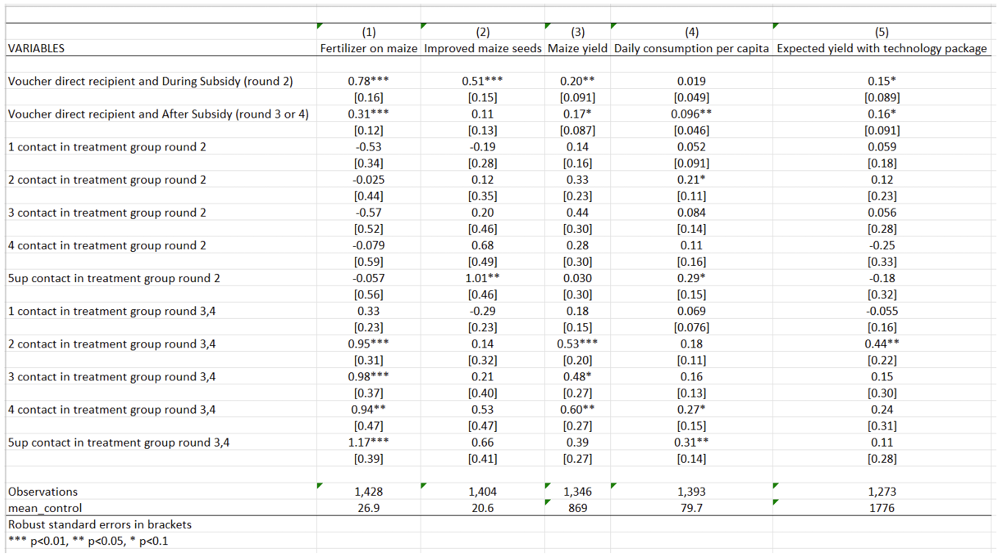
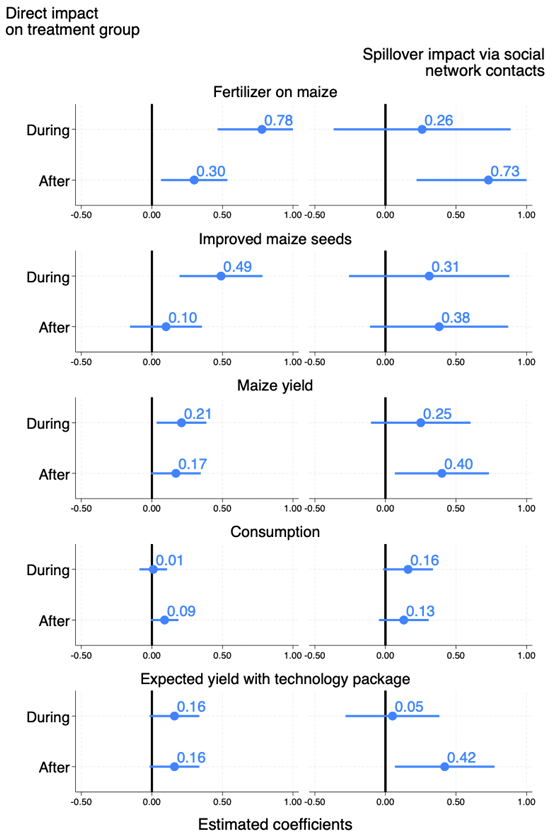
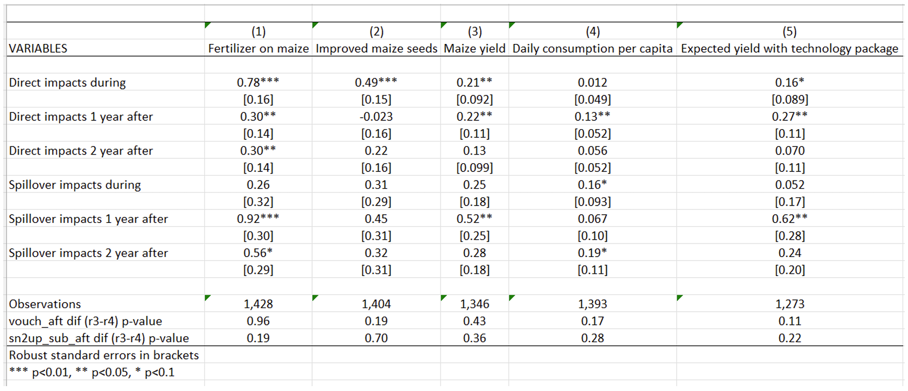

## Subsidies and the African Green Revolution: Direct effects and social network spillovers of randomized input subsidies in Mozambique

Carter, M., Laajaj, R., & Yang, D. (2021). Subsidies and the African Green Revolution: Direct effects and social network spillovers of randomized input subsidies in Mozambique. _American Economic Journal: Applied Economics_, _13_(2), 206‑229.<a href="https://www.aeaweb.org/articles?id=10.1257/app.20190396" target="_blank">https://doi.org/10.1257/app.20190396</a>

<a href="https://www.openicpsr.org/openicpsr/project/116761/version/V2/view?path=%2Fopenicpsr%2F116761%2Ffcr%3Aversions%2FV2.1%2FRep-file-Moz-Input-Subsidy&type=folder&fbclid=IwAR3bVz5SUf8L2eWPPmh6zxY97BOD8K0LHeIwB8rMiwFi7kfVxomJ3suDmb8" target="_blank">Link to the original replication package</a>

Click [here](https://git-link.vercel.app/api/download?url=https%3A%2F%2Fgithub.com%2FSorbonneDevEcon%2FM2-Econometrics-Book%2Fblob%2Fmain%2Fresources%2FCLY%2FDoFile_CLY.do&filename=DoFile_CLY.do) to get the complete do-file corresponding to the explanations below, <a href="https://www.openicpsr.org/openicpsr/project/116761/version/V2/view?path=/openicpsr/116761/fcr:versions/V2.1/Rep-file-Moz-Input-Subsidy/data/original/Moz1234panel.dta&type=file" target="_blank">here</a> to download the original dataset (named Moz1234panel.dta) from Open ICPSR, and [here](https://git-link.vercel.app/api/download?url=https%3A%2F%2Fgithub.com%2FSorbonneDevEcon%2FM2-Econometrics-Book%2Fblob%2Fmain%2Fresources%2FCLY%2FCodebook_CLY_M.pdf&filename=Codebook_CLY_M.pdf) to get a detailed description of the variables used (codebook).

### Highlights {-}

- The paper investigates the short-term and long-term effects (i.e. diffusion through farmers' networks) of an __input subsidy program__ on __agricultural yields__. 

- The authors rely on a standard __Randomized Controlled Trial__ in which farmers are randomly assigned to the treatment and control groups, eliminating potential selection bias.

- Yet, it departs from the standard by exploring __spillover effects through social networks__, assessing long-term impacts, and addressing informational market failures. The study emphasizes learning processes as part of the intervention’s impact, extending beyond the typical scope of a standard RCT.

- This document provides a detailed explanation of the original replication package. But you will also learn: 
    + how to create a beautiful coefficient plot tailored to your needs, with estimates stored in a matrix (this is how the authors display the main results of their paper) using `mkmat` together with `coefplot`, 
    + how to create a result table with `outreg2`, while adding a few statistical tests tailored to your needs in the bottom part with `test` and `scalar`, 
    + how to automatically generate a new label by keeping / removing certain parts of an existing label with `subinstr`,
    + how to use a `local` macro together with `replace` and `append` commands in order to loop over a list of variables and store all their corresponding results into a fresh table every time the code is run. 


### Background elements

This study examines the impact of a one-off input subsidy program implemented in Mozambique in 2010 within the context of the Green Revolution and the Alliance for a Green Revolution in Africa. While the Green Revolution transformed Asian and Latin American agriculture, Sub-Saharan Africa lagged behind. In response, the Maputo Declaration (2003) committed African nations to invest 10% of their budgets in agriculture. Launched in 2006, the Alliance aimed to catalyze the Green Revolution in Africa through input subsidy programs (ISPs), providing technologies at discounted rates to randomly selected farmers. Focusing on Mozambique's 2010 _Programa de Suporte aos Produtores_, this paper not only assesses subsidy impacts on 704 farmers but also explores post-subsidy persistence and spillover effects through social networks. Findings reveal increased technology adoption, sustained maize yield growth post-program, and notable impacts on farmers’ networks. The program also fostered enhanced beliefs about technology returns, mitigating information-related market failures.

### Replication of Table 2 - Regressions with spillover effects

This table (Table 2 in the paper) is the output you will get from the code we explain below. 



Table 2 examines the impact of the government-implemented input subsidy program (ISP) on various agricultural outcomes: fertilizer use on maize, adoption of improved maize seeds, maize yield, daily consumption per capita, and expected yield with the technology package. The objective of this analysis is to determine whether the ISP has a positive and statistically significant impact on the use of fertilizer on maize and on maize yields, measured as average maize yield per hectare.

__How to read this table.__ The first two lines of this table present the program’s results estimated on treated farmers (those who received the subsidy). The effects of the program are assessed both during and after the ISP implementation. This table reveals that the program has a positive impact on all farmers' outcomes, both during and after the program. The effects are more pronounced during the treatment period for fertilizer use, improved maize seeds, and maize yields.

The next lines present the impact of the ISP on social network spillovers, which is estimated on members of treated farmers' social networks during (round 2) and after (rounds 3 and 4) the treatment period, respectively. The general pattern observed is that the coefficients for social network variables are positive and significant in the post-intervention period but not in the intervention period. The magnitude of the coefficients increases as the number of social network contacts in the treatment group increases from one to two, and then stabilizes. This pattern suggests that the effect of social networks on technology adoption and yield increases sharply at two or more social network contacts in the treatment group. For example, after the program, having one contact in the treatment group increases maize yield by 0.18 kilogram per hectare, while having two contacts increases maize yield by 0.53 kilogram per hectare. This substantial increase in yield with two or more social network contacts justifies the authors' estimation of spillover effects on individuals having above-median (two or more) social network members in the treatment group in Figure 2.

#### Replication code for Table 2 {-}

##### Data importation {-}

After having downloaded the original dataset and saved this dataset under your working directory defined with command "cd" (for current directory), you can generate a shorter version of the dataset, named here __Dataset_CLY.dta__, for which we provide a [detailed codebook](https://git-link.vercel.app/api/download?url=https%3A%2F%2Fgithub.com%2FSorbonneDevEcon%2FM2-Econometrics-Book%2Fblob%2Fmain%2Fresources%2FCLY%2FCodebook_CLY_M.pdf&filename=Codebook_CLY_M.pdf). 

``` {.Stata language="Stata" numbers="none"}

*A/ Download and save data "Moz1234panel.dta" from: https://www.openicpsr.org/openicpsr/project/116761/version/V2/view?path=/openicpsr/116761/fcr:versions/V2.1/Rep-file-Moz-Input-Subsidy/data/original/Moz1234panel.dta&type=file

*B/ Set your working directory where Moz1234panel.dta already is:
cd "XXX" /*XXX=the directory where you just saved the 'Moz1234panel.dta' dataset*/

*C/ Create a shorter dataset:
use "Moz1234panel.dta", clear

* selecting the necessary avriables for replicating the Table 2, Figure 2, and Table A7
keep sn5up_sub_dur sn2up_sub_aft nw_talkedagmoder lfertmaizr sn2_sub_dur sn2up_sub_dur sn1_sub_aft lyieldr sn3_sub_aft lexp_yield_fertr vouch_aft_r3 sn2up_sub_aft_r3 limprovedseedsr vouch_aft sn1_sub_dur vlgid_round respid sn2up_sub_aft_r4 vouch_aft_r4 vouch_dur ldailyconsr sn3_sub_dur sn4_sub_aft sn5up_sub_aft sn4_sub_dur sn2_sub_aft fertmaizr vouch round

* exponentiation of the winsorized variables back to their original forms
foreach x in improvedseedsr yieldr dailyconsr exp_yield_fertr{ 
	// it is necessary in order to add the means of the control to the table 2. This way it uses the value that is not Winsorized. 
		gen `x' = exp(l`x')
}

save "Dataset_CLY.dta", replace
```

To start the replication, one should always start by deleting any potential data in memory using clear all. Then, open the dataset of interest, and the command use “...”, clear to indicate the dataset you want to import in Stata.

Because this project uses panel data, you need to inform Stata of the structure of the data. Use the command xtset to indicate that you are working with panel data, followed by the name of the variable you want to set as the panel variable. Here, _vlgid_round_ is an identifier for every possible combination of locality and round.

``` {.Stata language="Stata" numbers="none"}
clear all
use "Dataset_CLY.dta", clear
xtset vlgid_round
global sn_treatments sn1_sub_dur sn2_sub_dur sn3_sub_dur  sn4_sub_dur sn5up_sub_dur sn1_sub_aft sn2_sub_aft  sn3_sub_aft  sn4_sub_aft sn5up_sub_aft 
```

Now, you want to modify the labels for a set of variables that were in log format in the original dataset, to indicate that they are in their original scale.

Start with creating a loop to iterate the same procedure over a set of variables, using the foreach command.

*Stata trick:* Then, you can easily modify the labels using variable label to extract the label for each variable in the loop, remove the text “log” from the label using subinstr, remove the excess spaces using trim, and update the variable label with the modified text.

``` {.Stata language="Stata" numbers="none"}
foreach v in fertmaizr improvedseedsr yieldr dailyconsr exp_yield_fertr {
  local x : variable label l`v'
  local x = trim(subinstr("`x'","(log)","",.))
  label variable l`v' "`x'"
}
```

##### Regressions, and table creation {-}

You are now set to running the regressions and creating a table presenting results.

Stata trick: Start with initializing a local macro using local, named rep_app, and set its value to replace. The purpose of this macro is to control whether the replace option is used when exporting regression results in an Excel file using the command outreg2. In other words, it means that if the file already exists in your computer, it will be replaced.

``` {.Stata language="Stata" numbers="none"}
local rep_app = "replace"
```

Again, use a loop to iterate regressions over the same list of variables using foreach.

You want to apply several commands to the variables included in the loop only if they meet the following conditions: round==2 (survey round 2, that is, during the program) and vouch==0 (farmers who did not win the voucher, that is, the control group). Then:

- `qui sum` calculates the mean, and results are stored using the local command
- `areg` runs a fixed effects regression on panel data, using `absorb` to absorb fixed effects, and `cluster` to take into account the intra-cluster correlations
- `outreg2` creates the regression table and saves it into an Excel file (.xls extension)

Then, create a nice table using key commands:

- `bracket` generates brackets for standard errors
- `label` includes variable labels in the results table to display full variable names
- `nocons`, `nor2`, and `noni` are used to avoid displaying the constant, the R-squared and missing values in the table
- `less(1)` means that only the first row of the result table will be included (only the first regression)
- `keep` allows you to keep only the variables you want
- `adds()` is used to add control variables into the brackets

``` {.Stata language="Stata" numbers="none"}
foreach x in fertmaizr improvedseedsr yieldr dailyconsr exp_yield_fertr {
  qui sum `x' if vouch==0 & round==2
  local control_mean=r(mean)
  qui xi: areg l`x' vouch_dur vouch_aft ${sn_treatments} i.nw_talkedagmoder*i.round, ///
  absorb(vlgid_round) cluster(respid)

  outreg2 using "table 2.xls", `rep_app' bracket label nocons noni ///
  less(1) nor2 keep(vouch_dur vouch_aft ${sn_treatments}) adds(mean_control,`control_mean')

  local rep_app = "append"
}
```

### Replication of Figure 2 - Direct and Spillover Impacts of Subsidies

This figure (Figure 2 in the paper) is the output you will get from the code we explain below.



 This figure highlights the Intention-to-Treat estimates through the direct and indirect effects on five outcomes of the subsidy program on the farmers and on their social networks. The outcomes of interest include the adoption of fertilizer and adoption of improved maize seeds, the maize yields, the consumption of the household (an indirect measure of agricultural profit), and the expected yields to the technology package. In this figure, indirect effects are estimated on individuals having at least two contacts in the treatment group, because they are the ones for whom effects are the largest, as demonstrated in Table 2.

__How to read this figure.__ The coefficient of the regressions of interest are represented with dots, while the lines represent 95 percent confidence intervals.

Direct impacts of the subsidies on the voucher recipient group are estimated for all five outcomes for both the “during” (subsidized) and the “after” (post-subsidy) periods. The Figure shows that the program had a large and significant impact during the subsidy period on the adoption of fertilizers and improved seeds, also allowing for higher maize yields. The effects on consumption were only significant after the subsidy period. Yield expectations were stable across periods for treated farmers. While the effect on fertilizer use decreases in magnitude after the subsidy period, it remains substantial and statistically significant. The impact on agricultural yields also persists over time.

Regarding spillover effects, impacts of the program are positive and significant on the adoption of fertilizers, on improved seeds, maize yields, and expected returns to the technology package.

#### Replication code for Figure 2 {-}

##### Data preparation and confidence intervals calculation {-}

So far, a lot of modifications have been made to the variables. To construct the figure, you need the original data, without saving the transformations to the variables made until now.

``` {.Stata language="Stata" numbers="none"}
use "Dataset_CLY.dta", clear
```

Install the parmest package that allows for semi-parametric estimation of partially linear models.

``` {.Stata language="Stata" numbers="none"}
ssc install parmest
```

Then, regress the outcome variables on the treated individuals (farmers who won the vouchers) and on individuals who have at least two contacts in the treatment group. Regressions are run separately for each of the five outcomes, using a loop - see section 1.2.2 for more information on how to create a loop.

Cluster the standard error at the level of _respid_ (respid is the variable for the respondent’s identifier, that is, cluster at the individual level), and use parmest to save the regression results in the .dta format. For each variable, you will obtain the estimated coefficients and standard errors for the periods during and after the program, for treated farmers and those with at least two contacts in the treatment group.

``` {.Stata language="Stata" numbers="none"}
foreach x in lfertmaizr limprovedseedsr lyieldr ldailyconsr lexp_yield_fertr {
  qui xi: reg `x' vouch_dur vouch_aft sn2up_sub_dur sn2up_sub_aft ///
  i.nw_talkedagmoder*i.round i.vlgid_round, cluster(respid)
  parmest, saving(`x', replace)
}
```

To generate the final figure, you must create a new dataset. To do so, you need to iterate through variable names and perform certain operations on our variables.

First, use the `local` command to define a local macro y with a value of 1.

Then create a loop using `foreach` which includes our variables of interest. Then, apply the following commands on variables in the loop:

- ```use `x'```.dta loads the dataset corresponding to the variables in the loop
- use the command gen to create a time variable using the observation number (_n), drop the observations for which time is greater than 4 using `drop`
- This graph aiming to generate a visually informative figure by plotting mean estimates along with their corresponding 95% confidence intervals for a set of variables. Only keep the variables _estimate, stderr_ and _time_
- Use the `round` command to round the values of the variables to 2 decimal points
- Generate, using `gen`, two new variables with missing values which capture the estimates of each regression after the treatment and the standard error of these coefficients (respectfully _estimate_NV_ and _sd_NV,_ followed by the value taken by y). The command `replace` allows us to assign specific values to the new variables.
- With the command `rename`, include a suffix based on the local macro `y’` to the selected variables.
- Drop all periods after round 2 because you only want the first two periods in the figure
- Creating a `local` y equal to y + 1, increment y to the next rank to move on to the next variable estimate_Vy+1 and estimate_NV+1

Eventually, save the variables created with the command `save.`

``` {.Stata language="Stata" numbers="none"}
local y = 1

foreach x in lfertmaizr limprovedseedsr lyieldr ldailyconsr lexp_yield_fertr {
  use `x'.dta
  gen time=_n
  drop if time>4
  keep estimate stderr time

  replace estimate=round(estimate,0.01)
  replace stderr=round(stderr,0.01)
  
  gen estimate_NV`y'=.
  replace estimate_NV`y'=estimate[3] in 1
  replace estimate_NV`y'=estimate[4] in 2

  gen sd_NV`y'=.
  replace sd_NV`y'=stderr[3] in 1
  replace sd_NV`y'=stderr[4] in 2

  rename estimate estimate_V`y'
  rename stderr sd_V`y'

  local y = `y'+1
  drop if time>2
  save, replace
}
```

Merge the quantity of fertilizer used with each variable of interest (again, using a loop) based on the time variable.

``` {.Stata language="Stata" numbers="none"}
use lfertmaizr, clear

foreach x in limprovedseedsr lyieldr ldailyconsr lexp_yield_fertr{
  merge 1:1 time using `x'.dta, nogen
  save figure2.dta, replace
}
```

Clear existing matrices and results in Stata’s memory, and load the dataset named “figure2.dta”.

``` {.Stata language="Stata" numbers="none"}
clear matrix
clear results
use "figure2.dta", clear
```

Calculate lower and upper limits of the 95% confidence interval:

- Create a foreach loop to iterate over a list of variables(V1, V2, ..., NV5).
- Use the mean estimate (`estimate_`) and standard deviation (`sd_`) to calculate the lower and upper bounds of the 95% confidence interval for each variable by subtracting 1.96 times the standard deviation from the values taken by each variable in the loop.
- Set the upper limit to 1 if it's greater than 1, in other words, substitute 1 for any variable value exceeding 1.
- Create a matrix with `mkmat` to store the results (estimate, lower limit, and upper limit) for each variable in the loop.

``` {.Stata language="Stata" numbers="none"}
foreach i in V1 V2 V3 V4 V5 NV1 NV2 NV3 NV4 NV5{
  gen ll95_`i' = estimate_`i' - 1.96*sd_`i'
  gen ul95_`i' = estimate_`i' + 1.96*sd_`i'
  replace ul95_`i'=1 if ul95_`i'>1
  mkmat estimate_`i' ll95_`i' ul95_`i', matrix(`i')
}
```

##### Package installation and graph style settings {-}

These preprocessing steps are crucial for ensuring accurate and visually compelling representations of the estimated coefficients with their associated confidence intervals. The resulting figure is a valuable tool for conveying the uncertainty surrounding the mean estimates, aiding in the interpretation and communication of statistical findings.

Install and initialize additional packages (`grstyle` and `coefplot`) for graph styling and coefficient plotting.

Set graph style settings, such as background color and major grid color.

``` {.Stata language="Stata" numbers="none"}
ssc install grstyle
ssc install coefplot
grstyle init
grstyle color background white
grstyle color major_grid white
```

##### Graph creation and exportation {-}

The command `coefplot` creates a graphic displaying the coefficients of the regression and the confidence interval.  
- `matrix` selects the values to be used for the graph in the matrix.  
- `ci` selects the upper and lower bounds of the confidence interval  
- `msize` is used to select the size of the graph lines.  
- `xline(0, lpattern(solid) lw(thick))` adds a vertical line to the x-axis at position 0, with a line style of "solid" and a line thickness of "thick".  
- `xlabel(-0.5(0.5)1)` adds axis labels from -0.5 to 1, with a step of 0.5.  
- `bylabel` is used to define labels and byopts is used to define the chart title.  
- `ciopts(lwidth(thick thick))` defines the line thickness for confidence interval.

Reproduce 5 times this process for each variable, during and after the treatment.

``` {.Stata language="Stata" numbers="none"}
coefplot /*
*/ (matrix(V1[,1]), ci((V1[,2] V1[,3])) msize(large) xline(0, lpattern(solid) lw(thick)) ///
xscale(range(-0.5(0.5)1)) xlabel(-0.5(0.5)1)) || /*
*/ (matrix(NV1[,1]), ci((NV1[,2] NV1[,3])) msize(large) ///
xline(0, lpattern(solid) lw(thick)) xscale(range(-0.5(0.5)1)) xlabel(-0.5(0.5)1))|| /*
*/ ||, bylabel( ) byopts(title("Fertilizer on maize")) xsize(2) scale(1.35) ///
ylabel(,labsize(vlarge)) ciopts(lwidth(thick thick)) /*
*/ coeflabels(r1="During" r2="After" ) mlabel mlabposition(1) mlabsize(vlarge) ///
format(%04.2f) name(fertilizer)

coefplot /*
*/ (matrix(V2[,1]), ci((V2[,2] V2[,3])) msize(large) xline(0, lpattern(solid) lw(thick)) ///
xscale(range(-0.5(0.5)1)) xlabel(-0.5(0.5)1)) || /*
*/ (matrix(NV2[,1]), ci((NV2[,2] NV2[,3])) msize(large) ///
xline(0, lpattern(solid) lw(thick)) xscale(range(-0.5(0.5)1)) xlabel(-0.5(0.5)1)) || /*
*/ ||, byopts( title("Improved maize seeds")) bylabel( ) xsize(2) scale(1.35) ///
ylabel(,labsize(vlarge)) ciopts(lwidth(thick thick)) /*
*/ coeflabels(r1="During" r2="After" ) mlabel mlabposition(1) mlabsize(vlarge) ///
format(%04.2f) name(improved)

coefplot /*
*/ (matrix(V3[,1]), ci((V3[,2] V3[,3])) msize(large) xline(0, lpattern(solid) lw(thick)) ///
xscale(range(-0.5(0.5)1)) xlabel(-0.5(0.5)1)) || /*
*/ (matrix(NV3[,1]), ci((NV3[,2] NV3[,3])) msize(large) ///
xline(0, lpattern(solid) lw(thick)) xscale(range(-0.5(0.5)1)) xlabel(-0.5(0.5)1))|| /*
*/ ||, byopts( title("Maize yield")) bylabel( ) xsize(2) scale(1.35) ///
ylabel(,labsize(vlarge))ciopts(lwidth(thick thick) ) /*
*/ coeflabels(r1="During" r2="After" ) mlabel mlabposition(1) mlabsize(vlarge) ///
format(%04.2f) name(yield)

coefplot /*
*/ (matrix(V4[,1]), ci((V4[,2] V4[,3])) msize(large) xline(0, lpattern(solid) lw(thick)) ///
xscale(range(-0.5(0.5)1)) xlabel(-0.5(0.5)1)) || /*
*/ (matrix(NV4[,1]), ci((NV4[,2] NV4[,3])) msize(large) ///
xline(0, lpattern(solid) lw(thick)) xscale(range(-0.5(0.5)1)) xlabel(-0.5(0.5)1)) || /*
*/ ||, byopts( title("Consumption")) bylabel( ) xsize(2) scale(1.35) ///
ylabel(,labsize(vlarge))ciopts(lwidth(thick thick) ) /*
*/ coeflabels(r1="During" r2="After" ) mlabel mlabposition(1) mlabsize(vlarge) ///
format(%04.2f) name(consumption)

coefplot /*
*/ (matrix(V5[,1]), ci((V5[,2] V5[,3])) msize(large) xline(0, lpattern(solid) lw(thick)) ///
xscale(range(-0.5(0.5)1)) xlabel(-0.5(0.5)1)) || /*
*/ (matrix(NV5[,1]), ci((NV5[,2] NV5[,3])) msize(large) ///
xline(0, lpattern(solid) lw(thick)) xscale(range(-0.5(0.5)1)) xlabel(-0.5(0.5)1)) || /*
*/ ||, byopts( title("Expected yield with technology package")) bylabel( ) xsize(2) ///
scale(1.35) ylabel(,labsize(vlarge)) ciopts(lwidth(thick thick)) /*
*/ coeflabels(r1="During" r2="After" ) mlabel mlabposition(1) mlabsize(vlarge) ///
format(%04.2f) name(expected)
```

Combine all the graphs in one graph and edit it:

- `b1title(Estimated coefficients, size(small) color(black))` adds a title to the top of the combined chart, stating "Estimated coefficients." The title size is "small" and the text color is "black."
- `cols(1)` charts are combined into a single column.
- `altshrink` altering scaling of text
- `iscale(*3.2)` is used to select the graph scale. The graphs here are enlarged by 3.2 times.
- `xcommon` means that the x is common to all graphs.
- `imargine` define the interior margins.

``` {.Stata language="Stata" numbers="none"}
graph combine fertilizer improved yield consumption expected, ///
b1title(Estimated coefficients, size(small) color(black)) cols(1) altshrink iscale(*3.2) ///
xsize(3) xcommon imargin(b=1 t=1) title("Direct impact" "on treatment group", ///
size(small) color(black) position(11)) subtitle("Spillover impact via social" ///
"network contacts", size(small) color(black) position(1))
```

Finally, export the graph in .png and .pdf with the function gr export.

``` {.Stata language="Stata" numbers="none"}
gr export figure2.png, replace
gr export figure2.pdf, replace
```

### Replication of Table 7 - Separated Estimation of Spillover Effects for the First and Second Years After the Program

In both Table 2 and Figure 2 presented above, researchers estimate a single “after” treatment effect, pooling the two years after the intervention period. In Table 7, the researchers distinguish between spillover effects one year after, and two years after the program, separately. The objective of this table is to push the analysis of spillovers further, and is similar to conduct a robustness check in the context of this study.

To dissect spillover effects over time, researchers introduce two different “after” indicators for each of the post-subsidy years. As expected, due to reduced power, fewer coefficients reach statistical significance. There is no clear systematic pattern to the coefficients across the two years, and the hypothesis that the direct and spillover effects are consistent between the first and second "after" years cannot be rejected.



#### Replication code for Table 7 {-}

##### Data preparation {-}

Start with initializing a local macro using local, named rep_app and set its value to replace. For more information, see section explaining Table 2 above.

``` {.Stata language="Stata" numbers="none"}
use "Dataset_CLY.dta", clear
local rep_app = "replace""
```

Begin by correctly labeling the variables that will appear in Table 7.

``` {.Stata language="Stata" numbers="none"}
local rep_app = "replace"
label var vouch_dur "Direct impacts during"
label var vouch_aft_r3 "Direct impacts 1 year after"
label var vouch_aft_r4 "Direct impacts 2 year after"
label var sn2up_sub_dur "Spillover impacts during"
label var sn2up_sub_aft_r3 "Spillover impacts 1 year after"
label var sn2up_sub_aft_r3 "Spillover impacts 2 year after"
```

##### Regressions, and table creation {-}

The code for creating Table 7 is very similar to that for creating Table 2 (see above). The interesting novelties are the following: 

Using a loop, run a regression with `areg`, adding the prefix `xi-` to indicate that the regression includes indicator values (equal to either 0 or 1), and including fixed effects which will be absorbed for the variable _vlgid_round_ with the option `absorb`. Standard errors are clustered at the individual level (_respid_ variable). The command `qui`, for “quietly”, means that the results will not be displayed.

Then test the equality of coefficients between _vouch_aft_r3_ and _vouch_aft_r4_, and between _sn2up_sub_aft_r3_ and _sn2up_sub_aft_r4_ using the `test` command. This command performs Wald tests of simple and composite linear hypotheses about the parameters of the most recently fitted model. This allows us to test whether there is a significant difference between the coefficients for period 3 and period 4.

Next, store the p-value results using `scalar`.

The last step is to export the results you have just obtained into our results folder using `outreg2`. To create a nice table easily, refer to explanations from Table 2.

``` {.Stata language="Stata" numbers="none"}
foreach x in lfertmaizr limprovedseedsr lyieldr ldailyconsr lexp_yield_fertr {
  qui xi: areg `x' vouch_dur vouch_aft_r3 vouch_aft_r4 sn2up_sub_dur sn2up_sub_aft_r3 ///
  sn2up_sub_aft_r4 i.nw_talkedagmoder*i.round, absorb(vlgid_round) cluster(respid)

  test vouch_aft_r3 = vouch_aft_r4
  scalar vou_di = r(p)

  test sn2up_sub_aft_r3 = sn2up_sub_aft_r4
  scalar sn_di = r(p)

  outreg2 using "table A7.xls", `rep_app' bracket label nocons noni less(1) nor2 ///
  keep(vouch_dur vouch_aft_r3 vouch_aft_r4 sn2up_sub_dur sn2up_sub_aft_r3 ///
  sn2up_sub_aft_r4) adds("vouch_aft dif (r3-r4) p-value", vou_di, ///
  "sn2up_sub_aft dif (r3-r4) p-value" , sn_di )

  local rep_app = "append"
}
```

---

**Authors of the replication:** Elvire Jégu, Ambre Delaunay, Chiara Balducci, Yagmur Helin Aslan, students in the <a href="https://economie-master-developmenteconomics.pantheonsorbonne.fr/" target="_blank">Master program in Development Economics and Sustainable Development</a> (2023-2024), Sorbonne School of Economics, Université Paris 1 Panthéon Sorbonne. 

**Date:** December 2023