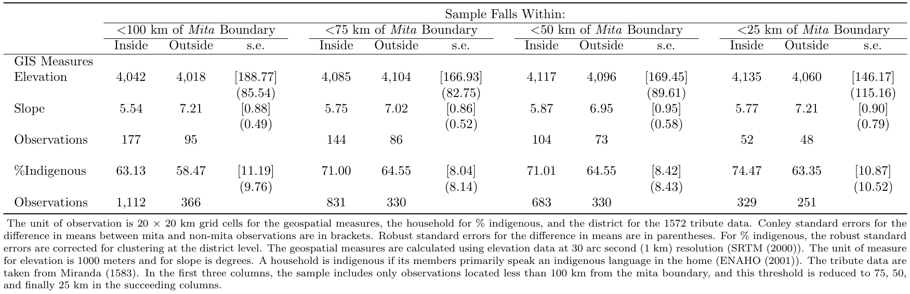
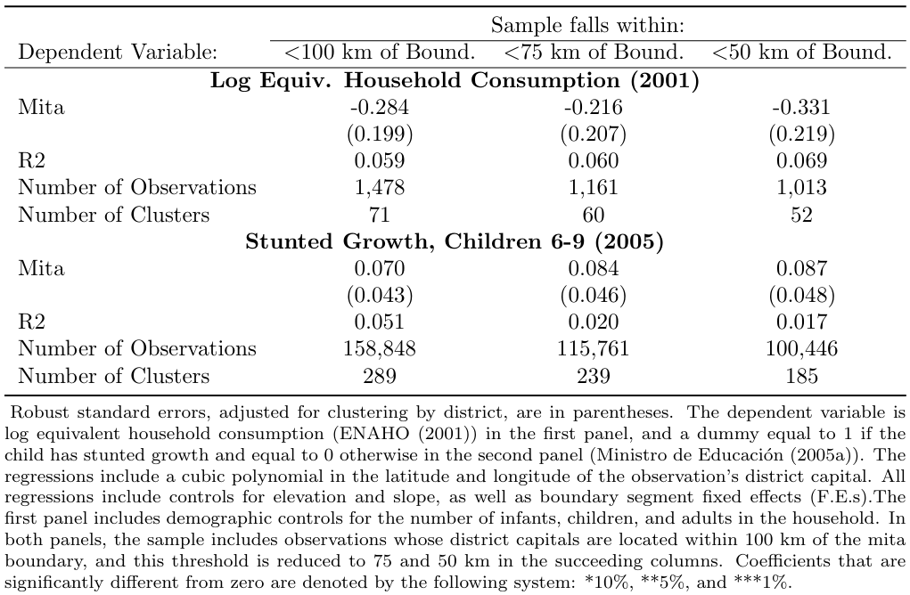
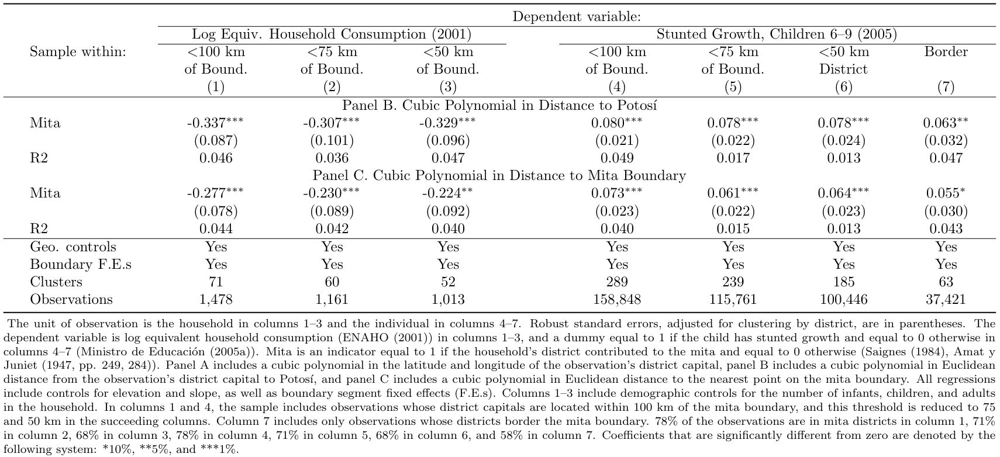

## The Persistent Effects of Peru's Mining _Mita_

Dell, M. (2010). The Persistent Effects of Peru's Mining _Mita_. _Econometrica_, 78(6), 1863-1903. Retrieved 2023-11-20, from http://www.jstor.org/stable/40928464

### Highlights {-}

-   Dell (2010) examines the long run impacts of the mita, an extensive
    forced mining labor system in effect in Peru and Bolivia between
    1573 and 1812.

-   We will code a spatial regression discontinuity design that is used
    to compare outcomes of households on each side of the mita
    boundaries.

-   This paper is a pioneering work in the application of spatial
    regression discontinuity designs and lays the foundations for a
    burgeoning literature on the impact of spatially delimited policies.

-   In this document, we provide a detailed explanation on how to
    implement spatial RDD in Stata.

-   A key element of our contribution consists in capturing Conley
    standard errors using the "x_ols" program (see [Install x_ols line
    142](#sec:XOLS)).

-   In the appendix you will find the codes that allow the
    automatization of formatted output tables in a ready to publish
    style with minimal required manual manipulation using matrices and
    the "appendmodels\" program.

-   Link to published article: <https://www.jstor.org/stable/40928464>

### Introduction

A useful method for analyzing the impact of a policy when it is
implemented in a geographically delimited area is the Spatial Regression
Discontinuity Design (Spatial RDD). The paper focuses on the causal
effect of the mita, an extensive forced mining labor system in effect in
Peru and Bolivia between 1573 and 1812, on household consumption and
stunted growth in children.

This identification strategy is based on a cut-off defined by geographic
borders, specifically the assignment variables are examined by their
distance from the mita boundary (the threshold in this research) using a
discontinuity in longitude-latitude space. This framework is based on
the assumption that all the characteristics of the treatment and the
control groups, except the variables of interest, must vary smoothly at
the mita cutoff to be able to do a comparison. Therefore, the treatment
effect is firstly computed by using cubic polynomials in latitude and
longitude in a multidimensional RD polynomial. Then, to strengthen the
results, other two single geographical dimension specifications were
used. The first one uses the cubic polynomial Euclidian distance to
Potosì and the second one the cubic polynomial distance to the mita
boundary.

### Good Practices

#### Necessary libraries

-   ssc install estout, replace

-   x_ols (Appendix)

-   appendmodels (Appendix)

#### Organization of the directories

``` {.Stata language="Stata" numbers="none"}
capture log close
clear
clear matrix

global dirroot "YOUR DIRECTORY GOES HERE"
global dirdata "${dirroot}/"
global dirlogs "${dirroot}/"
global dirtables "${dirroot}/"
log using "${dirlogs}/Replication_Dell.log", replace
```

#### Building the three different data frames

``` {.Stata language="Stata" numbers="none"}
use "${dirdata}Dataset_Dell.dta", clear
keep if gis_db==1
drop gis_db
save "${dirdata}gis_grid.dta", replace

use "${dirdata}Dataset_Dell.dta", clear
keep if consumption_db==1
drop consumption_db
save "${dirdata}consumption.dta", replace

use "${dirdata}Dataset_Dell.dta", clear
keep if height_db==1
drop height_db
save "${dirdata}height.dta", replace
```

### Table 1 - Summary Statistics

#### **Table 1: Summary Statistics** {-}


#### Code for Table 1

A critical assumption for the identification strategy is that all the
characteristics of the treatment and control vary smoothly at the mita
cutoff. Table 1 presents summary statistics for sample characteristics
within and outside of the mita boundaries. Different distances from the
Mita boundaries are used in the selection of observations to include in
each group. Reassuringly, there are no significant differences.

-   We are going to use a loop to move through each distance
    specification.

-   We are using for this the data gis_grid.dta.

-   Then, with the command `tabstat` we are going to create a table
    with the mean and the number of observations for the elevation by
    group (pothuan_mita, which is 0 if it's outside the *Mita* and 1
    otherwise) and the same for the slope. This has the option `not`
    which is an abbreviation for `nototal` because we are not interested
    in the overall statistics.

-   After this we're going to regress the elevation and the slope with
    the dummy of pothuan_mita in order to capture the robust standard
    error of the difference in mean between the two groups.

    ``` {.Stata language="Stata" numbers="none"}
    // Elevation and Slope

    foreach Y of num 100 75 50 25 {
        //Elevation
        use "${dirdata}gis_grid.dta", clear
        drop if d_bnd>`Y'
        tabstat elev, by(pothuan_mita) statistics(mean n) not
        regress elev pothuan_mita, robust
        //Slope
        tabstat slope, by(pothuan_mita) statistics(mean n) not
        regress slope pothuan_mita, robust
    }
    ```

-   We then repeat this with the quantity of indigenous people.

-   We are going to be using the consumption.dta dataset.

    ``` {.Stata language="Stata" numbers="none"}
    // Indigenous

    foreach Y of num 100 75 50 25 {
        use "${dirdata}consumption.dta", clear
        tabstat QUE if (d_bnd<`Y' & cusco!=1), by(pothuan_mita) statistics(mean n) not
        regress QUE pothuan_mita if (d_bnd<`Y' & cusco!=1), robust cluster (ubigeo)
    }
    ```

-   Finally, we are going to be capturing the Conley Standard Error.

-   This is done using the program x_ols which we install at the
    beginning of the code.

-   We are also going to do it for the elevation, slope and indigenous
    people.

-   This command works by specifying the latitude ("xcord\"), longitude
    ("ycord\"), two cut points in each coordinate and the dependent
    ("elev\") and independent variable ("pothuan_mita\". xreg(2) and
    coord(2) are necessary, xreg denotes the number of regressor and
    coord the dimensions of the coordinates.

-   For more information on this command:
    <https://economics.uwo.ca/people/conley_docs/data_GMMWithCross_99/x_ols.ado>

``` {.Stata language="Stata" numbers="none"}
//Conley Standard Errors

// Elevation and Slope

foreach Y of num 100 75 50 25 {

    // Elevation
    use "${dirdata}gis_grid.dta", clear
    keep if elev<.
    gen xcut1=1
    gen ycut1=1
    gen const=1
    drop if d_bnd>`Y'
    x_ols xcord ycord xcut1 ycut1 elev const pothuan_mita, xreg(2) coord(2)
    drop  window epsilon dis1 dis2
    
    // Slope
    use "${dirdata}gis_grid.dta", clear
    drop if slope==.
    gen xcut1=1
    gen ycut1=1
    gen const=1
    drop if d_bnd>`Y'
    x_ols xcord ycord xcut1 ycut1 slope const pothuan_mita, xreg(2) coord(2)
    drop  window epsilon dis1 dis2
}

// Indigenous

foreach Y of num 100 75 50 25 {
    use "${dirdata}consumption.dta", clear
    drop if QUE==.
    drop if cusco==1
    gen xcut1=1
    gen ycut1=1
    gen const=1
    drop if d_bnd>`Y'   
    x_ols x y xcut1 ycut1 QUE const pothuan_mita, xreg(2) coord(2)
    drop  window epsilon dis1 dis2
}
```

### Table 2 - Main Results

#### **Table 2: Main Results** {-}


#### Code for Table 2

The paper is interested in the impact of Mita on both economic outcomes
(household consumption) and outcomes in terms of health (stunted growth)
so both results are presented in the main table with the following code.

-   Again, a loop is used to move through each distance specification.
    The loop ensures that the same regressions are run for each distance
    specification specified in the local Y.

-   Within the loop, we use the two main datasets on consumption and
    height and run the same regressions on the two main dependent
    variables lhhequiv and desnu on the cubic polynomial of the
    observation's district capital, controlling for relevant variables.

-   The if conditions specify that the regression omits observations in
    Cusco and indicates the distance specification that should be used.

-   The robust option specifies that heteroskedasticity-robust standard
    errors should be reported.

-   The cluster (ubigeo) option indicates that standard errors should be
    clustered by district.

``` {.Stata language="Stata" numbers="none"}
local Y "100 75 50"
foreach Y in `Y' {
    // Log Consumption
    use "${dirdata}consumption.dta", clear
    reg lhhequiv pothuan_mita x y x2 y2 xy x3 y3 x2y xy2 infants children adults elv_sh ///
      slope bfe4* if (cusco != 1 & d_bnd < `Y'), robust cluster (ubigeo)
    
    // Stunted Growth
    use "${dirdata}height.dta", clear
    reg desnu pothuan_mita x y x2 y2 xy x3 y3 x2y xy2 elv_sh slope bfe4* ///
      if (cusco != 1 & d_bnd < `Y'), robust cluster (ubigeo)
}
```


### Table 3 - Robustness Results

#### **Table 3: Robustness** {-}


#### Code for Table 3

The multidimensional RD polynomial approach was a novel methodology at
the time and therefore there was no empirical background able to state a
priori why this strategy performs better. Given these concerns, two
other single-dimension specifications were applied to examine the
robustness of the findings. The first is the polynomial in distance to
Potosi, which is likely to capture variation in unobservable
characteristics but it is not the most precise approach in mapping RD
setup. The second specification controls for a polynomial in distance to
the Mita boundary, which is closer to traditional one-dimensional RD
designs even if it lacks a historical explanation that states its
relevancy. Looking at the results across the three specifications is not
possible to reject that they are statistically identical and
consequently admit the robustness of the main findings.

-   Another time, we use the two main datasets on consumption and height
    to capture the causal effect on the dependent variables lhhequiv and
    desnu.

-   In the loop, first, we consider the effect of the mita on the
    consumption by including in the regression the Euclidean distance to
    Potosi in its linear, quadratic, and cubic form (together with
    relevant control variables and excluding the observation in Cusco)
    within 50, 70 and 100 km (Y).

-   The second regression is run using the same dependent variable and
    controls but using the distance to the mita boundary in its linear,
    quadratic, and cubic terms.

-   The following two regressions have exactly the same specifications
    but as dependent variable is used stunted growth.

-   Finally, the last two regressions are peculiar to the previous ones
    but use the observation at the three border limits (again 50, 75,
    and 100 km from the Mita border).

``` {.Stata language="Stata" numbers="none"}
local Y "100 75 50"
foreach Y in `Y' {
   //Log Consumption
    
   use "${dirdata}consumption.dta", clear

   // Cubic polynomial in distance to Potosi
    
   reg lhhequiv pothuan_mita dpot dpot2 dpot3 infants children adults elv_sh slope bfe4* ///
    if (cusco!=1 & d_bnd<`Y'),robust cluster (ubigeo)
   
   // Cubic polynomial in distance to the mita boundary
   
   reg lhhequiv pothuan_mita dbnd_sh dbnd_sh2 dbnd_sh3 infants children adults elv_sh ///
    slope bfe4* if (cusco!=1 & d_bnd<`Y'), robust cluster (ubigeo)
   
   // Stunted Growth
   
   use "${dirdata}height.dta", clear
   
   // Cubic polynomial in distance to Potosi
   
   reg desnu pothuan_mita dpot dpot2 dpot3 elv_sh slope bfe4* if (cusco!=1 & d_bnd<`Y'), ///
    robust cluster (ubigeo)
   
   // Cubic polyonomial in distance to the mita boundary
   
   reg desnu pothuan_mita dbnd_sh dbnd_sh2 dbnd_sh3 elv_sh slope bfe4*  ///
    if (cusco!=1 & d_bnd<`Y'), robust cluster (ubigeo)
}

reg desnu pothuan_mita dpot dpot2 dpot3 elv_sh slope bfe4* if (cusco!=1 & border==1), ///
  robust cluster (ubigeo)
   
reg desnu pothuan_mita dbnd_sh dbnd_sh2 dbnd_sh3 elv_sh slope bfe4* ///
  if (cusco!=1 & border==1), robust cluster (ubigeo)
```

### Appendix: Automatization of table outputs

The following code allows the creation of each table without minimal
manual manipulation. We use two possible approaches, one is through the
use of matrices and the other through the use of "eststo\" with the
"append models\" program written by Ben Jann (more information here:
<https://repec.sowi.unibe.ch/stata/estout/other/901.do>).

#### Automatic Output for Table 1

``` {.Stata language="Stata" numbers="none"}
eststo clear
scalar drop _all
clear matrix

// Elevation

foreach Y of num 100 75 50 25 {
    //Elevation
    use "${dirdata}gis_grid.dta", clear
    drop if d_bnd>`Y'
    
    tabstat elev, by(pothuan_mita) statistics(mean) not save
    matrix insi_elev_`Y'=r(Stat2)
    matrix outs_elev_`Y'=r(Stat1)
    
    quietly regress elev pothuan_mita, robust
    matrix V=e(V)
    scalar se_elev_`Y' = sqrt(V[1,1])
    
    *Conley Standard Errors
    keep if elev<.
    gen xcut1=1
    gen ycut1=1
    gen const=1

    x_ols xcord ycord xcut1 ycut1 elev const pothuan_mita, xreg(2) coord(2)
    drop window epsilon dis1 dis2
    scalar con_se_elev_`Y'=con_se2
    
    //Slope
    use "${dirdata}gis_grid.dta", clear
    drop if d_bnd>`Y'
    tabstat slope, by(pothuan_mita) statistics(mean) not save
    matrix insi_slope_`Y'=r(Stat2)
    matrix outs_slope_`Y'=r(Stat1)
    
    tabstat slope, by(pothuan_mita) statistics(n) not save
    matrix N_insi_slope_`Y'=r(Stat2)
    matrix N_outs_slope_`Y'=r(Stat1)
    
    quietly regress slope pothuan_mita, robust
    matrix V=e(V)
    scalar se_slope_`Y' = sqrt(V[1,1])
    
    *Conley Standard Errors
    drop if slope==.
    gen xcut1=1
    gen ycut1=1
    gen const=1
    x_ols xcord ycord xcut1 ycut1 slope const pothuan_mita, xreg(2) coord(2)
    drop  window epsilon dis1 dis2
    scalar con_se_slope_`Y'=con_se2
}

// Indigenous

foreach Y of num 100 75 50 25 {
    use "${dirdata}consumption.dta", clear
    tabstat QUE if (d_bnd<`Y' & cusco!=1), by(pothuan_mita) statistics(mean) not save
    matrix insi_indig_`Y'=r(Stat2)*100
    matrix outs_indig_`Y'=r(Stat1)*100
    tabstat QUE if (d_bnd<`Y' & cusco!=1), by(pothuan_mita) statistics(n) not save
    matrix N_insi_indig_`Y'=r(Stat2)
    matrix N_outs_indig_`Y'=r(Stat1)
    quietly regress QUE pothuan_mita if (d_bnd<`Y' & cusco!=1), robust cluster (ubigeo)
    matrix V=e(V)
    scalar se_indig_`Y' = sqrt(V[1,1])*100
    
    drop if QUE==.
    drop if cusco==1
    gen xcut1=1
    gen ycut1=1
    gen const=1
    drop if d_bnd>`Y'   
    x_ols x y xcut1 ycut1 QUE const pothuan_mita, xreg(2) coord(2)
    drop  window epsilon dis1 dis2
    scalar con_se_indig_`Y'=con_se2*100
}

// Inputting everything on a Matrix

// Submatrix 1: Elevation
matrix elev = (insi_elev_100, outs_elev_100, con_se_elev_100, insi_elev_75, ///
  outs_elev_75, con_se_elev_75, insi_elev_50, outs_elev_50, con_se_elev_50, ///
  insi_elev_25, outs_elev_25, con_se_elev_25 \ ., ., se_elev_100, ., ., se_elev_75, ., ///
  ., se_elev_50, ., ., se_elev_25)

// Submatrix 2: Slope
matrix slope = (insi_slope_100, outs_slope_100, con_se_slope_100, insi_slope_75, ///
  outs_slope_75, con_se_slope_75, insi_slope_50, outs_slope_50, con_se_slope_50, ///
  insi_slope_25, outs_slope_25, con_se_slope_25 \ ., ., se_slope_100, ., ., se_slope_75, ///
  ., ., se_slope_50, ., ., se_slope_25)

// Submatrix 3: Number of observations for elevation and slope
matrix num_slope = (N_insi_slope_100, N_outs_slope_100, ., N_insi_slope_75, ///
  N_outs_slope_75, ., N_insi_slope_50, N_outs_slope_50, ., N_insi_slope_25, ///
  N_outs_slope_25, .)

// Submatrix 4: Indigenous
matrix indig = (insi_indig_100, outs_indig_100, con_se_indig_100, insi_indig_75, ///
  outs_indig_75, con_se_indig_75, insi_indig_50, outs_indig_50, con_se_indig_50, ///
  insi_indig_25, outs_indig_25, con_se_indig_25 \ ., ., se_indig_100, ., ., se_indig_75, ///
  ., ., se_indig_50, ., ., se_indig_25)

// Submatrix 5: Number of observations for Indigenous
matrix num_indig = (N_insi_indig_100, N_outs_indig_100, ., N_insi_indig_75, ///
  N_outs_indig_75, ., N_insi_indig_50, N_outs_indig_50, ., N_insi_indig_25, ///
  N_outs_indig_25, .)

// Final Matrix

matrix Table1 = (elev\slope\num_slope\indig\num_indig)

matrix rownames Table1 = Elevation "." Slope "." Observations %Indigenous "." Observations
matrix colnames Table1 = Inside Outside "Conley SE/SE" Inside Outside "Conley SE/SE" ///
  Inside Outside "Conley SE/SE" Inside Outside "Conley SE/SE" 
    
// Show in command
    
esttab matrix(Table1, fmt("0 0 2 0 0 2 0 0 " "0 0 2 0 0 2 0 0 " "2 2 2 2 0 2 2")), ///
    refcat(Elevation "GIS Measures" %Indigenous "", nolab) ///
    coef(. " ") ///
    title("Table 1: Summary Statistics") nomti ///
    addn("The unit of observation is 20 × 20 km grid cells for the geospatial measures and the household for % indigenous. Conley standard errors for the difference in means between mita and non-mita observations are first in each SE columns. Robust standard errors for the difference in means are second. For % indigenous, the robust standard errors are corrected for clustering at the district level. The geospatial measures are calculated using elevation data at 30 arc second (1 km) resolution (SRTM (2000)). The unit of measure for elevation is 1000 meters and for slope is degrees. A household is indigenous if its members primarily speak an indigenous language in the home (ENAHO (2001)). In the first three columns, the sample includes only observations located less than 100 km from the mita boundary, and this threshold is reduced to 75, 50, and finally 25 km in the succeeding columns.") replace
```

#### Automatic Output for Table 2

``` {.Stata language="Stata" numbers="none"}
eststo clear
scalar drop _all
clear matrix

local Y "100 75 50"
local j = 1
foreach Y in `Y' {
    // Log Consumption
    use "${dirdata}consumption.dta", clear
    quietly reg lhhequiv pothuan_mita x y x2 y2 xy x3 y3 x2y xy2 infants children adults ///
      elv_sh slope bfe4* if (cusco != 1 & d_bnd < `Y'), robust cluster (ubigeo)

    local i = 1
    
    scalar Nclusters_`j'_`i' =e(N_clust)
    scalar N_`j'_`i' =e(N)
    scalar R_`j'_`i' =e(r2)
    matrix V=e(V)
    matrix B=e(b)
    scalar se_`j'_`i' = sqrt(V[1,1])
    scalar b_`j'_`i' = (B[1,1])
    
    local i = `i' + 1
    
    // Stunted Growth
    use "${dirdata}height.dta", clear
    quietly reg desnu pothuan_mita x y x2 y2 xy x3 y3 x2y xy2 elv_sh slope bfe4* ///
      if (cusco != 1 & d_bnd < `Y'), robust cluster (ubigeo)
    
    scalar Nclusters_`j'_`i' =e(N_clust)
    scalar N_`j'_`i' =e(N)
    scalar R_`j'_`i' =e(r2)
    matrix V=e(V)
    matrix B=e(b)
    scalar se_`j'_`i' = sqrt(V[1,1])
    scalar b_`j'_`i' = (B[1,1])
    
    local j = `j' + 1
}

matrix Main = (b_1_1, b_2_1, b_3_1 \ se_1_1, se_2_1, se_3_1 \ R_1_1, R_2_1, R_3_1 \ ///
  N_1_1, N_2_1, N_3_1 \ Nclusters_1_1, Nclusters_2_1, Nclusters_3_1 \ b_1_2, b_2_2, ///
  b_3_2 \ se_1_2, se_2_2, se_3_2 \ R_1_2, R_2_2, R_3_2 \ N_1_2, N_2_2, N_3_2 \ ///
  Nclusters_1_2, Nclusters_2_2, Nclusters_3_2)

matrix rownames Main = Mita1 "." R2 "Number of Observations" "Number of Clusters" Mita2 ///
  "." R2 "Number of Observations" "Number of Clusters"
matrix colnames Main = "<100 km of Bound." "<75 km of Bound." "<50 km of Bound."

esttab matrix(Main, fmt("3 3 3 0 0 3 3 3 0 0")), ///
    model(17) ///
    varwidth(40) ///
    not ///
    refcat(Mita1 "Log Equiv. Household Consumption (2001)" ///
		Mita2 "Stunted Growth, Children 6-9 (2005)", nolab) ///
    coef(. " " Mita1 "Mita" Mita2 "Mita") nomti ///
    title("Table 2: Main Results for replication")
```

#### Automatic Output for Table 3

``` {.Stata language="Stata" numbers="none"}
eststo clear
scalar drop _all
clear matrix

local Y "100 75 50"
local i=1
foreach Y in `Y' {
  //Log Consumption
    use "${dirdata}consumption.dta", clear
    ren pothuan_mita row1
//Cubic polynomial in distance to Potosi
    eststo id`i': quietly reg lhhequiv row1 dpot dpot2 dpot3 infants children adults ///
      elv_sh slope bfe4* if (cusco!=1 & d_bnd<`Y'),robust cluster (ubigeo)
    quietly matrix R_`i' =e(r2)
    quietly scalar Nclusters_`i' = e(N_clust)
    quietly scalar N_`i' = e(N)

 //Cubic polynomial in distance to the mita boundary
    
    ren row1 row2
    local i = `i'+ 1
    eststo id`i': quietly reg lhhequiv row2 dbnd_sh dbnd_sh2 dbnd_sh3 infants children ///
      adults elv_sh slope bfe4* if (cusco!=1 & d_bnd<`Y'), robust cluster (ubigeo)
    quietly matrix R_`i' =e(r2)
    
// Stunted Growth
    use "${dirdata}height.dta", clear
//Cubic polynomial in distance to Potosi

    ren pothuan_mita row1
    local i = `i'+ 1
    eststo id`i': quietly reg desnu row1 dpot dpot2 dpot3 elv_sh slope bfe4* ///
      if (cusco!=1 & d_bnd<`Y'), robust cluster (ubigeo)
    quietly matrix R_`i' =e(r2)
    quietly scalar Nclusters_`i' = e(N_clust)
    quietly scalar N_`i' = e(N)
    
//Cubic polyonomial in distance to the mita boundary

    ren row1 row2
    local i = `i'+ 1
    eststo id`i': quietly reg desnu row2 dbnd_sh dbnd_sh2 dbnd_sh3 elv_sh slope bfe4* ///
      if (cusco!=1 & d_bnd<`Y'), robust cluster (ubigeo)
    quietly matrix R_`i' =e(r2)
    local i = `i'+ 1    
}
use "${dirdata}height.dta", clear

ren pothuan_mita row1
eststo id13: quietly reg desnu row1 dpot dpot2 dpot3 elv_sh slope bfe4* ///
  if (cusco!=1 & border==1), robust cluster (ubigeo)
    quietly matrix R_13 =e(r2)
    quietly scalar Nclusters_13 = e(N_clust)
    quietly scalar N_13 = e(N)
    
ren row1 row2
eststo id14: quietly reg desnu row2 dbnd_sh dbnd_sh2 dbnd_sh3 elv_sh slope bfe4* ///
  if (cusco!=1 & border==1), robust cluster (ubigeo)
    quietly matrix R_14 =e(r2)

    
local i="1 5 9 3 7 11 13"
local j="2 6 10 4 8 12 14"
foreach i in `i' {
  quietly matrix coln R_`i' = R_1
}
foreach j in `j' {
  quietly matrix coln R_`j' = R_2
}

// Append Models

local i="1 5 9 3 7 11 13"
local k=1
foreach i in `i' {
    eststo c`k': appendmodels id`i' id`++i'
    quietly estadd local geoc "Yes"
    quietly estadd local bound "Yes"
    quietly estadd local obs = (N_`--i')
    quietly estadd local clu = (Nclusters_`i')
    estadd matrix R2_1=R_`i'
    estadd matrix R2_2=R_`++i'
    local k = `k' + 1
}

esttab c1 c2 c3 c4 c5 c6 c7, ///
    keep(row1 row2 R_1 R_2) ///
    coeflabels(row1 "Mita" row2 "Mita" R_1 "R2" R_2 "R2")  ///
    cells(b(star fmt(3)) se(par fmt(3)) R2_1(fmt(3)) R2_2(fmt(3))) ///
    star(* 0.1 ** 0.05 *** 0.01) noobs ///
    title("TABLE II LIVING STANDARDS") ///
    ml("<100 km of Bound" "<75 km of Bound" "<50 km of Bound" "<100 km of Bound" ///
    "<75 km of Bound" "<50 km of Bound" "Border District") ///
    model(17) varwidth(30) ///
    posth("Sample within: " `"{hline @width}"') hlinechar("-") ///
    mgroups("" "Log Equiv. Household Consumption (2001)" ///
	"Stunted Growth, Children 6-9 (2005)", pattern(1 1 0 0 1 0 0) span) ///
	s(geoc bound clu obs, labels("Geo. controls" ///
    "Boundary F.E.s" "Clusters" "Observations")) ///
    order(row1 R_1 row2 R_2) ///
    refcat(row1 "Panel B. Cubic Polynomial in Distance to Potosi" row2 ///
	"Panel C. Cubic Polynomial in Distance to Mita Boundary", nolabel) nonote ///
    addnote("The unit of observation is the household in columns 1–3 and the individual in columns 4–7. Robust standard errors, adjusted for clustering by district, are in parentheses. The dependent variable is log equivalent household consumption (ENAHO (2001)) in columns 1–3, and a dummy equal to 1 if the child has stunted growth and equal to 0 otherwise in columns 4–7 (Ministro de Educación (2005a)). Mita is an indicator equal to 1 if the household's district contributed to the mita and equal to 0 otherwise (Saignes (1984), Amat y Juniet (1947, pp. 249, 284)). Panel B includes a cubic polynomial in Euclidean distance from the observation's district capital to Potosí, and panel C includes a cubic polynomial in Euclidean distance to the nearest point on the mita boundary. All regressions include controls for elevation and slope, as well as boundary segment fixed effects (F.E.s). Columns 1–3 include demographic controls for the number of infants, children, and adults in the household. In columns 1 and 4, the sample includes observations whose district capitals are located within 100 km of the mita boundary, and this threshold is reduced to 75 and 50 km in the succeeding columns. Column 7 includes only observations whose districts border the mita boundary. 78% of the observations are in mita districts in column 1, 71% in column 2, 68% in column 3, 78% in column 4, 71% in column 5, 68% in column 6, and 58% in column 7. Coefficients that are significantly different from zero are denoted by the following system: *10%, **5%, and ***1%.") tex replace
```

#### Install "x_ols" and "appendmodels" programs

##### x_ols {-}

``` {.Stata language="Stata" numbers="none"}
capt prog drop x_ols
program define x_ols
    version 6.0
#delimit ;              /*sets `;' as end of line*/

/*FIRST I TAKE INFO. FROM COMMAND LINE AND ORGANIZE IT*/
local varlist   "req ex min(1)";    /*must specify at least one variable...
                       all must be existing in memory*/
local options   "xreg(int -1) COord(int -1)";
        /* # indep. var, dimension of location coordinates*/

parse "`*'";                /*separate options and variables*/

if `xreg'<1{;
    if `xreg'==-1{;
        di in red "option xreg() required!!!";
        exit 198};
    di in red "xreg(`xreg') is invalid";
    exit 198};  

if `coord'<1{;
    if `coord'==-1{;
        di in red "option coord() required!!!";
        exit 198};
    di in red "coord(`coord') is invalid";
    exit 198};  


/*Separate input variables:
    coordinates, cutoffs, dependent, regressors*/

parse "`varlist'", parse(" ");  

local a=1;
while `a'<=`coord'{;
    tempvar coord`a';
    gen `coord`a''=``a'';   /*get coordinates*/
local a=`a'+1};

local aa=1;
while `aa'<=`coord'{;
    tempvar cut`aa';
    gen `cut`aa''=``a'';    /*get cutoffs*/
    local a=`a'+1;
local aa=`aa'+1};

tempvar Y;
gen `Y'=``a'';          /*get dep variable*/
local depend : word `a' of `varlist';

local a=`a'+1;

local b=1;
while `b'<=`xreg'{;
    tempvar X`b';
    local ind`b' : word `a' of `varlist';
    gen `X`b''= ``a'';
    local a=`a'+1;
local b=`b'+1};         /*get indep var(s)...rest of list*/

/*NOW I RUN THE REGRESSION AND COMPUTE THE COV MATRIX*/

quietly{;           /*so that steps are not printed on screen*/

    /*(1) RUN REGRESSION*/
    tempname XX XX_N invXX invN;
    scalar `invN'=1/_N;
    if `xreg'==1 {;
        reg `Y' `X1', noconstant robust;
        mat accum `XX'=`X1',noconstant;
        mat `XX_N'=`XX'*`invN';
        mat `invXX'=inv(`XX_N')};   /* creates (X'X/N)^(-1)*/
    else{;
        reg `Y' `X1'-`X`xreg'', noconstant;
        mat accum `XX'=`X1'-`X`xreg'',noconstant;
        mat `XX_N'=`XX'*`invN';
        mat `invXX'=inv(`XX_N')};   /* creates (X'X/N)^(-1)*/
    predict epsilon,residuals;  /* OLS residuals*/

    /*(2) COMPUTE CORRECTED COVARIANCE MATRIX*/
    tempname XUUX XUUX1 XUUX2 XUUXt;
    tempvar XUUk;
    mat `XUUX'=J(`xreg',`xreg',0);
    gen `XUUk'=0;
    gen window=1;           /*initializes mat.s/var.s to be used*/
    local i=1;
    while `i'<=_N{;         /*loop through all observations*/
        local d=1;
        replace window=1;
        while `d'<=`coord'{;    /*loop through coordinates*/
            if `i'==1{;
                gen dis`d'=0};
            replace dis`d'=abs(`coord`d''-`coord`d''[`i']);
            replace window=window*(1-dis`d'/`cut`d'');
            replace window=0 if dis`d'>=`cut`d'';
        local d=`d'+1};             /*create window*/
        capture mat drop `XUUX2';
        local k=1;
        while `k'<=`xreg'{;
            replace `XUUk'=`X`k''[`i']*epsilon*epsilon[`i']*window;
            mat vecaccum `XUUX1'=`XUUk' `X1'-`X`xreg'', noconstant;
            mat `XUUX2'=nullmat(`XUUX2') \ `XUUX1';
        local k=`k'+1};
        mat `XUUXt'=`XUUX2'';
        mat `XUUX1'=`XUUX2'+`XUUXt';
        scalar fix=.5;      /*to correct for double-counting*/
        mat `XUUX1'=`XUUX1'*fix;
        mat `XUUX'=`XUUX'+`XUUX1';
    local i=`i'+1};
    mat `XUUX'=`XUUX'*`invN';

};                  /*end quietly command*/

tempname V VV;
mat `V'=`invXX'*`XUUX';
mat `VV'=`V'*`invXX';

matrix cov_dep=`VV'*`invN';     /*corrected covariance matrix*/


/*THIS PART CREATES AND PRINTS THE OUTPUT TABLE IN STATA*/
local z=1;
local v=`a';
di _newline(2) _skip(5)
"Results for Cross Sectional OLS corrected for Spatial Dependence";
di _newline _col(35)    " number of observations=  "  _result(1);
di " Dependent Variable= " "`depend'";
di _newline
"variable" _col(13) "ols estimates" _col(29) "White s.e." _col(42) 
    "s.e. corrected for spatial dependence";
di 
"--------" _col(13) "-------------" _col(29) "----------" _col(42) 
    "-------------------------------------";

while `z'<=`xreg'{;
    tempvar se1`z' se2`z';
    local beta`z'=_b[`X`z''];
    local se`z'=_se[`X`z''];
    gen `se1`z''=cov_dep[`z',`z'];
    gen `se2`z''=sqrt(`se1`z'');
    di "`ind`z''" _col(13)  `beta`z''  _col(29)  `se`z'' _col(42) `se2`z'';
    scalar con_se`z'=`se2`z''; // ADDED BY THE REPLICATORS: This line is to 
                               // capture Conley S.E.
local z=`z'+1};

end
```

##### appendmodels {-}

``` {.Stata language="Stata" numbers="none"}
capt prog drop appendmodels
program appendmodels, eclass
*! version 1.0.0  14aug2007  Ben Jann
    // using first equation of model
    version 8
    syntax namelist
    tempname b V tmp
    foreach name of local namelist {
        qui est restore `name'
        mat `tmp' = e(b)
        local eq1: coleq `tmp'
        gettoken eq1 : eq1
        mat `tmp' = `tmp'[1,"`eq1':"]
        local cons = colnumb(`tmp',"_cons")
        if `cons'<. & `cons'>1 {
            mat `tmp' = `tmp'[1,1..`cons'-1]
        }
        mat `b' = nullmat(`b') , `tmp'
        mat `tmp' = e(V)
        mat `tmp' = `tmp'["`eq1':","`eq1':"]
        if `cons'<. & `cons'>1 {
            mat `tmp' = `tmp'[1..`cons'-1,1..`cons'-1]
        }
        capt confirm matrix `V'
        if _rc {
            mat `V' = `tmp'
        }
        else {
            mat `V' = ///
            ( `V' , J(rowsof(`V'),colsof(`tmp'),0) ) \ ///
              ( J(rowsof(`tmp'),colsof(`V'),0) , `tmp' )
        }
    }
    local names: colfullnames `b'
    mat coln `V' = `names'
    mat rown `V' = `names'
    eret post `b' `V' 
    eret local cmd "whatever"
end;
exit;
```

---

**Authors of the replication:** Alejandro Arciniegas Herrera, Marcella De Giovanni, Anselm Rabaté, Kenan Topalovic

**Date:** December 2023
