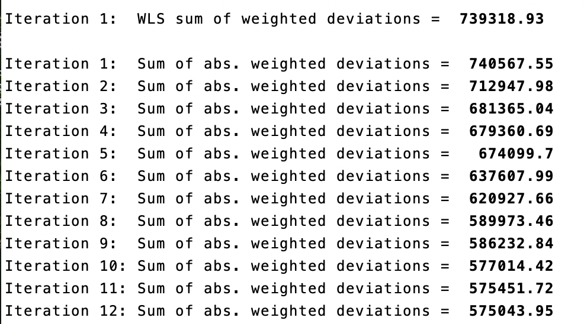
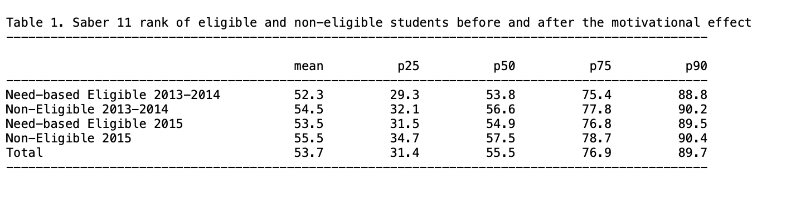
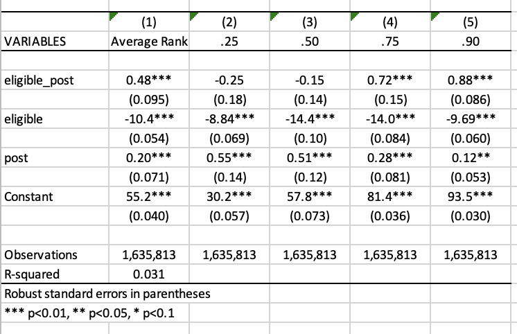
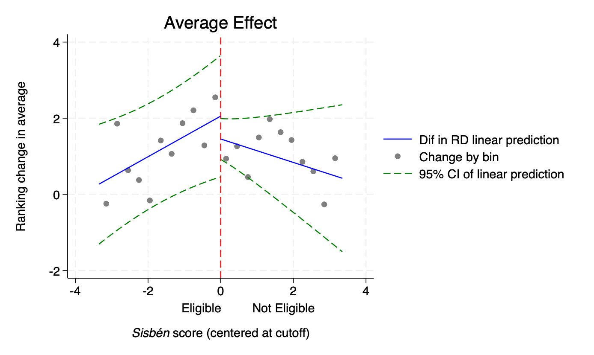
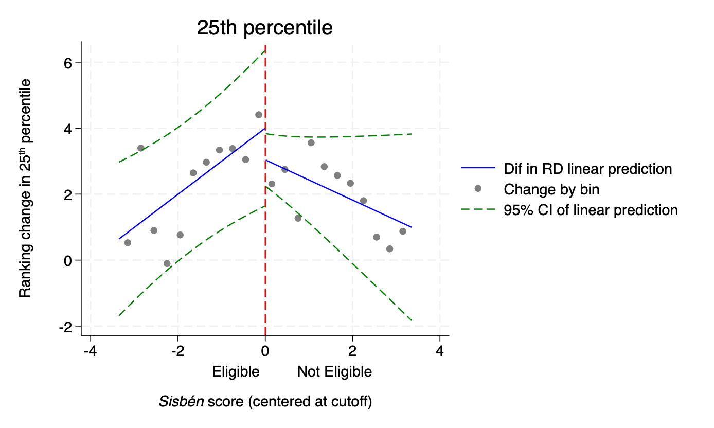
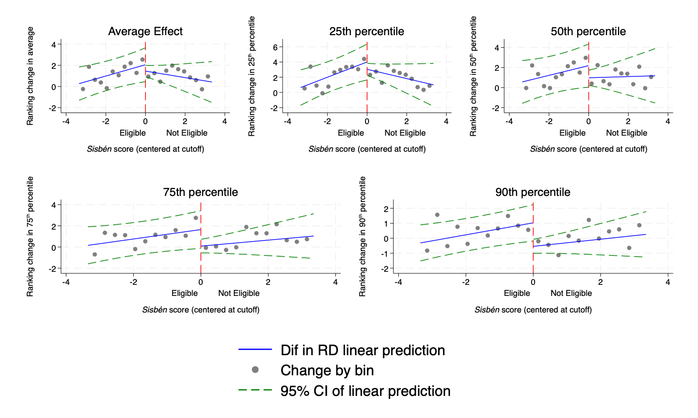
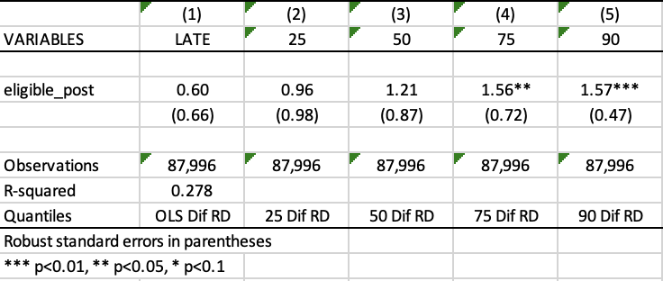
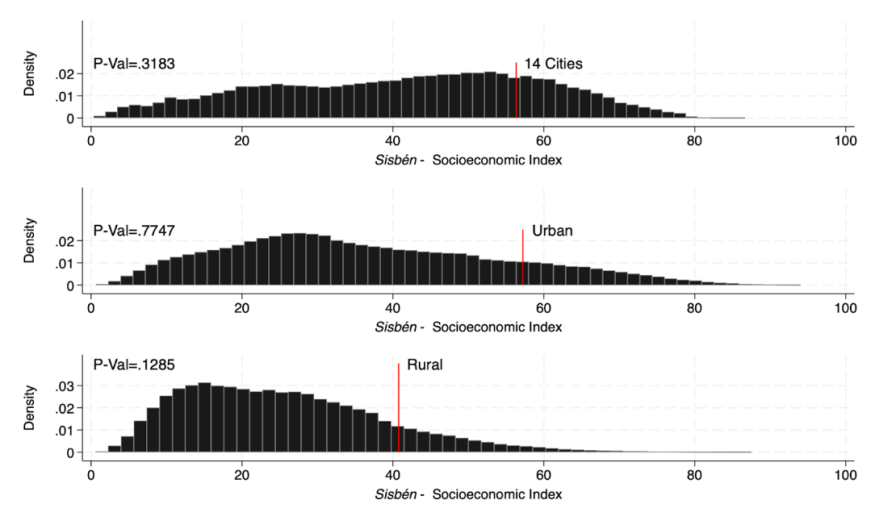

## Equality of opportunity and human capital accumulation: Motivational effect of a nationwide scholarship in Colombia

Rachid Laajaj, Andrés Moya, Fabio Sánchez, Equality of opportunity and human capital accumulation: Motivational effect of a nationwide scholarship in Colombia, _Journal of Development Economics_, Volume 154, 2022, 102754, ISSN 0304-3878,
.<a href="https://doi.org/10.1016/j.jdeveco.2021.102754" target="_blank">https://doi.org/10.1016/j.jdeveco.2021.102754</a> 

```{r echo = F, include =T}
library(downloadthis)

## Link in Github repo
download_link(
  link = "https://git-link.vercel.app/api/download?url=https%3A%2F%2Fgithub.com%2FSorbonneDevEcon%2FM2-Econometrics-Book%2Fblob%2Fmain%2Fresources%2FCLY%2FDoFile_LMS.do&filename=DoFile_LMS.do",
  button_label = "Download Do-File corresponding to the explanations below",
  button_type = "default",
  has_icon = TRUE,
  icon = "fa fa-save",
  self_contained = FALSE
)

## Link in Github repo
download_link(
  link = "https://git-link.vercel.app/api/download?url=https%3A%2F%2Fgithub.com%2FSorbonneDevEcon%2FM2-Econometrics-Book%2Fblob%2Fmain%2Fresources%2FCLY%2FCodebook_LMS.pdf&filename=Codebook_LMS.pdf",
  button_label = "Download Codebook",
  button_type = "default",
  has_icon = TRUE,
  icon = "fa fa-save",
  self_contained = FALSE
)

download_link(
  link = "https://www.openicpsr.org/openicpsr/project/146921/version/V1/view",
  button_label = "Download Original Data (Data>Originals>SPP_ready.dta)",
  button_type = "default",
  has_icon = TRUE,
  icon = "fa fa-save",
  self_contained = FALSE
)
```

<a href="https://www.openicpsr.org/openicpsr/project/146921/version/V1/view" target="_blank">[Link to the full original replication package paper from Open ICPSR]</a>

### Highlights {-}

- The research question of this paper is the following: How did the opportunity to receive a scholarship influence the performance of low-income students in the national exit and 9th grade exams, and their university enrollment rates? 

- This replication exercise will deal with the quasi-experimental Regression Discontinuity Design (RDD) method, with an **eligibility cutoff** and a **linear function** (and its extension in the form of difference-in-discontinuities model).

- This methodology is applied in this context because the scholarship eligibility is based on an eligibility threshold, which allows the authors to compare similar students and thus, avoid the issue of selection on unobservable.

- The special feature of this study is the combination of the regression discontinuity design extension, with the **quantile regression method**.

- Throughout this replication exercise, we provide a detailed explanation of the original replication package.

- Through this exercise, you will learn many tricks on Stata:
    + How to present your results in academic tables, by using the packages `estout` and `outreg2`
    + How to use bandwidths in a regression, here the optimal bandwidth from <a href="https://doi.org/10.3982/ECTA11757" target="_blank">Calonico et al. (2014)</a> using the `rdrobust` package
    + How to run multiple loops within another loop 
    + How to use the `grc1leg` package to merge different graphs in only one figure, using an online package 
    + How to conduct regression discontinuity analysis using the package `rddensity`, and more specifically to test for manipulation (Cattaneo et al., 2018)

### Before we start

If you wish to replicate yourself, you will need to download the original dataset `SPP_ready.dta` from the <a href="https://www.openicpsr.org/openicpsr/project/146921/version/V1/view" target="_blank">original replication package</a>. 

Then, follow these instructions: 
``` {.Stata language="Stata" numbers="none"}

Set the directory where you have stored the dataset SPP_ready.dta and where you will store your datasets and results:
cd "put here your own working directory"

*Data Preparation    
use "SPP_ready.dta", clear

*keep only the variables we need for the replication
keep ranking eligible_post eligible non_eligible post sisben sisben_eligible sisben_post sisben_eligible_post area_ciudades area_urbano icfes_padre_nivel1 icfes_padre_nivel2 icfes_padre_nivel3 icfes_madre_nivel1 icfes_madre_nivel2 icfes_madre_nivel3 edad sexo_sisben departamento_cod_* saber_rk_col area_sisben_dnp puntaje_sisben_dnp year 

*rename the variables 
rename area_ciudades cities 
rename area_urbano other_urban 
rename icfes_padre_nivel1 father_educ_prim 
rename icfes_padre_nivel2 father_educ_second 
rename icfes_padre_nivel3 father_educ_high 
rename icfes_madre_nivel1 mother_educ_prim 
rename icfes_madre_nivel2 mother_educ_second 
rename icfes_madre_nivel3 mother_educ_high 
rename edad age
rename sexo_sisben sex 
rename area_sisben_dnp area_sisben
rename puntaje_sisben_dnp score_sisben 
rename saber_rk_col saber_avg_school

*change labels for the variable area_sisben
label define new_labels 1 "14 Main Cities" 2 "Urban Rest" 3 "Rural"
label values area_sisben new_labels

*use a loop to rename several variables
forval i = 1/33 {
    local oldvar "departamento_cod_`i'"
    local newvar "department_`i'"
    rename `oldvar' `newvar'
}

gen status_eligible= 1 if non_eligible == 0 & post ==0
replace  status_eligible= 2 if non_eligible == 1 & post ==0
replace  status_eligible = 3 if non_eligible == 0 & post ==1
replace  status_eligible = 4 if non_eligible ==1 & post ==1

label define status_eligible_labels 1 "Need-based Eligible 2013-2014" 2 "Non-Eligible 2013-2014" 3 "Need-based Eligible 2015" 4 "Non-Eligible 2015"

* Apply the labels to the categorical variable
label values status_eligible non_eligible_post_labels
drop non_eligible 

label variable score_sisben "Score Sisbén DNP"
label variable area_sisben "Area Sisbén DNP"
label variable father_educ_prim "Father's primary education"
label variable father_educ_second "Father's secondary education"
label variable father_educ_high "Father's high school education"
label variable mother_educ_prim "Mother's primary education"
label variable mother_educ_second "Mother's secondary education"
label variable mother_educ_high "Mother's high school education"
label variable sex "Sex"
label variable cities "14 Main Cities"
label variable other_urban "Other cities"
label variable ranking "Ranking Saber test"
label variable sisben "Distance to the threshold"
label variable post "Before or after SPP"
label variable eligible "Eligibility"
label variable eligible_post "Treated or not"
label variable status_eligible "Student's status"
label variable saber_avg_school "Saber average score of middle school"

save "dataset_LMS.dta", replace // save the dataset created in a new file
```

You will also have to install a few packages and set up a global listing the control variables used in the regressions. 

``` {.Stata language="Stata" numbers="none"}

** Necessary packages to run the code:
ssc install estout, replace
ssc install outreg2, replace
ssc install rdrobust, replace
net install grc1leg.pkg, replace
ssc install rddensity, replace

**Set a global for all the control variables used in regressions
global controls cities other_urban father_educ_prim father_educ_second father_educ_high mother_educ_prim mother_educ_second mother_educ_high age sex department_1-department_32 saber_avg_school
```

Now you can open the dataset: 

``` {.Stata language="Stata" numbers="none"}
use "dataset_LMS.dta", clear
```

### Introduction	
In 2014, a **scholarship** named Ser Pilo Paga (SPP), meaning “Being a Good Student Pays Off”, was introduced in Colombia in order to allow meriting students coming from low- income households to go to high-quality universities by **funding their entire undergraduate education and living expenses**.

The eligibility for this scholarship is based on two criteria. First, students must come from a household that scored below a certain cutoff on the *Sisbén index*, which is a **socioeconomic index**. Second, students must have scored above a given cutoff on the *Saber 11*, which is the **national high school exit exam**.

Data on the *Sisbén* scores are available at the *Department Nacional de Planeacion*, and the information on the _Saber 11_ test scores is provided by the *Instituto Colombiano para el Fomento de la Educación Superior*.

This paper analyzes the motivational effect of this scholarship on three dimensions: the students’ **performances at the _Saber 11_**, the **enrollment rates in high-quality universities** and the **students’ performances at the _Saber 9_** to test for the ex-ante motivational effect.    

This replication paper exercise will be focused on the effect of the SPP on the students’ test scores at the _Saber 11_. The authors used a **difference-in-discontinuities model**, an extension of the Regression Discontinuity Design (RDD) approach. The latter consists in estimating a local average treatment effect around a given cutoff to compare individuals with similar characteristics and be able to attribute the difference in outcomes to the only effect of the treatment. The difference-in-discontinuities extension allows studying the differences around a discontinuity threshold as in a standard RDD, and at two different time periods. Here, the authors study the discontinuity around the need-based eligibility cutoff, comparing students just below and above the threshold, two and ten months after the introduction of SPP. 

Together with **quantile regression**, the authors are able to show a positive and significant effect of the SPP concentrated at the **top of the distribution** (from the 70th percentile), emphasizing the SPP’s contribution to a reduction in socioeconomic achievement gap between eligible and non-eligible students. 

Throughout a replication exercise of the article by Laajaj, Moya and Sánchez, the following aims at providing an explanation of the main insights of the Regression Discontinuity Design and Quantile Regression frameworks, as well as some methodological and code explanation to improve your Stata skills.

### Main strategies explanation: Regression Discontinuity Design and Quantile Regressions	

#### Regression Discontinuity Design	

The Regression Discontinuity Design is a method that leverages a **natural experiment**, utilizing a threshold or **cutoff point** to determine who receives treatment. The core idea is to compare the outcomes of individuals who receive treatment to those who do not by examining both sides of this threshold. The **running variable** X assigns observations to treatment given the cutoff value C.
Here, the RDD takes the form of a **standard eligibility cutoff with a linear function**. Though, in other RDD settings, you might encounter spatial RDD with a border as threshold (Black, 1999) or Regression Kink Design, with a discontinuity showing a kink in the treatment variable (Card et al., 2015).

The key identifying assumption here is that individuals situated just above or below the threshold share similarity in all aspects except for the treatment they are subjected to. This assumption enables researchers to attribute disparities in results solely to the treatment, sidestepping the issue of selection bias.

To extrapolate the discontinuity, one needs to set up a window called **bandwidths**, containing the treated and control units.

There are two main designs within RDD: the **sharp** design and the **fuzzy** design.

- In the sharp design, the treatment assignment is a deterministic function of the running variable X. Units are either treated or not, depending on whether they fall on one side or the other of the threshold.

- In the fuzzy design, the treatment assignment is not strictly determined by the threshold, there can be instances of imperfect compliance. The probability of receiving treatment might jump at the threshold. Some units may not receive treatment even if they were expected to, and vice versa. 

To identify the treatment effect at the discontinuity, one needs to specify the potential outcomes model as a **flexible function of the running variable**. The specification of the functions is empirically important, as it needs to be flexible enough to get the functional form of the relationship between the outcome variable and the running variable. 

In our paper, the authors are using a **standard eligibility cutoff**, in a **sharp design**, estimating the change in ranking of the national high school exit exam (_Saber 11_) after the introduction of a merit- and need-based scholarship in Columbia (SPP). The treatment is a specific cutoff on the *Sisbén* (the socioeconomic index used by the government to target subsidies and social programs): students coming from low-income households under the cutoff are eligible and those above are not eligible. The authors are using a **linear function for the functional form of the relationship between _Sisbén_ and the ranking**. The **_Sisbén_ cutoff** is based on the households’ geographic location: 

- 57,21 for the 14 main cities
- 56,32 for other urban areas
- 40,75 for rural areas 

The **running variable** here is the distance between the student’s _Sisbén_ score and the need-based eligibility cutoff. Students taken into account in the study are assumed to be similar, the only difference being the threshold and thus the possibility of receiving the scholarship or not ex-post. 

To isolate the confounding effect of other social programs established prior to SPP sharing the same eligibility cutoffs, the authors use the **difference-in-discontinuities extension of the RDD**. This method allows the authors to study, around the need-based eligibility cutoff, the motivational effect of SPP by comparing two time periods. The model was introduced by <a href="
https://doi.org/10.1257/app.20150076 target="_blank">Grembi et al. (2016)</a>. 

The **difference-in-discontinuities** estimate compares **two cohorts**: the **2015 cohort**, composed of students who passed the Saber 11 exam in 2015, 10 months after the implementation of SPP, and the **2014 cohort** that comprises students who passed the Saber 11 exam only two months after the implementation of SPP. The 2014 cohort is taken as a control group: since SPP was launched for the first time not long before their _Saber 11_ exam, their motivation and results cannot be influenced by the program itself. However, the program can be considered as a credible signal for 2015 students, hence the comparison in the motivational effect of SPP between eligible and non-eligible students (on both sides of the threshold), two months after SPP implementation (2014 students, post=0) and ten months after (2015 cohort, post=1).

#### Quantile Regression	
In addition to their RDD specification, the authors are testing for heterogeneous effects of the scholarship program on students with different test scores in _Saber 11_ using quantile regressions. While an OLS model is minimizing the sum of squared residuals, the quantile regression model minimizes the objective loss function (sum of absolute weighted deviations). Contrary to OLS, there is no explicit solution for this minimization. Thus, it should be done numerically via the simplex method (a method using iterations). This explains why, each time you run a quantile regression code, the Stata software will display several successive iterations in the "Results” window before displaying the final regression result (see image below).



They regress the test scores (variable “ranking”)  on the scholarship eligibility for students who passed the _Saber 11_ exam after the introduction of SPP (variables “eligible” and “eligible_post”) and the running variable (variable “sisben”) at the 25th , 50th, 75th and 90th percentiles. This method has the advantage of studying the effect of a treatment on the entire distribution of interest, not only on its conditional mean. In this paper, this method is crucial because the authors find no motivational average effect of the SPP on the _Saber 11_ test scores, while they find a positive effect starting from the 75th percentile. These results can be explained by the level of the merit-based cutoff. Indeed, as this ranking cutoff is away from the median, students at the bottom of the distribution will feel discouraged and give up as it would require too much effort to try reaching it. 

### Descriptive statistics - Replication of Table 1 and Figure 4	
#### Main insights of descriptive statistics	
It is essential to run some descriptive statistics at every stage of a research project. Descriptive statistics play a crucial role in an econometric regression framework by providing a comprehensive summary of the data under consideration. By depicting the key insights and trends of the variables of interest, they serve to demonstrate the motivation behind the analysis, and provide justification for the chosen empirical strategy. Good descriptive statistics should also highlight the main results, ensuring the alignment of the research in the intended direction. Descriptive statistics also serve as an initial step in exploring the dataset, verifying the coherence of values and identifying any potential missing data issues.

The command `summarize` in Stata shows you directly the mean, standard deviation, minimum, and maximum of the desired variables. However, descriptive statistics can also take the form of a graph depicting the correlation between two variables of interest, a figure, a map or even non-causal regressions. Nevertheless, whatever the form it adopts, the primary focus should remain on data visualization: descriptive statistics must be clear, and allow us to catch the main information very quickly.

#### Replication of Table 1 - Average rank of eligible and non-eligible students in the _Saber 11_	

##### Replication of the means for average and quantiles scores using tabstat and the package `estout` {-}

The paper presents different sets of descriptive statistics. The focus is on replicating Table 1, which displays the average rank of eligible and non-eligible students in the _Saber 11_ test two months after the implementation of SPP (2013-2014 cohort) and ten months after (2015 cohort). It also details the rank of students at the 25th, 50th, 75th, and 90th percentiles within each group.

The replication of Table 1 will take place in two steps: first, the replication of rows (1), (2), (4) and (5) of parts A and B of the table and then row (7) from part C. 

At the end of this part 1 of the replication exercise, you should have the following .txt output of Table 1, parts (A) and (B).

The first part of Table 1 (rows (1), (2), (4) and (5) of parts A and B) displays the means for averages scores and for each quantile (25, 50, 75, 90). To replicate it, you will use the `tabstat` command with the “status_eligible” variable. 

With the `tabstat` command, you can select the desired statistics of the “ranking” variable with statistics, in this case the number of observations (N), the mean, the quantiles p25, p50, p75 and p90 (q and p90). 

To do so, you will first need to save it with the `estpost` command, with the name of your choice (here: A). 

The `estpost`, `eststo` and `esttab` commands are available in the `estout` package.

``` {.Stata language="Stata" numbers="none"}
ssc install estout
eststo A: estpost tabstat ranking, by(status_eligible) statistics(N mean q p90) columns(statistics) 
```

`tabstat` displays summary statistics (here the number of observations, the mean and the 25th, 50th, 75th and the 90th quantiles).

Then, you can export it in the desired format with `esttab` (here .txt) with the desired features: 

- `fmt(1)` gives the desired number of decimal places, 

- `label` gives the name of the labels in the output table, 

- `varwidth(30)` gives the width of the column containing the variable names.

``` {.Stata language="Stata" numbers="none"}
esttab A using "means.txt", cells("mean(fmt(1)) p25(fmt(1)) p50(fmt(1)) p75(fmt(1)) p90(fmt(1))") title("Table 1. Saber 11 rank of eligible and non-eligible students before and after the motivational effect") noobs nonumber nonote nostar label replace varwidth(30) 
```

##### Replication of the descriptive diff-in-diff in average and by quantile, using `outreg2`	{-}

To replicate the last part of table 1, row (7) of part C, which is the descriptive diff-in-diff in average then by percentile, you will do it in two steps: 

**Step 1**: Run a basic diff-in-diff regression of ranking on the variables “eligible_post”, “eligible” and “post” and export it in excel format 
``` {.Stata language="Stata" numbers="none"}
reg ranking eligible_post eligible post, vce (robust)
```

Once the regression is estimated, we can use the command outreg2 to report the regression outputs from Stata into Excel, Word, Latex or any other format. It gives you the type of presentation found in academic papers. To use it, you have to install the package outreg2 first.

``` {.Stata language="Stata" numbers="none"}
ssc install outreg2
outreg2 using "descr_DiD_.xls", label ///
ctitle("Average Rank") replace less (1)
```

Step 2: Run the same regression but in quantiles, using a loop for each quantile, and then export it in an excel format (.xls) and append it to the basic diff-in-diff table you got in Step 1.

``` {.Stata language="Stata" numbers="none"}
foreach j in .25 .50 .75 .90 {
qreg ranking eligible_post eligible post, q(`j') vce (robust) 
outreg2 using "descr_DiD_.xls", ///
ctitle(`j') append less (1)  
}
```

At the end of this part 2) of the replication exercise, you should have the following  .xls output of Table 1, part (C).


**The following results can be drawn from the table**:  

- First, non-eligible students have in general a better ranking than eligible, revealing the importance of targeting this subpopulation. (Part A and B of table 1).

- Then, there is a reduction of the gap between eligible and non-eligible students after the implementation of SPP (by calculating the difference between non-eligible’s rank and eligible’s rank). This suggests a potential positive motivational effect of the program on students’ results. 

- With a simple difference-in-differences regression, the authors compute the significance of the gap reduction (part C of table 1). The gap reduction is much more important from the 75th percentile of the distribution, suggesting that even with an effect at the average, the impact of SPP is only significant for students ranked at the top of the distribution. 

**Two main conclusions can be drawn from this table**: 

- It provides support for estimating a causal effect of SPP on motivation, by comparing eligible and non-eligible students.  

- It highlights the interest of a quantile regression to study the potential heterogeneous treatment effect at different points of the distribution of ranking. 


#### Replication of Figure 4 - Graphical representation of the Regression-in-Discontinuities estimators on average effect, and at each quantile	

Moreover, RDD is a special case where graphical representations as descriptive statistics are indispensable. Prior to any RDD estimation, it is imperative to conduct a **graphical analysis** to justify the credibility of the chosen strategy. The graphical representation should demonstrate a **notable jump in the outcome and treatment assignment at the threshold**, attributable to the treatment. 

For this purpose, one can plot the relationship between (i) treatment assignment and the running variable, between (ii) the outcome and running variable, (iii) between control variables and running variable, and (iv) the density of the running variable. The latter provides justification for the **absence of manipulation of the running variable** and is often done as a robustness check (see replication of Figure A2 below for more details).

In what follows, you will replicate Figure 4, which plots the relationship between the running variable (_Sisbén_ score, centered at the cutoff, variable “sisben”) and the outcome variable (ranking change, variable “ranking”). It provides a graphical representation of the RDD estimators on average effect, and at the 25th, 50th, 75th, 90th percentile. It shows evidence of the presence of a discontinuity at the threshold, and offers insights for a significant effect from the 75th percentile only.

The code is quite imposing and can be discouraging. **Let’s not get ourselves intimidated** and break the code step by step.

##### Step 1 - Data preparation: defining some scalars and creating bins {-}

The `scalar x` command stores a single numeric value into a scalar named x. Scalars are useful to hold numerical outcomes, constants, or intermediate results of computations without creating new variables. The command `scalar drop _all` deletes any scalar Stata has in memory, and can be used prior to any new computation.

You will first use scalars to set the width of bins, as well as the value of the CERSUM optimal bandwidth (by Calonico et al. 2014) to 3.35. The optimal bandwidth restricts the regression to the subsample of students whose distance between the _Sisbén_ score and the need-based eligibility cutoff is inferior to 3.35. 

> **Focus on bandwidths** Bandwidths are employed to define a specific data window around the cutoff in order to compare eligible students to non-eligible ones. The authors apply the CERSUM (Coverage Error-Rate Optimal Bandwidths) optimal bandwidth suggested by <a href="https://doi.org/10.3982/ECTA11757" target="_blank">Calonico et al. (2014)</a>. Coverage error is a type of non-sampling error that occurs when there is not a one-to-one correspondence between the target population and the sampling frame from which a sample is drawn. This can lead to violations of the Regression Discontinuity assumptions, and bias estimates calculated using survey data. CERSUM bandwidths are chosen to minimize the probability that the confidence interval for the regression discontinuities treatment effect does not contain the true effect. It thus allows for bias-corrected robust confidence intervals for the average treatment effect at the cutoff. 

> In Stata, the computation of these CERSUM optimal bandwidths can be done using the package `rdrobust` introduced by <a href="https://doi.org/10.3982/ECTA11757" target="_blank">Calonico et al. (2014)</a>.


For more details about bandwidth calculation, you can look at the code in Section 4.1.5.

In the context of a RDD graph, bins refer to intervals along the running variable in which observations are grouped for visualization or analysis. Each bin represents a range of values around the threshold. Here, bins of two different sizes are defined.

```{.Stata language="Stata" numbers="none"}
scalar drop _all
scalar bw_dif_cersum =  3.3502511
scalar small_binsize = .01 
scalar large_binsize = .3
set seed 1984
```

The `set seed` command is used to set the seed for the random number generator, ensuring that Stata produces the same sequence of random numbers (here 1984) every time the program is run. 

Use the `keep if` command to keep only observations for which the absolute value of the running variable (distance between student's _Sisbén_ score and the need-based eligibility cutoff) is inferior to 3.35 (`scalar bw_dif_cersum`), that is keep only the need-based eligible. 

```{.Stata language="Stata" numbers="none"}
keep if abs(sisben)<bw_dif_cersum 
```
Create a variable “pre” using the command gen, that is the opposite of the variable post. It is equal to 1 for students who passed the Saber 11 exam in 2015 before and didn't benefit from the SPP.

```{.Stata language="Stata" numbers="none"}
gen pre = (post == 0) 
```

You can then generate bins that will appear in the graph. In an RDD graph, observations are often grouped into bins based on their values on the assignment variable. The graph displays the average ranking in the Saber 11 for each bin. 

```{.Stata language="Stata" numbers="none"}
gen large_bins = round(sisben + large_binsize/2, large_binsize) - large_binsize/2 if abs(sisben)<bw_dif_cersum  
gen small_bins = round(sisben,small_binsize) // Each small bin is set to 0.01 around the sisben score for each individual. 
```

##### Step 2 - Prepare the OLS (average) estimation depicted in the graph {-}	

You will prepare in this section the main regression to be represented in the OLS graph, and the percentiles. 

Firstly, regress (using the command `reg dependant independents, robust`) the ranking in _Saber_ score (outcome) according to control variables and passing the _Saber_ exam after the implementation of SPP. You will then have to save the **residuals of this regression**, creating a variable *resid_ols*. The predict command always refers to the last regression Stata has in memory. You have to specify after the comma what you want to predict. 
For clearer and less heavy regressions, don’t forget to define a `global` with all your controls of interest. This avoids having to rewrite the full list of covariates in every regression.

```{.Stata language="Stata" numbers="none"}
global controls cities other_urban father_educ_prim father_educ_second father_educ_high mother_educ_prim mother_educ_second mother_educ_high age sex department_1-department_32 saber_avg_school /*if not done yet*/
reg ranking ${controls} post, robust 
predict resid_ols, residuals 
```

The next step is to compute **local percentiles**. This is done in 2 stages:

**Stage 1**: Compute means of the outcome variable and residuals

Using a loop, compute means for the variables *ranking* and *resid_ols*, within subsets defined by the variables *small_bins* and *large_bins*, for two time periods (pre and post). It creates new variables for each combination of time period, variable, and subset. For examples:

- *ranking_ols_pre* is the mean of ranking within each small bin, before the introduction of SPP.

- *ranking_ols_r_pre* is the mean of the residuals (of the regression of ranking on post) within each small bin, before the introduction of SPP.

- *ranking_ols_r_largeb_post* is the mean of the residuals within each bin, before the introduction of SPP.

```{.Stata language="Stata" numbers="none"}
foreach t in pre post {
bysort small_bins: egen ranking_ols_`t'= mean(ranking) if `t'==1 
bysort small_bins: egen ranking_ols_r_`t'= mean(resid_ols) if `t'==1  
bysort large_bins: egen ranking_ols_r_largeb_`t'= mean(resid_ols)  if`t'==1
}
```

A loop repeats the same lines of code for different values of a specified variable, here for each value of pre and post. It allows you to save time, by avoiding copying and pasting the exact same code for different variables. Don’t forget to open the bracket at the end of the first line after specifying the variable to repeat the loop on, to return to line to write your code, and to return to another line to close the bracket.
The command `bysort` tells Stata to apply an operation (here creating means) separately for each value taken by the variable *small_bins.* Please note that to compute means, you have to use the command `egen` and not `gen`.

**Stage 2**: Adjust for the constant, so that the average is the same as the data

You will calculate means for the variables computed in stage 1 (*ranking_ols_r_pre*, *ranking_ols_r_post*, *ranking_ols_r_largeb_pre*, *ranking_ols_r_largeb_post*), and then adjust the values of those variables based on the differences between the mean of the original variable (*ranking*) and the calculated means on residuals. You can notice here that you can include several loops within the first one: 

```{.Stata language="Stata" numbers="none"}
foreach t in pre post {
foreach x in ranking_ols_r_`t' ranking_ols_r_largeb_`t' {
quietly sum`x'if `t' == 1 //This quietly calculates the mean of each variable within each group for the specified time period. 
scalar m_`x' = r(mean) //Store the previous mean in a scalar (m_`x')
quietly  sumranking if `t' == 1  // This calculates the mean of ranking within each group for the specified time period.
scalar ols_ranking = r(mean) // Store the previous mean in a scalar (ols_ranking)
scalar dify = ols_ranking - m_`x'// This calculates the difference between the mean of the original ranking variable and the mean of the residuals variables.
replace `x' = `x' + dify if `t' == 1 // Replace the values of the variables by their adjusted values based on the calculated difference
}
}
```

##### Step 3 - Prepare the quantile estimations depicted in the graph {-}	

With a loop , you can run the same code as in the OLS estimation, on each quantile (`foreach q in 25 50 75 90`) ; that is regress the ranking in _Saber_ score according to controls and passing the Saber exam after the implementation of SPP ; calculation of local percentiles ; and adjust for the constant. 

You have to be careful though, when running quantile regression, that Stata is able to compute enough iterations. In quantile regression, the estimation procedure follows a numerical minimization procedure through the simplex method: the algorithm repeats computations to find parameter estimates minimizing the objective loss function. To make sure Stata will compute enough iterations, we suggest you to set the maximum number of iterations to 1000 with the command `set maxiter 1000`.

##### Step 4 - Collapse data to keep only one observation per bin {-}

It is frequent using quantiles that multiple observations take the same value. Instead of counting them as one observation, each of the observations is assigned a weight. For example, if you have three observations taking the same value, counting them as one observation and assigning them a weight of 3 reflects the fact that these three observations contribute to the percentile calculation. One will be used for counting and then weight based on the number of observations used to calculate the percentile.

First of all, for predictions, you need to replace each control by its average value:

```{.Stata language="Stata" numbers="none"}
foreach x in cities other_urban father_educ_prim father_educ_second father_educ_high mother_educ_prim mother_educ_second mother_educ_high age sex saber_rk_col department_1 department_2 department_3 department_4 department_5 department_6 department_7 department_8 department_9 department_10 department_11 department_12 department_13 department_14 department_15 department_16 department_17 department_18 department_19 department_20 department_21 department_22 department_23 department_24 department_25 department_26 department_27 department_28 department_29 department_30 department_31 department_32 {
quietly  sum`x'//This quietly calculates the mean of each control
scalar aux = r(mean) //Store the previous results in the scalar "aux".
quietly  replace`x' = aux //Replace each control variable by its mean value.
}
```

Then you will create binary indicator variables (“one_pre” and “one_post”) that take the value 1 for observations corresponding to the specified time periods (pre or post, that is if t==1) and 0 for all other observations. 

```{.Stata language="Stata" numbers="none"}
foreach t in pre post {
gen one_`t' = 1 if `t' == 1
}
```

Finally, collapse by bins, in order to keep only one observation per bin, which makes you avoid artificial significance through repetition of observations:

```{.Stata language="Stata" numbers="none"}
collapse ranking_*sisben large_bins eligible_post eligible post sisben_eligible sisben_post sisben_eligible_post ${controls} (count) one_pre one_post, by(small_bins)
```

You should end up with only 675 observations, one for each unique value of small bins. 

For each of the residuals variables, you then have to generate a variable equal to the difference between their pre and post value. We do so in the OLS average and in the quantile estimations using a loop. This is the code for the OLS loop:

```{.Stata language="Stata" numbers="none"}
foreach x in ranking_ols_r_ ranking_ols_r_largeb_ {
gen `x'dif = `x'post - `x'pre 
}
```

Don’t forget to save the database you just created in a new file. It is important to never delete the original database. You rather want to save your modifications in a separate file. 

```{.Stata language="Stata" numbers="none"}
save"bybeans_pre_post_dif.dta", replace 
```

##### Step 5 - Construct the OLS average graph and its confidence intervals {-}

We are getting closer to creating the graph! Once again, let’s decompose into several stages. By the end of these stages, you should have the following .png output of Figure 4:



**Stage 1**: Main regression to display in the graph
Use the original dataset to run this regression. 

```{.Stata language="Stata" numbers="none"}
reg ranking eligible_post eligible post sisben sisben_eligible sisben_post sisben_eligible_post ${controls} if abs(sisben)<bw_dif_cersum, ro
```

Stage 2: Data preparation for the confidence intervals 
Here, use the second dataset you created (the one processed by bins). 

Interacting a variable with *post* restricts the estimation on the sample of students who passed the _Saber 11_ exam in 2015, 10 months after the implementation of SPP. The regression in discontinuities design compares treated and untreated students (on both sides of the threshold) before (*post*=0, 2014 cohort) and after the implementation of SPP (*post*=1, 2015 cohort). 

However, in order to represent the discontinuity effect graphically and construct confidence intervals, you have to get rid of this temporal dimension. The setting shifts closely to a standard RDD representation that solely depicts the relation between the running variable determining the eligibility to SPP and the output variable (*ranking*), independently of the year students passed their *Saber 11* exam and benefited from SPP.  

To do so, the authors suppress the interaction with the *post* variable. They replace each variable that is interacted with *post*, by the corresponding simple non-interacted variable. 
For instance, they attribute the values of the *eligible* variable to the *eligible_post* variable. The variable of interest (initially *eligible_post* - that is whether students are eligible to the scholarship and pass the _Saber 11_ exam in 2015) is translated to simply being eligible to the scholarship. It now estimates the effect of being eligible to SPP on the ranking in the _Saber 11_ exam, independently from whether students benefited from SPP two or ten months before writing the _Saber 11_ exam. 

```{.Stata language="Stata" numbers="none"}
replace eligible_post = eligible 
replace sisben_post = sisben  
replace sisben_eligible_post = sisben_eligible 
```

*post*, *eligible*, *sisben*, and *sisben_eligible* are now present twice in the dataset, once under their original name, and a second time under their post interaction name (that you just modified the value). You now want to set the values of the original variables to 0 to avoid multicollinearity in the regression.

```{.Stata language="Stata" numbers="none"}
foreach x in post eligible sisben sisben_eligible {
replace`x' = 0
}
```

Stage 3: Predicted values of the main regression
Using the `predict` command, you will calculate linear predicted values from the regression above (creating a new variable *yh_ols*); as well as standard errors of the prediction `xb` (saving them in a new variable *y_stdp_ols*) 

```{.Stata language="Stata" numbers="none"}
predict yh_ols, xb  
predict y_stdp_ols, stdp 
```

Stage 4: Adjustment for the constant 
You want here to adjust the values *yh_ols* variable, so that the average is the same as the `q'th percentile. To do so, you need to add to each observation of the *yh_ols* variable the calculated average difference between mean of *ranking_ols_r_dif* and mean of *yh_ols.* 
Note that with many commands, you can also use the `quietly` command when you don’t want Stata to show the results.

```{.Stata language="Stata" numbers="none"}
quietly  sum yh_ols // Calculate mean for the variable yh_ols
scalar m_yh_ols = r(mean) // Store the previous results in a scaler (m_yh_ols) 
quietly  sum ranking_ols_r_dif // Calculate mean for the variable ranking_ols_r_dif
scalar ols_ranking_dif = r(mean) // Store the previous results in a scaler (ols_ranking_dif)
scalar dify = ols_ranking_dif - m_yh_ols // Calculate the difference between the mean of ranking_ols_r_dif and the mean of yh_ols and store it in the scalar (dify)
replace yh_ols = yh_ols + dify // Adding the calculated difference to each observation
```

Stage 5: Compute confidence intervals 
Create here two new variables for the lower and upper bound of the confidence intervals, taking missing values for each observation, and then attribute values to the CI bounds, to estimate confidence intervals at the 95% level. For each small and large bin, the value of the higher bound of the confidence interval is equal to: (the coefficient estimates - 1.96 * the standard error estimated). 

```{.Stata language="Stata" numbers="none"}
gen ci_h_ols=. 
gen ci_l_ols=.
replace ci_h_ols = yh_ols+1.96*y_stdp_ols  
replace ci_l_ols=yh_ols-1.96*y_stdp_ols 
```

Stage 6: Create the graph! 
One particularity of this RDD design is the linear fit on each side of the threshold. Within this framework, you want to attribute the values of the variable *small_bins* to *sisben.*  

```{.Stata language="Stata" numbers="none"}
replace sisben = small_bins 
```

Using the `twoway` command, you will create a scatter plot, displaying the relationship between ranking in the _Saber 11_ and the _Sisbén_ score at the cutoff.
In the command `scatter` (and within the same brackets) you can specify options after a comma to define the symbol to employ and its color (`msymbol` and `mcolor`). 
You can also add lines in your scatter plot, using the command `line`, and specify options after a comma to define the style, pattern and color of the line (`pstyle`, `lpattern` and `lcolor`). For instance, here, we add a line plot of *ci_l_ols* against *small_bins* for cases where *sisben* is inferior to 0. The line has point-style (p3 p3), a dashed line pattern, is sorted, and has green color.

Once you have indicated all elements to draw in the `twoway graph`, add a comma and write the options of the graph: its title, y and x-axis titles, legend settings, and design options (style and color of the graph region, background color of the graph).

```{.Stata language="Stata" numbers="none"}
twoway(scatter ranking_ols_r_largeb_dif large_binsif large_bins == small_bins, msymbol(O) mcolor(gray)) 
 (line yh_ols small_bins if sisben <0, pstyle(p) sort lcolor(blue))
 (line ci_l_ols small_bins if sisben <0, pstyle(p3 p3) lpattern(dash) sort  lcolor(green)) 
 (line ci_h_ols small_bins if sisben <0, pstyle(p3 p3) lpattern(dash) sort lcolor(green)) 
 (line yh_ols small_bins if sisben >0, pstyle (p) sort lcolor(blue)) 
(line  ci_l_ols  small_bins if sisben >0, pstyle (p3 p3) lpattern(dash) sort lcolor(green)) 
(line ci_h_ols small_bins if sisben >0, pstyle (p3 p3) lpattern(dash) sort lcolor(green)), 
ytitle("Ranking change in average" " ") 
xtitle("Eligible Not Eligible" " " "{it:Sisbén} score (centered at cutoff)") 
legend(label(1 "Change by bin") label(2 "Dif in RD linear prediction") label(3 "95% CI of linear prediction") order(2 1 3)) 
title(Average Effect) 
graphregion(style(none) color(gs16))
bgcolor(white) 
xline(0, lcolor(red)) 
name(DifRD_ols, replace) 
```

Step 7: Export the graph into the format of your choice, here .png. 

You just replicated one of the elements of Figure 4! 

```{.Stata language="Stata" numbers="none"}
graph export "DIf_RD_Fig_Lin_ols.png", replace 
```

##### Step 6 - Construct the quantile graphs and their confidence intervals {-}
We redo the same procedure as in the OLS estimation (steps 1 to 7), with a loop to get one graph for each quantile (download our do-file in section Highlights for details). 

At this stage of the replication exercise, you should have four .png outputs of Figure 4, one for each quantile (as the output below for the 25th percentile). 



##### Step 7 - Merge the five graphs into one figure using the grc1leg package {-}

To be able to use the grc1leg command, you probably have to install the package. However, the package is not provided by the Sata package library. You have to import it directly from its author, <a href="https://www.stata.com/users/vwiggins/grc1leg/grc1leg.ado" target="_blank">Vince Wiggins (2010)</a>.  

```{.Stata language="Stata" numbers="none"}
net install grc1leg, from (http://www.stata.com/users/vwiggins) 
```

You will first merge the three first graphs on a single-row graph named *row1*, then the two remaining ones on another single-row graph named *row2*. We finally merge *row1* and *row2* in a single one column graph. 

```{.Stata language="Stata" numbers="none"}
grc1leg DifRD_ols DifRD_25 DifRD_50, rows(1) name(row_1, replace) graphregion(color(white)) 
grc1leg DifRD_75 DifRD_90, rows(1) name(row_2, replace) graphregion(color(white)) 
grc1leg row_1 row_2, cols(1) graphregion(color(white)) 

graph export"figure_4.png", replace
```
At the end of this part of this replication exercise, you should have the following .png output of Figure 4: 



### Main results - Replication of Table 3	
In their main results, the model they estimate is the following (based on Grembi et al, 2016):

\begin{equation}
\tag{1}
Ranking_{it} = β_{0} + β_{1} eligible\_post_{it} + β_{2} eligible_{i} + β_{3} sisben_{i} + β_{4} sisben\_eligible_{i} + β_{5} sisben\_post_{it} + β_{6} sisben\_eligible\_post_{it} + X_{it} α + ϵ_{it}
\end{equation}


where $Ranking_{it}$ is the dependent variable, the rank (from 0 to 100) on the _Saber 11_ exam of student $i$ who passed the test in year $t$, $β_{1}$ is the difference-in-discontinuities estimate (our coefficient of interest, the change in discontinuity in test scores before and after the introduction of SPP), and $sisben_{i}$ is the running variable.

Table 3 summarizes the main results of the paper from the above equation. The first column reports the results estimated with the regression-in-discontinuities specification (mean effect) while the columns 3 to 5 report the results obtained with quantile regressions. 

At the end of this part of this replication exercise, you should have the following .xls output of Table 3:



#### Step 1 - Bandwidths calculation {-}

Before running this regression, it is necessary to define a bandwidth around the cutoff to compare eligible students to non-eligible ones. 

>Focus on bandwidths - The authors apply the CERSUM (Coverage Error-Rate Optimal Bandwidths) optimal bandwidth suggested by <a href="https://doi.org/10.3982/ECTA11757" target="_blank">Calonico et al. (2014)</a>. Coverage error is a type of non-sampling error that occurs when there is not a one-to-one correspondence between the target population and the sampling frame from which a sample is drawn. This can lead to violations of the Regression Discontinuity assumptions, and bias estimates calculated using survey data. CERSUM bandwidths are chosen to minimize the probability that the confidence interval for the regression discontinuities treatment effect does not contain the true effect. It thus allows for bias-corrected robust confidence intervals for the average treatment effect at the cutoff. 

In our case, the optimal bandwidth restricts the regression to the subsample of students whose distance between the *Sisbén* score and the need-based eligibility cutoff is inferior to 3.35.

In Stata, the computation of these CERSUM optimal bandwidths can be done using the package `rdrobust` introduced by Calonico et al.(2014).

First you will have to install the package rdrobust. 

```{.Stata language="Stata" numbers="none"}
ssc install rdrobust
```

Then, to get the CERSUM optimal bandwidths, you will: 

- Calculate it for pre-period (year 2013 and 2014, *post*=0) with the regression discontinuity analysis command `rdrobust`, using the uniform kernel function:

```{.Stata language="Stata" numbers="none"}
*pre cersum:
rdrobust ranking sisben if post == 0, kernel(uniform) bwselect(cersum)

```

- Create a scalar variable and assign it to the value of the estimated bandwidth stored in `e(h_l)`

```{.Stata language="Stata" numbers="none"}
scalar bw_pre_cersum = e(h_l) 
```

- Do the same for the post-period (*post*=1)

```{.Stata language="Stata" numbers="none"}
*post cersum:
rdrobust ranking sisben if post == 1, kernel(uniform) bwselect(cersum)
scalar bw_post_cersum = e(h_l) 

```

- Create a scalar variable and assign it to the mean of both above calculated bandwidths.

```{.Stata language="Stata" numbers="none"}
scalar bw_dif_cersum = (bw_pre_cersum +bw_post_cersum)/2 
```

- To see the resulting bandwidths estimation, use `scalar list _all`

Once you have done this computation a first time and obtained the optimal bandwidth value (3.35 in our case), you can simply store this value in a scalar for simplicity. This avoids you redoing the complete computation every time you want to use it.

```{.Stata language="Stata" numbers="none"}
scalar bw_dif_cersum = 3.3502511
```

Then, set a global for the control variables required in this regression.

```{.Stata language="Stata" numbers="none"}
global controls cities other_urban father_educ_prim father_educ_second father_educ_high mother_educ_prim mother_educ_second mother_educ_high age sex department_1-department_32 saber_rk_col
```

#### Step 2 - Regression at the eligibility cutoff and saving the results with outreg2 command	 {-}

You will regress, at the eligibility cutoff, the ranking in the *Saber 11* (variable *ranking*) on variables for whether students are eligible to the scholarship and pass the *Saber 11* exam in 2015 (variable *eligible_post*), on the running variable *sisben*, as well as on control variables. The coefficient of interest (variable *eligible_post*) gives the change in discontinuity in test scores before and after the introduction of SPP.

To do so, you will use the command `reg` and add the condition which states that the absolute value of the variable *sisben* must be inferior to the optimal bandwidth, as explained above.

```{.Stata language="Stata" numbers="none"}
reg ranking eligible_post eligible post sisben sisben_eligible sisben_post sisben_eligible_post ${controls} if abs(sisben)<bw_dif_cersum, robust
```

Once the regression is estimated, use the command `outreg2` to report the regression outputs from Stata into Excel, Word, Latex or any other format. It gives you the type of presentation found in academic papers. To use it, you have to install the package `outreg2` first. 

```{.Stata language="Stata" numbers="none"}
ssc install outreg2
outreg2 using "DIF_RD_main.xls", addtext(Quantiles,"OLS Dif RD") ctitle("LATE") less(1) keep(eligible_post) nocons replace
```

The option `less()` specifies how many less significant digits to be displayed for the auxiliary (non-coefficient) statistics.

#### Step 3 - Quantile regressions with qreg command	 {-} 

For the quantile regressions, use the command `qreg` to run the regression, as before, the dependent *ranking* on variables of interest, the running variable, and on control variables. Though, in this case, the regression is performed with a loop `foreach` to repeat it for each quantile. Once again, you will have to specify the condition of eligibility and use a robust estimator of variance vce(r). To display the results for each quantile regression in an academic table, you can once again use the `outreg2` command in the loop. 

However, before running the regression, you will have to set the maximum number of iterations to 1,000. Indeed, in quantile regression, the estimation procedure follows a numerical minimization procedure through the simplex method: the algorithm repeats computations (here set at 1000 repetitions) to find parameter estimates minimizing the loss objective function.

```{.Stata language="Stata" numbers="none"}
set maxiter 1000

foreach q in 25 50 75 90 {
qreg ranking eligible_post eligible post sisben sisben_eligible sisben_post sisben_eligible_post  ${controls}if abs(sisben)<bw_dif_cersum , q(`q') vce(robust)  

outreg2 using "DIF_RD_main.xls", addtext(Quantiles,"`q' Dif RD") ctitle("`q'") less(1) keep(eligible_post) nocons append
}
```


**How to read Table 3?** Table 3 above shows that the introduction of the scholarship Ser Pilo Paga has non-significant effect on the _Saber 11_ test scores at the mean, as well as at the 25th and 50th percentiles. However, looking at heterogeneity in the ranking, there are positive and statistically significant effects for the 75th and 90th percentiles, respectively. In other words, a significant gap reduction in test scores between eligible and non-eligible students can be observed at the top of the distribution of the ranking in test scores. The effect of the scholarship on the _Saber 11_ ranking is around 1.5 rank for eligible students. These findings are in line with the Figure 4 replicated just above.

### Robustness check - Replication of Figure A2

An important and interesting robustness check to conduct in RDD is to study the density of the running variable. This allows checking whether there are too many observations on one side of the cut-off compared to the other side. In other words, you want to verify whether individuals have manipulated the running variable in order to benefit from the program provided by the policy in place. 

<a href="https://EconPapers.repec.org/RePEc:eee:econom:v:142:y:2008:i:2:p:698-714" target="_blank">McCrary (2008)</a> was the first to introduce the idea of manipulation testing in the context of regression discontinuity (RD) designs.

In our case, the authors want to demonstrate that the *Sisbén* score has not been manipulated around the eligibility cutoff. To this end, they will test for discontinuity in observation densities around the cutoff. A cluster below the cutoff would suggest that households have manipulated their *Sisbén* score in order to qualify for the program, creating a selection effect and posing a serious problem in terms of unobservable differences between students on either side of the cutoff. This would make for a biased comparison between the two groups. 

To test for that, you will replicate Figure A2 below. It should show no significant discontinuity in the *Sisbén* score density, when examining the three types of geographical areas taken into account by the Colombian statistics office: the 14 main cities, the other urban areas and the rural areas (each with a different cutoff). 




#### Test for manipulation around the eligibility cutoff using the rddensity package	

To test for manipulation around the eligibility cutoff, the authors are using the local polynomial density estimation technique introduced by <a href="https://doi.org/10.1080/01621459.2019.1635480" target="_blank">Cattaneo et al. (2017)</a>.  

To start, you will first have to find the p-value using the Cattaneo et al.’s method. For that, you will need to install the package `rddensity`. If the p-value is lower than 0.05, it suggests that there has been some manipulation.

```{.Stata language="Stata" numbers="none"}
ssc install rddensity
```

Since the year of interest for manipulation is 2015, set `keep if year == 2015`.

Then, run a regression discontinuity analysis, specifying a first-order polynomial (p(1)) around the cutoff point in the *sisben* variable for each of the sisben area. For example, to take into account the 14 largest Colombian cities, you have to set the variable *area_sisben=1*.

```{.Stata language="Stata" numbers="none"}
rddensity sisben if area_sisben==1, p(1) 
```

You should see that these results are robust for the three types of geographical areas taken into account by the Colombian statistics office: the 14 main cities, the other urban areas and the rural areas (each with a different cutoff). 

- p-value for 14 main cities: 0.3183
- p-value for other urban areas: 0.7747
- p-value for rural areas: 0.1285

Indeed, all the three p-values are higher than 0.05. 

Compared to the McCrary density test (2008) usually used so far, the technique of Cattaneo et al. (2017) avoids pre-binning the data and is constructed intuitively based on easy-to-interpret kernel functions.


#### Replication of the chart for the 14 major cities, then for urban and rural using `twoway`	

To plot the discontinuity, use the command `twoway`, which is a basic command for graphs fitting Y on X and use the `histogram` function for the variable *score_sisben*.

At this step, you may: 
- Choose the color of your histogram (here black (fcolor(black)) with gray outlines (bcolor(gray))),
- Place a red line to place the cutoff of the 14 main Colombian cities using the command scatteri, 
- Add the p-value you got in the part A for each type of area (here for the 14 main cities 0.3183) at the lop left of the graph, 
-	Give the respective names *Sisbén* - Socioeconomic Index and Density to the X and Y axes and finally,
-	Export the graph as .png file format

```{.Stata language="Stata" numbers*="none"}
*Replicate first graph of Figure A1
twoway(histogram score_sisben if area_sisben==1, fcolor(black) bcolor(gray)) ///
(scatteri 0 56.32 0.025 56.32 (9), c(l) m(i) color(red)), /// plots a single red line at coordinates (0.025, 56.32) 
text(0.025 57.21 "14 Cities", place(e) size(medium)) /// adds the text for the line 
text(0.025 0 "P-Val=.3183", place(e) size(medium)) /// adds the p-value at the top left of the graph
legend(off) xtitle("{it:Sisbén} -  Socioeconomic Index") ylabel(0(.01).025) /// no legend, name of the var on the x- and y-axis
ytitle("Density") graphregion(style(none) color(gs16)) name("histogram_14cities", replace)  // title

graph export "histogram_14cities.png", replace // Exports the graph as a PNG file named "histogram_14cities1.png" to the directory specified
```

#### Combination and exportation of the three graphs together

```{.Stata language="Stata" numbers="none"}
graph combine histogram_14cities histogram_urban histogram_rural, ///
	rows(3) graphregion(style(none) color(gs16)) ///
	imargin(medsmall) xcommon ycommon

graph export"figure_A2.png", replace
```

---

**Authors:** Angélique FANTOU, Agathe LOYER, Emma VERHILLE, students in the <a href="https://economie-master-developmenteconomics.pantheonsorbonne.fr/" target="_blank">Master program in Development Economics and Sustainable Development</a> (2023-2024), Sorbonne School of Economics, Université Paris 1 Panthéon Sorbonne. 

**Date:** December 2023